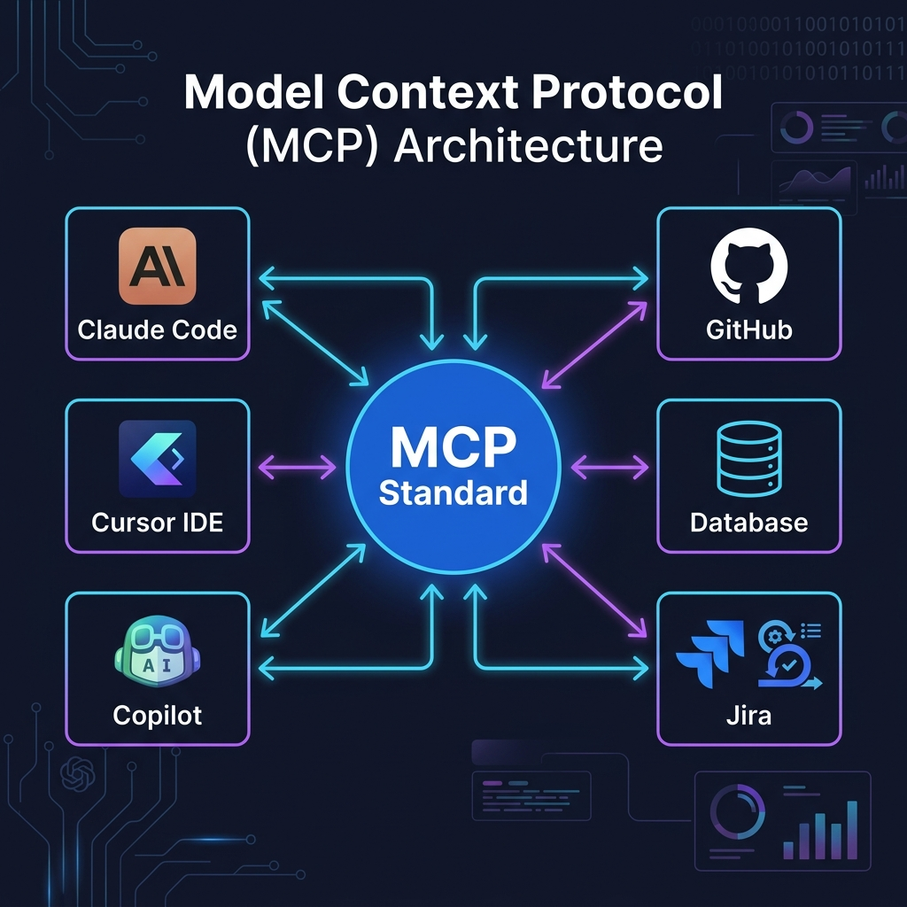

# 🔌 Bài 4: Model Context Protocol (MCP) — Chuẩn Kết Nối AI

> MCP là "USB-C port cho AI" — một chuẩn duy nhất để kết nối AI với mọi công cụ



---

## 1. MCP là gì?

**Model Context Protocol (MCP)** là giao thức chuẩn mở do Anthropic phát triển, cho phép ứng dụng AI kết nối an toàn với dữ liệu, công cụ, và hệ thống bên ngoài.

### Vấn đề trước MCP:
```
Trước MCP (N×M):                    Sau MCP (N+M):
━━━━━━━━━━━━━━━━                    ━━━━━━━━━━━━━━
Claude ──→ GitHub (custom)           Claude ──┐
Claude ──→ Jira (custom)             GPT    ──┤── MCP ──┬── GitHub
Claude ──→ DB (custom)               Gemini ──┘         ├── Jira
GPT   ──→ GitHub (custom khác)                          ├── Database
GPT   ──→ Jira (custom khác)                            └── Slack
GPT   ──→ DB (custom khác)
                                     Build tool 1 lần,
Mỗi AI × mỗi tool = N×M             dùng với mọi AI = N+M
integrations                         
```

---

## 2. Kiến Trúc MCP

```
┌──────────────┐         JSON-RPC 2.0        ┌──────────────┐
│  MCP HOST    │◄──────────────────────────►│  MCP SERVER  │
│  (AI App)    │         Transport:          │  (Tool)      │
│              │         - stdio             │              │
│  Claude Code │         - HTTP/SSE          │  GitHub API  │
│  Cursor      │                             │  Database    │
│  Antigravity │                             │  Jira        │
│  VS Code     │                             │  File System │
└──────────────┘                             └──────────────┘
```

---

## 3. Ba Primitives Cốt Lõi

| Primitive | Mô tả | Ví dụ |
|-----------|--------|-------|
| **Tools** | Hàm AI có thể gọi | Query database, gửi email, tạo PR |
| **Resources** | Dữ liệu AI có thể đọc | Nội dung file, database schema, API response |
| **Prompts** | Template hướng dẫn AI | System instructions, few-shot examples |

### Ví dụ cụ thể:

```
MCP Server: "bookwormhub-db"

Tools:
  - query_books(search, genre) → List<Book>
  - get_review_stats(book_id) → ReviewStats
  - add_book(title, author, isbn) → ServiceResult

Resources:
  - /schema → Database schema (tables, columns)
  - /books/{id} → Chi tiết sách
  - /stats → Thống kê tổng quan

Prompts:
  - code-review: Template cho review code C#
  - test-generate: Template cho tạo unit tests
```

---

## 4. Cấu Hình MCP Server

### Trong Claude Code:
```json
// .claude/mcp.json
{
  "mcpServers": {
    "github": {
      "command": "npx",
      "args": ["-y", "@modelcontextprotocol/server-github"],
      "env": {
        "GITHUB_PERSONAL_ACCESS_TOKEN": "ghp_xxx"
      }
    },
    "filesystem": {
      "command": "npx",
      "args": ["-y", "@modelcontextprotocol/server-filesystem", "./"]
    },
    "sqlite": {
      "command": "npx",
      "args": ["-y", "@modelcontextprotocol/server-sqlite", "BookWormHub.db"]
    }
  }
}
```

### Trong Cursor:
Vào **Settings → MCP** và thêm server configuration.

### Trong Antigravity:
```json
// mcp_config.json
{
  "mcpServers": {
    "gitnexus": {
      "command": "npx",
      "args": ["-y", "gitnexus@latest", "mcp"],
      "env": {
        "GITNEXUS_ANALYZE_ON_START": "true"
      }
    }
  }
}
```

---

## 5. Tự Tạo MCP Server (Python)

### Sử dụng FastMCP:

```python
# bookwormhub_mcp.py
from fastmcp import FastMCP
import sqlite3

mcp = FastMCP("BookWormHub MCP Server")

@mcp.tool()
def get_book_count() -> int:
    """Đếm tổng số sách trong database"""
    conn = sqlite3.connect("BookWormHub.db")
    cursor = conn.execute("SELECT COUNT(*) FROM Books")
    count = cursor.fetchone()[0]
    conn.close()
    return count

@mcp.tool()
def search_books(query: str) -> list[dict]:
    """Tìm kiếm sách theo tên hoặc tác giả"""
    conn = sqlite3.connect("BookWormHub.db")
    cursor = conn.execute(
        "SELECT Id, Title, Author, Genre FROM Books "
        "WHERE Title LIKE ? OR Author LIKE ?",
        (f"%{query}%", f"%{query}%")
    )
    books = [
        {"id": r[0], "title": r[1], "author": r[2], "genre": r[3]}
        for r in cursor.fetchall()
    ]
    conn.close()
    return books

@mcp.tool()
def get_review_statistics() -> dict:
    """Lấy thống kê reviews"""
    conn = sqlite3.connect("BookWormHub.db")
    cursor = conn.execute("""
        SELECT 
            COUNT(*) as total,
            AVG(Rating) as avg_rating,
            SUM(CASE WHEN Status = 0 THEN 1 ELSE 0 END) as approved,
            SUM(CASE WHEN Status = 1 THEN 1 ELSE 0 END) as hidden
        FROM Reviews
    """)
    r = cursor.fetchone()
    conn.close()
    return {
        "total_reviews": r[0],
        "average_rating": round(r[1], 2) if r[1] else 0,
        "approved": r[2],
        "hidden": r[3]
    }

@mcp.resource("bookwormhub://schema")
def get_schema() -> str:
    """Database schema của BookWormHub"""
    return """
    Tables:
    - Books (Id, Title, Author, ISBN13, Genre, Description, PublishedYear)
    - Reviews (Id, Rating, Comment, Status, CreatedAt, UpdatedAt, UserId, BookId)
    - BannedWords (Id, Word, CreatedAt)
    - AspNetUsers (Id, UserName, Email, IsCritic, CriticSince, ...)
    """

if __name__ == "__main__":
    mcp.run()
```

### Chạy server:
```bash
pip install fastmcp
python bookwormhub_mcp.py
```

---

## 6. MCP Trong Thực Tế

### Use case cho BookWormHub:

```
┌──────────────┐     MCP      ┌──────────────────┐
│  Claude Code │◄────────────►│ GitHub MCP Server │
│              │              │ - Tạo issues      │
│              │     MCP      │ - Tạo PRs         │
│              │◄────────────►├──────────────────┤
│              │              │ SQLite MCP Server │
│              │              │ - Query data      │
│              │     MCP      │ - Check schema    │
│              │◄────────────►├──────────────────┤
│              │              │ Jira MCP Server   │
│              │              │ - Read tickets    │
│              │              │ - Update status   │
└──────────────┘              └──────────────────┘
```

---

## 7. Best Practices

1. **Bắt đầu với MCP servers có sẵn** — npm registry có hàng trăm servers
2. **Tự tạo server** chỉ khi cần custom logic
3. **Bảo mật** — giữ API keys trong env, không hardcode
4. **Một server = một concern** — đừng tạo server "biết tất cả"
5. **Test server** trước khi kết nối với AI

---

> **Tiếp theo**: [Bài 5: Plugins, Hooks & Skills →](05-Plugins-Hooks-Skills.md)
