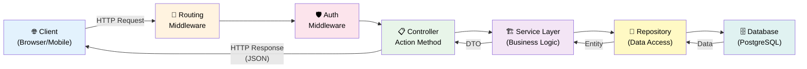

# Phần 1: Kiến trúc Nền tảng và Chuẩn bị Môi trường Phát triển API RESTful với ASP.NET Core 8

## 1.1 Giới thiệu tổng quan và mục tiêu khóa học

Chào mừng bạn đến với hành trình xây dựng một RESTful Web API mạnh mẽ, có khả năng mở rộng và dễ bảo trì bằng ASP.NET Core 8 và Entity Framework Core. Phần đầu tiên này sẽ thiết lập nền móng vững chắc, cung cấp cái nhìn toàn diện về kiến trúc tổng thể, các công nghệ chủ đạo, và quan trọng nhất là hướng dẫn chi tiết từng bước để thiết lập một môi trường phát triển hoàn chỉnh.

Chúng ta sẽ không chỉ dừng lại ở việc học cách sử dụng các công cụ mà còn đi sâu vào các nguyên tắc thiết kế cốt lõi. Khóa học này sẽ tập trung vào Dependency Injection để quản lý các phụ thuộc một cách linh hoạt, Repository Pattern để trừu tượng hóa lớp truy cập dữ liệu, Controllers và HTTP Verbs để định nghĩa giao diện API rõ ràng, cùng với nhiều kỹ thuật tiên tiến khác như Domain Models, DTOs, AutoMapper, lập trình bất đồng bộ, xác thực dữ liệu với FluentValidation, và bảo mật với Authentication/Authorization dựa trên vai trò. Mục tiêu cuối cùng là trang bị cho bạn không chỉ kỹ năng lập trình mà còn cả tư duy kiến trúc để xây dựng các API chất lượng cao.

### 1.1.1 Đối tượng độc giả và yêu cầu kiến thức nền tảng

Khóa học này được thiết kế dành cho các nhà phát triển đã có kinh nghiệm tối thiểu 3 tháng với C# và ASP.NET Core hoặc ASP.NET MVC. Mặc dù chúng tôi sẽ giải thích chi tiết các khái niệm quan trọng, việc có kiến thức nền tảng vững chắc về ngôn ngữ C#, hệ sinh thái .NET, và hiểu rõ về mục đích của Web API sẽ giúp bạn tiếp thu bài giảng một cách hiệu quả nhất. Khóa học sẽ tập trung vào các phương pháp hay nhất (best practices) và các mẹo thực tế để giúp bạn trở thành một nhà phát triển API chuyên nghiệp.

> [!NOTE]
> Khóa học này giả định bạn đã có kinh nghiệm lập trình cơ bản. Nếu bạn là người mới bắt đầu hoàn toàn với C# hoặc phát triển web, chúng tôi khuyến nghị bạn nên tìm hiểu các khóa học giới thiệu trước khi tham gia để đảm bảo bạn có đủ kiến thức nền tảng cần thiết.

## 1.2 Tổng quan kiến trúc RESTful Web API với ASP.NET Core và .NET 8

Trước khi đi sâu vào chi tiết kỹ thuật và thiết lập môi trường, việc nắm vững các khái niệm kiến trúc cốt lõi là điều tối quan trọng. Chúng ta sẽ xây dựng một API cho một ứng dụng quản lý thông tin về các khu vực và tầng lớp xã hội ở New Zealand, phục vụ cho các ứng dụng client (web, mobile) khác nhau.

### 1.2.1 Web API là gì và vai trò của nó?

API (Application Programming Interface) là một tập hợp các định nghĩa và giao thức cho phép các ứng dụng phần mềm giao tiếp với nhau. Trong ngữ cảnh của phát triển web, **Web API** là một loại API được xây dựng trên giao thức HTTP, cho phép các hệ thống phân tán (như ứng dụng di động, ứng dụng web frontend, hoặc các dịch vụ backend khác) trao đổi dữ liệu qua mạng. Chúng đóng vai trò như cầu nối, cho phép các thành phần độc lập của một hệ thống hoạt động cùng nhau một cách liền mạch, tạo nên một kiến trúc microservices hoặc phân tầng hiện đại.

### 1.2.2 REST và các nguyên tắc RESTful

REST (Representational State Transfer) là một kiểu kiến trúc (architectural style) chứ không phải một giao thức. Một API được coi là **RESTful** khi nó tuân thủ các nguyên tắc thiết kế sau:

*   **Client-Server:** Tách biệt hoàn toàn giao diện người dùng (client) khỏi lưu trữ dữ liệu (server). Điều này giúp tăng tính di động của client và khả năng mở rộng độc lập của server. Client không cần biết logic nghiệp vụ của server, và server không cần biết về giao diện người dùng của client.
*   **Stateless (Không trạng thái):** Mỗi yêu cầu từ client đến server phải chứa tất cả thông tin cần thiết để server hiểu và xử lý yêu cầu đó. Server không lưu trữ bất kỳ trạng thái nào của client giữa các yêu cầu. Mọi thông tin cần thiết để xử lý yêu cầu (ví dụ: thông tin xác thực, ID phiên) phải được gửi kèm trong mỗi yêu cầu. Điều này giúp server dễ dàng mở rộng theo chiều ngang (scale horizontally) và phục hồi sau lỗi.
*   **Cacheable (Có thể lưu trữ vào bộ nhớ đệm):** Client hoặc các lớp trung gian (proxy) có thể lưu trữ phản hồi từ server để cải thiện hiệu suất. Server phải chỉ định rõ liệu một phản hồi có thể được lưu vào bộ đệm hay không.
*   **Layered System (Hệ thống phân lớp):** Hệ thống có thể được tổ chức thành các lớp (ví dụ: lớp proxy, lớp cân bằng tải, lớp bảo mật), và client không cần biết nó đang giao tiếp trực tiếp với server cuối cùng hay một lớp trung gian. Điều này tăng cường tính linh hoạt và bảo mật.
*   **Uniform Interface (Giao diện đồng nhất):** Đây là nguyên tắc quan trọng nhất, bao gồm bốn ràng buộc phụ:
    *   **Identification of resources:** Tất cả các "tài nguyên" (resource) trong hệ thống phải được xác định duy nhất bằng URI (Uniform Resource Identifier). Ví dụ: `/api/regions/1`, `/api/walks`.
    *   **Manipulation of resources through representations:** Client thao tác với tài nguyên thông qua các "biểu diễn" của chúng (representations). Khi client yêu cầu một tài nguyên, server gửi về một biểu diễn của tài nguyên đó (thường là JSON hoặc XML). Client gửi lại một biểu diễn đã sửa đổi để cập nhật tài nguyên.
    *   **Self-descriptive messages:** Mỗi thông điệp (yêu cầu hoặc phản hồi) phải đủ thông tin để client (hoặc server) hiểu cách xử lý nó. Điều này thường đạt được thông qua các HTTP headers và body có cấu trúc rõ ràng.
    *   **Hypermedia as the Engine of Application State (HATEOAS):** Server có thể cung cấp các liên kết (hyperlinks) trong phản hồi để client có thể khám phá các hành động tiếp theo hoặc các tài nguyên liên quan. Đây là nguyên tắc khó thực hiện nhất và thường bị bỏ qua trong nhiều API tự nhận là RESTful. Tuy nhiên, việc hiểu và áp dụng các nguyên tắc khác là rất quan trọng để xây dựng một API linh hoạt và bền vững.

### 1.2.3 Giới thiệu ASP.NET Core và .NET 8

**ASP.NET Core** là một framework mã nguồn mở, đa nền tảng (Windows, macOS, Linux) để xây dựng các ứng dụng web hiện đại, API, và microservices. Nó được thiết kế từ đầu để mang lại hiệu suất cao, khả năng mở rộng tốt, tính linh hoạt thông qua kiến trúc mô-đun, và khả năng cấu hình mạnh mẽ với Dependency Injection tích hợp.

**_._NET 8** là phiên bản mới nhất của nền tảng .NET, mang lại nhiều cải tiến đáng kể về hiệu suất, tính năng mới và là phiên bản hỗ trợ lâu dài (LTS - Long Term Support). Việc sử dụng .NET 8 đảm bảo bạn đang làm việc với công nghệ tiên tiến nhất, ổn định nhất và được hỗ trợ lâu dài từ Microsoft, giúp tối ưu hóa hiệu suất ứng dụng và quy trình phát triển.



*Kiến trúc tổng quan: Client gửi HTTP Request → Middleware xử lý → Controller → Service → Repository → Database, rồi trả response ngược lại.*

### 1.2.4 Các khái niệm cốt lõi sẽ khám phá

Để xây dựng một Web API RESTful hiệu quả cho ứng dụng quản lý khu vực và tầng lớp xã hội ở New Zealand, chúng ta sẽ đi sâu vào các khái niệm kiến trúc và kỹ thuật sau:

#### 1.2.4.1 Controllers và HTTP Verbs: Trái tim của tương tác API

*   **Controllers:** Trong ASP.NET Core, `Controller` là các lớp xử lý yêu cầu HTTP đến. Mỗi controller chứa một hoặc nhiều *action methods* (phương thức hành động) tương ứng với các thao tác khác nhau trên một tài nguyên cụ thể. Ví dụ, một `RegionController` có thể có các action method để lấy danh sách khu vực, lấy một khu vực theo ID, tạo khu vực mới, v.v. Các controller hoạt động như điểm tiếp nhận đầu tiên cho các yêu cầu client và điều phối logic nghiệp vụ.
*   **HTTP Verbs (Phương thức HTTP):** Là các phương thức chuẩn của giao thức HTTP được sử dụng để chỉ định loại hành động mà client muốn thực hiện trên một tài nguyên. Việc sử dụng đúng HTTP Verb là rất quan trọng để API tuân thủ RESTful và dễ hiểu:
    *   `GET`: Yêu cầu lấy (đọc) dữ liệu từ server. Yêu cầu `GET` phải *idempotent* (gửi nhiều lần vẫn cho cùng một kết quả mà không gây ra tác dụng phụ trên server).
    *   `POST`: Yêu cầu tạo tài nguyên mới trên server. Yêu cầu `POST` thường *không idempotent* (gửi nhiều lần có thể tạo ra nhiều tài nguyên).
    *   `PUT`: Yêu cầu cập nhật toàn bộ tài nguyên hiện có trên server. Nếu tài nguyên không tồn tại, `PUT` có thể tạo mới (tùy thuộc vào triển khai). Yêu cầu `PUT` phải *idempotent*.
    *   `DELETE`: Yêu cầu xóa một tài nguyên cụ thể khỏi server. Yêu cầu `DELETE` phải *idempotent*.
    *   `PATCH`: Yêu cầu cập nhật một phần (partial update) của tài nguyên hiện có trên server. Yêu cầu `PATCH` thường *không idempotent*.

    **Ví dụ minh họa:**
    | Thao tác             | HTTP Verb | URI                         | Mô tả                                   |
    | :------------------- | :-------- | :-------------------------- | :-------------------------------------- |
    | Lấy tất cả khu vực   | `GET`     | `/api/regions`              | Lấy danh sách tất cả các khu vực.       |
    | Lấy một khu vực      | `GET`     | `/api/regions/{id}`         | Lấy thông tin của một khu vực cụ thể.   |
    | Tạo khu vực mới      | `POST`    | `/api/regions`              | Tạo một khu vực mới.                    |
    | Cập nhật khu vực     | `PUT`     | `/api/regions/{id}`         | Cập nhật toàn bộ thông tin khu vực.     |
    | Xóa khu vực          | `DELETE`  | `/api/regions/{id}`         | Xóa một khu vực cụ thể.                 |

#### 1.2.4.2 Dependency Injection (DI): Nguyên tắc Inversion of Control

*   **Dependency Injection (DI)** là một kỹ thuật thiết kế phần mềm giúp giảm sự phụ thuộc cứng nhắc giữa các thành phần của ứng dụng. Thay vì một đối tượng tự tạo hoặc tìm kiếm các đối tượng mà nó cần (phụ thuộc), các đối tượng phụ thuộc sẽ được "tiêm" (inject) vào nó từ bên ngoài. Trong ASP.NET Core, DI được tích hợp sẵn thông qua một vùng chứa DI (DI Container) mạnh mẽ.
*   **Cơ chế hoạt động (Under the Hood):** Khi bạn đăng ký một dịch vụ (ví dụ: `builder.Services.AddScoped<IRegionRepository, SqlRegionRepository>()`), bạn đang nói với DI Container rằng "khi bất kỳ thành phần nào cần một `IRegionRepository`, hãy cung cấp cho nó một thể hiện của `SqlRegionRepository`". Container sẽ tự động tạo và quản lý vòng đời của các đối tượng này.
*   **Lợi ích:**
    *   **Loose Coupling (Khớp nối lỏng):** Các thành phần ít phụ thuộc vào nhau hơn, dễ dàng thay thế hoặc sửa đổi mà không ảnh hưởng đến các phần khác.
    *   **Testability (Khả năng kiểm thử):** Dễ dàng thay thế các phụ thuộc bằng các đối tượng giả lập (mock objects) trong quá trình kiểm thử đơn vị.
    *   **Maintainability (Khả năng bảo trì):** Code trở nên rõ ràng, mô-đun hơn, dễ hiểu và dễ bảo trì hơn.
    *   **Flexibility:** Dễ dàng thay đổi triển khai của một dịch vụ mà không cần thay đổi code sử dụng dịch vụ đó.
*   **Vòng đời dịch vụ (Service Lifetimes):** DI Container quản lý ba loại vòng đời chính:
    *   `Transient`: Một thể hiện mới được tạo mỗi khi dịch vụ được yêu cầu.
    *   `Scoped`: Một thể hiện được tạo một lần cho mỗi yêu cầu HTTP và được tái sử dụng trong suốt yêu cầu đó.
    *   `Singleton`: Một thể hiện duy nhất được tạo ra lần đầu tiên và được tái sử dụng cho tất cả các yêu cầu tiếp theo trong suốt vòng đời của ứng dụng.
    Chúng ta sẽ sử dụng `Scoped` cho các repository và `DbContext` để đảm bảo tính nhất quán trong một yêu cầu.

#### 1.2.4.3 Entity Framework Core (EF Core): ORM mạnh mẽ

*   **Entity Framework Core (EF Core)** là một Object-Relational Mapper (ORM) mã nguồn mở, đa nền tảng cho .NET. Nó cho phép nhà phát triển .NET làm việc với cơ sở dữ liệu bằng cách sử dụng các đối tượng .NET (domain models) thay vì viết các câu lệnh SQL trực tiếp.
*   **Lợi ích:**
    *   **Tăng năng suất:** Giảm thiểu đáng kể lượng code truy cập dữ liệu thủ công.
    *   **An toàn kiểu (Type Safety):** Sử dụng các đối tượng C# giúp phát hiện lỗi ở thời điểm biên dịch thay vì thời điểm chạy.
    *   **Hỗ trợ Migration:** Dễ dàng quản lý và áp dụng các thay đổi cấu trúc cơ sở dữ liệu theo thời gian.
    *   **Độc lập cơ sở dữ liệu:** Với cùng một code EF Core, bạn có thể chuyển đổi giữa các hệ quản trị cơ sở dữ liệu khác nhau (SQL Server, PostgreSQL, MySQL, SQLite) chỉ bằng cách thay đổi cấu hình.

#### 1.2.4.4 Repository Pattern: Trừu tượng hóa lớp truy cập dữ liệu

*   **Repository Pattern** là một mẫu thiết kế giúp trừu tượng hóa lớp truy cập dữ liệu khỏi các lớp nghiệp vụ và controller. Thay vì các controller hoặc lớp nghiệp vụ truy cập trực tiếp vào EF Core `DbContext`, chúng ta sẽ tạo một lớp repository để xử lý tất cả các thao tác CRUD (Create, Read, Update, Delete) với một loại thực thể cụ thể.
*   **Cơ chế hoạt động:**
    1.  Định nghĩa một `interface` cho repository (ví dụ: `IRegionRepository`) khai báo các phương thức CRUD.
    2.  Triển khai `interface` này trong một lớp cụ thể (ví dụ: `SqlRegionRepository`) sử dụng EF Core `DbContext`.
    3.  Đăng ký `IRegionRepository` và `SqlRegionRepository` vào DI Container.
    4.  Controller sẽ yêu cầu `IRegionRepository` thông qua DI, và container sẽ cung cấp `SqlRegionRepository`.
*   **Lợi ích:**
    *   **Separation of Concerns (Tách biệt mối quan tâm):** Lớp nghiệp vụ không cần biết chi tiết về cách dữ liệu được lưu trữ hoặc truy xuất.
    *   **Testability:** Dễ dàng tạo các phiên bản repository giả lập để kiểm thử controller hoặc logic nghiệp vụ mà không cần kết nối cơ sở dữ liệu thực.
    *   **Flexibility:** Dễ dàng thay đổi công nghệ cơ sở dữ liệu trong tương lai (ví dụ: từ SQL Server sang MongoDB) mà chỉ cần thay đổi lớp triển khai repository, không ảnh hưởng đến các lớp gọi.

#### 1.2.4.5 Domain Models và Data Transfer Objects (DTOs): Quản lý dữ liệu hiệu quả

*   **Domain Models:** Là các đối tượng đại diện cho các thực thể nghiệp vụ cốt lõi trong ứng dụng của bạn (ví dụ: `Region`, `Walk`). Chúng chứa dữ liệu và logic nghiệp vụ liên quan, thường ánh xạ trực tiếp với các bảng trong cơ sở dữ liệu khi sử dụng EF Core.
*   **Data Transfer Objects (DTOs):** Là các đối tượng được sử dụng để truyền dữ liệu giữa các lớp trong ứng dụng hoặc giữa ứng dụng và client. DTO thường chỉ chứa các thuộc tính cần thiết cho một hoạt động cụ thể, giúp:
    *   **Kiểm soát dữ liệu hiển thị:** Tránh phơi bày quá nhiều thông tin từ Domain Model ra bên ngoài.
    *   **Bảo mật:** Giảm thiểu rủi ro tấn công *over-posting* (client gửi thêm các trường không mong muốn).
    *   **Tối ưu hóa tải trọng (payload):** Chỉ gửi những dữ liệu cần thiết, giảm băng thông.
    *   **Ngăn chặn vòng lặp tham chiếu:** Tránh các vấn đề khi serialize các đối tượng có quan hệ vòng lặp.
    Chúng ta sẽ tạo DTOs cho các yêu cầu (ví dụ: `AddRegionRequestDto`) và các phản hồi (ví dụ: `RegionDto`).

#### 1.2.4.6 AutoMapper: Tự động ánh xạ đối tượng

*   **AutoMapper** là một thư viện giúp tự động ánh xạ các thuộc tính từ đối tượng loại này sang đối tượng loại khác. Chúng ta sẽ sử dụng nó để chuyển đổi giữa Domain Models và DTOs, giảm thiểu việc viết code ánh xạ thủ công lặp đi lặp lại, giúp code sạch hơn và dễ bảo trì hơn.

#### 1.2.4.7 Lập trình bất đồng bộ (Async/Await): Nâng cao hiệu suất API

*   `async` và `await` là các từ khóa trong C# cho phép bạn viết code bất đồng bộ một cách dễ đọc và hiệu quả. Trong một Web API, các thao tác I/O (như truy cập cơ sở dữ liệu, gọi dịch vụ bên ngoài) thường tốn thời gian.
*   **Cơ chế hoạt động (Under the Hood):** Khi một phương thức `async` gặp từ khóa `await` trong một thao tác I/O, nó sẽ tạm dừng thực thi mà không chặn luồng hiện tại. Luồng này được giải phóng để xử lý các yêu cầu khác. Khi thao tác I/O hoàn tất, phương thức sẽ tiếp tục thực thi trên một luồng từ Thread Pool.
*   **Lợi ích:**
    *   **Cải thiện khả năng phản hồi (Responsiveness):** API có thể xử lý nhiều yêu cầu đồng thời hơn.
    *   **Khả năng mở rộng (Scalability):** Giảm số lượng luồng bị chặn, tận dụng tối đa tài nguyên máy chủ.
    *   **Tối ưu hóa tài nguyên:** Tránh lãng phí tài nguyên CPU cho các luồng chờ đợi I/O.
    Chúng ta sẽ áp dụng `async/await` cho tất cả các thao tác truy cập cơ sở dữ liệu và các hoạt động I/O khác.

#### 1.2.4.8 Validation (FluentValidation): Đảm bảo tính toàn vẹn dữ liệu

*   Xác thực dữ liệu đầu vào là rất quan trọng để đảm bảo tính toàn vẹn của dữ liệu và ngăn chặn các lỗi tiềm ẩn hoặc các lỗ hổng bảo mật.
*   Chúng ta sẽ sử dụng thư viện **FluentValidation** để định nghĩa các quy tắc xác thực rõ ràng, mạnh mẽ và dễ đọc cho các DTOs. FluentValidation cho phép bạn định nghĩa các quy tắc bằng cách sử dụng cú pháp fluent, tách biệt logic xác thực khỏi model, giúp code sạch và dễ kiểm thử hơn.

#### 1.2.4.9 Authentication & Authorization (Role-based): Bảo mật API

*   **Authentication (Xác thực):** Là quá trình xác minh danh tính của người dùng (Ai là bạn?). API cần biết người dùng là ai trước khi cho phép họ truy cập tài nguyên.
*   **Authorization (Ủy quyền):** Là quá trình xác định quyền truy cập của người dùng đã xác thực vào một tài nguyên cụ thể (Bạn có được phép làm điều này không?).
*   Chúng ta sẽ triển khai xác thực và ủy quyền dựa trên vai trò (Role-based Authorization) để đảm bảo rằng chỉ những người dùng được phép mới có thể truy cập các endpoint API nhất định hoặc thực hiện các hành động cụ thể.

## 1.3 Antigravity IDE và Tư duy AI-Driven Development (Vibe Coding)

Trong khóa học này, bạn đang làm việc với một hệ thống đặc biệt: **Antigravity IDE**. Đây không chỉ là một trình soạn thảo mã thông thường mà là một môi trường phát triển tích hợp được hỗ trợ bởi AI Agentic siêu việt, có khả năng tự chạy script ngầm, gọi subagent trình duyệt, đọc ghi file, và lập kế hoạch tự động. Việc hiểu và tận dụng tối đa Antigravity sẽ thay đổi cách bạn tiếp cận việc phát triển phần mềm.

### 1.3.1 AI Coding và Vibe Coding là gì?

*   **AI Coding:** Là việc sử dụng trí tuệ nhân tạo để hỗ trợ và tăng tốc quá trình phát triển phần mềm. Điều này bao gồm việc sinh mã, đề xuất refactoring, tìm lỗi, viết kiểm thử, và thậm chí là thiết kế kiến trúc. Với Antigravity, AI Coding không chỉ là gợi ý dòng mã mà là khả năng thực hiện các tác vụ phức tạp một cách tự động.
*   **Vibe Coding:** Đây là một phương pháp tư duy độc đáo, kết hợp trực giác, kinh nghiệm, và "cảm nhận" về mã nguồn tốt với sức mạnh của AI. Thay vì chỉ đơn thuần yêu cầu AI "viết code này", Vibe Coding khuyến khích bạn:
    *   **Cảm nhận kiến trúc:** Bạn "cảm thấy" một phần của hệ thống cần được tách ra, một interface cần được định nghĩa, hay một mẫu thiết kế nào đó sẽ phù hợp.
    *   **Dự đoán vấn đề:** Bạn "ngửi thấy" mùi code smell, tiềm năng gây lỗi, hay vấn đề hiệu suất trước khi chúng xảy ra.
    *   **Định hình yêu cầu AI:** Bạn không chỉ yêu cầu "viết một controller" mà là "hãy viết một `RegionController` tuân thủ RESTful, sử dụng `IRegionRepository` được inject, và đảm bảo các endpoint `POST`/`PUT` có xác thực dữ liệu cho `AddRegionRequestDto`".
    *   **Đánh giá và tinh chỉnh:** Bạn không chỉ chấp nhận code do AI tạo ra mà còn đánh giá nó theo các nguyên tắc về hiệu suất, bảo mật, khả năng đọc và bảo trì.

### 1.3.2 Áp dụng Vibe Coding với Antigravity IDE

Antigravity IDE là công cụ hoàn hảo để thực hành Vibe Coding, bởi nó cho phép bạn biến trực giác và ý tưởng kiến trúc thành hành động một cách nhanh chóng.

1.  **Prototyping và Khám phá Kiến trúc:**
    *   **Tư duy:** Bạn có một ý tưởng về cấu trúc API (ví dụ: cần một `RegionController`, một `IRegionRepository` và `SqlRegionRepository` để tương tác với EF Core).
    *   **Với Antigravity:** Thay vì tự viết từ đầu, bạn có thể yêu cầu: "Antigravity, hãy tạo cấu trúc file và boilerplate cho `RegionController`, `IRegionRepository`, và `SqlRegionRepository` trong dự án của tôi. Đảm bảo `SqlRegionRepository` nhận `ApplicationDbContext` qua DI."
    *   **Lợi ích:** Antigravity sẽ tự động tạo các file, điền code cơ bản, và thậm chí có thể đề xuất cách đăng ký chúng vào DI trong `Program.cs`. Điều này giúp bạn nhanh chóng thấy "vibe" của kiến trúc mà không tốn thời gian vào các tác vụ lặp lại.

2.  **Tối ưu hóa Dependency Injection và Cấu hình Dịch vụ:**
    *   **Tư duy:** Bạn nhận ra rằng cần phải đăng ký một dịch vụ mới (ví dụ: `FluentValidation` hoặc `AutoMapper`) hoặc thay đổi vòng đời của một dịch vụ hiện có.
    *   **Với Antigravity:** "Antigravity, hãy thêm cấu hình cho FluentValidation vào `Program.cs` và đăng ký `RegionValidator` cho `AddRegionRequestDto`. Đồng thời, cấu hình AutoMapper để tự động quét các profile trong assembly hiện tại."
    *   **Lợi ích:** Antigravity sẽ điều chỉnh `Program.cs` một cách thông minh, đảm bảo cú pháp chính xác và vị trí hợp lý trong pipeline cấu hình.

3.  **Refactoring và Áp dụng Best Practices:**
    *   **Tư duy:** Bạn nhìn vào một đoạn code và "cảm thấy" nó có thể được cải thiện, ví dụ, tách logic ra khỏi controller vào một service layer, hoặc áp dụng `async/await` cho các thao tác I/O.
    *   **Với Antigravity:** "Antigravity, hãy refactor phương thức `GetRegions` trong `RegionController` để sử dụng `async/await` và gọi phương thức bất đồng bộ từ `IRegionRepository`. Đảm bảo xử lý lỗi và trả về `Ok` hoặc `NotFound`." Hoặc "Antigravity, đoạn code này có vi phạm nguyên tắc SOLID nào không? Hãy đề xuất cách refactor để cải thiện tính mô-đun."
    *   **Lợi ích:** Antigravity có thể phân tích ngữ cảnh, đề xuất các thay đổi cụ thể, và thậm chí thực hiện chúng, cho phép bạn tập trung vào việc đánh giá chất lượng cuối cùng.

4.  **Gỡ lỗi và Xử lý Vấn đề (Agentic Troubleshooting):**
    *   **Tư duy:** Bạn gặp một lỗi runtime hoặc một hành vi không mong muốn. Trực giác mách bảo bạn rằng có thể do cấu hình DI sai, hoặc một truy vấn EF Core không tối ưu.
    *   **Với Antigravity:** "Antigravity, tôi đang gặp lỗi `NullReferenceException` tại dòng X trong `RegionController`. Hãy phân tích log lỗi, kiểm tra cấu hình DI cho `IRegionRepository`, và đề xuất các bước gỡ lỗi." Antigravity có thể tự động chạy dự án, theo dõi luồng thực thi, đọc ghi file log và thậm chí sử dụng subagent để tìm kiếm giải pháp trên Stack Overflow hoặc tài liệu chính thức.
    *   **Lợi ích:** Khả năng tự động hóa việc gỡ lỗi của Antigravity giúp bạn tiết kiệm thời gian đáng kể, biến quá trình tìm lỗi thành một cuộc đối thoại hiệu quả.

5.  **"Claude Code" và vai trò của bạn:**
    *   "Claude Code" là thuật ngữ chúng ta dùng để chỉ mã nguồn được tạo ra bởi AI (trong trường hợp này là Antigravity). Đây không phải là sản phẩm cuối cùng mà là một **bản nháp thông minh**.
    *   **Vai trò của bạn:** Sử dụng Antigravity để tạo ra "Claude Code", sau đó áp dụng "Vibe Coding" để xem xét, đánh giá, tinh chỉnh, và tích hợp nó vào dự án. Bạn là kiến trúc sư, người chỉ huy, và người kiểm soát chất lượng cuối cùng. Antigravity là người cộng sự đắc lực, thực hiện các tác vụ và gợi ý giải pháp.

> [!TIP]
> Hãy xem Antigravity IDE như một công cụ khuếch đại tư duy của bạn. Nó cho phép bạn thử nghiệm các ý tưởng kiến trúc nhanh hơn, tự động hóa các tác vụ lặp lại, và tập trung vào các vấn đề phức tạp hơn. Đừng ngại "nói chuyện" với Antigravity về kiến trúc, về các best practices, và về cách tối ưu hóa code.

## 1.4 Chuẩn bị môi trường phát triển

Để bắt đầu xây dựng API, chúng ta cần cài đặt các công cụ và phần mềm thiết yếu. Dưới đây là danh sách các thành phần chính mà chúng ta sẽ cài đặt:

*   **Visual Studio 2022:** Môi trường phát triển tích hợp (IDE) chính, cung cấp trải nghiệm phát triển toàn diện.
*   **.NET 8 SDK và .NET Runtime:** Bộ công cụ phát triển và môi trường thực thi cho các ứng dụng .NET.
*   **SQL Server Developer Edition:** Hệ quản trị cơ sở dữ liệu quan hệ mạnh mẽ.
*   **SQL Server Management Studio (SSMS):** Công cụ để quản lý và tương tác với SQL Server.

Hãy cùng đi vào chi tiết cài đặt từng thành phần.

### 1.4.1 Cài đặt Visual Studio 2022

Visual Studio 2022 là một môi trường phát triển tích hợp (IDE) mạnh mẽ của Microsoft, cung cấp đầy đủ các công cụ cần thiết để phát triển ứng dụng .NET, bao gồm trình soạn thảo mã thông minh, trình gỡ lỗi mạnh mẽ, trình biên dịch, và nhiều tiện ích khác.

1.  **Tải xuống Visual Studio Community Edition:**
    *   Truy cập trang web chính thức: `https://visualstudio.microsoft.com/downloads/`
    *   Tìm phần **Visual Studio 2022** và chọn phiên bản **Community**. Đây là phiên bản miễn phí, đầy đủ tính năng cho sinh viên, nguồn mở và các nhà phát triển cá nhân. Nhấp vào nút "Free download".
    *   Tệp cài đặt nhỏ (Visual Studio Installer) sẽ được tải xuống. Lưu và chạy nó.

2.  **Chạy Visual Studio Installer và chọn Workloads:**
    *   Sau khi chạy trình cài đặt, nó sẽ tải xuống một số tệp ban đầu.
    *   Khi cửa sổ "Workloads" xuất hiện, bạn cần chọn các gói công việc (workloads) cần thiết cho việc phát triển Web API:
        *   **ASP.NET and web development:** Đây là workload chính để phát triển ứng dụng web và API với ASP.NET Core. Nó bao gồm các mẫu dự án, công cụ phát triển web, và các thành phần cần thiết.
        *   **Data storage and processing:** Cần thiết để làm việc với cơ sở dữ liệu SQL Server, bao gồm các công cụ để kết nối và quản lý dữ liệu trực tiếp từ Visual Studio.
    *   Bạn không cần chọn các workload khác như Python, Node.js, hoặc Desktop development trừ khi bạn có nhu cầu phát triển khác.
    *   Nhấp vào nút **Install** để bắt đầu quá trình cài đặt. Quá trình này có thể mất một thời gian tùy thuộc vào tốc độ mạng và cấu hình máy tính của bạn.

3.  **Khởi động Visual Studio:**
    *   Sau khi cài đặt hoàn tất, bạn có thể nhấp vào nút **Launch** để mở Visual Studio 2022.

> [!NOTE]
> Nếu bạn đang sử dụng hệ điều hành macOS hoặc Linux, bạn có thể sử dụng **Visual Studio Code** - một IDE nhẹ nhàng, miễn phí và đa nền tảng. Mặc dù Visual Studio Code là một lựa chọn tuyệt vời cho .NET Core, khóa học này sẽ tập trung vào Visual Studio 2022 trên Windows để tận dụng tối đa các tính năng tích hợp và trải nghiệm phát triển phong phú.

### 1.4.2 Cài đặt .NET SDK và .NET Runtime

.NET SDK (Software Development Kit) chứa tất cả các công cụ cần thiết để phát triển ứng dụng .NET, bao gồm trình biên dịch, công cụ dòng lệnh (CLI), và các thư viện. .NET Runtime (hay .NET Host) là môi trường để chạy các ứng dụng .NET đã được biên dịch.

1.  **Tải xuống .NET 8 SDK và Runtime:**
    *   Truy cập trang tải xuống chính thức của .NET: `https://dotnet.microsoft.com/download/dotnet/8.0`
    *   Trên trang này, bạn sẽ thấy các phiên bản .NET 8 LTS (Long Term Support).
    *   Tìm phần **SDK** và chọn phiên bản phù hợp với hệ điều hành và kiến trúc của máy tính bạn (ví dụ: `x64` cho Windows 64-bit). Nhấp vào liên kết để tải xuống.
    *   Tương tự, tìm phần **Runtime** và chọn phiên bản **ASP.NET Core Runtime** phù hợp với hệ điều hành và kiến trúc của máy tính bạn. Nhấp vào liên kết để tải xuống. Việc cài đặt ASP.NET Core Runtime là cần thiết để chạy các ứng dụng web và API.

2.  **Cài đặt SDK và Runtime:**
    *   Sau khi tải xuống, chạy từng tệp cài đặt (trước hết là SDK, sau đó là Runtime).
    *   Quá trình cài đặt thường rất đơn giản, chỉ cần nhấp vào **Install** và làm theo hướng dẫn.

3.  **Kiểm tra cài đặt:**
    *   Mở Command Prompt (CMD) hoặc PowerShell.
    *   Gõ lệnh sau và nhấn Enter:
        ```bash
        dotnet --list-sdks
        ```
        Bạn sẽ thấy danh sách các phiên bản SDK đã cài đặt, bao gồm .NET 8 (ví dụ: `8.0.x`).

    *   Gõ lệnh sau và nhấn Enter:
        ```bash
        dotnet --list-runtimes
        ```
        Bạn sẽ thấy danh sách các phiên bản Runtime đã cài đặt, bao gồm .NET 8 (đặc biệt là `Microsoft.AspNetCore.App 8.x.x`).

### 1.4.3 Cài đặt SQL Server và SQL Server Management Studio (SSMS)

Chúng ta sẽ sử dụng SQL Server làm hệ quản trị cơ sở dữ liệu và SQL Server Management Studio (SSMS) để quản lý cơ sở dữ liệu của mình.

1.  **Tải xuống SQL Server Developer Edition:**
    *   Truy cập trang tải xuống SQL Server: `https://www.microsoft.com/en-us/sql-server/sql-server-downloads`
    *   Cuộn xuống phần **Developer Edition**. Đây là phiên bản miễn phí, đầy đủ tính năng, thích hợp cho việc phát triển và kiểm thử.
    *   Nhấp vào nút **Download now**.
    *   Chạy tệp cài đặt. Chọn tùy chọn **Basic** để cài đặt nhanh chóng hoặc **Custom** nếu bạn muốn tùy chỉnh các thành phần. Đối với khóa học này, tùy chọn **Basic** là đủ.
    *   Chấp nhận các điều khoản và nhấp vào **Install**. Quá trình này sẽ cài đặt SQL Server trên máy tính của bạn.
    *   Sau khi cài đặt xong, bạn sẽ thấy một cửa sổ hiển thị thông tin về cài đặt, bao gồm **Connection String** và **Instance Name** của SQL Server.

    > [!TIP]
    > **Lưu trữ thông tin Server Name (Instance Name):** Thông tin này (ví dụ: `localhost\SQLEXPRESS` hoặc `(localdb)\MSSQLLocalDB`) rất quan trọng để kết nối đến cơ sở dữ liệu sau này. Hãy sao chép và lưu trữ nó ở một nơi an toàn. Đây là tên của máy chủ cơ sở dữ liệu mà ứng dụng của bạn sẽ cần để kết nối.

2.  **Tải xuống và cài đặt SQL Server Management Studio (SSMS):**
    *   Từ cửa sổ cài đặt SQL Server, bạn có thể thấy một tùy chọn để cài đặt SSMS. Nhấp vào đó hoặc truy cập trực tiếp trang tải xuống SSMS: `https://docs.microsoft.com/en-us/sql/ssms/download-sql-server-management-studio-ssms`
    *   Nhấp vào liên kết để tải xuống phiên bản mới nhất của **SQL Server Management Studio**.
    *   Chạy tệp cài đặt SSMS. Nhấp vào **Install** và làm theo các bước để hoàn tất quá trình.

3.  **Kết nối đến SQL Server bằng SSMS:**
    *   Sau khi cài đặt SSMS, mở nó từ menu Start.
    *   Cửa sổ "Connect to Server" sẽ tự động bật lên.
    *   Trong trường **Server name**, dán hoặc nhập tên máy chủ SQL Server mà bạn đã lưu lại từ bước cài đặt SQL Server (ví dụ: `localhost\SQLEXPRESS`).
    *   Trong trường **Authentication**, chọn **Windows Authentication** (phương thức xác thực mặc định và dễ sử dụng nhất cho môi trường phát triển cục bộ).
    *   Nhấp vào nút **Connect**.
    *   Nếu kết nối thành công, bạn sẽ thấy Object Explorer ở bên trái hiển thị các cơ sở dữ liệu hiện có trên máy chủ của bạn.

## 1.5 Phân tích cấu trúc cơ bản của một API ASP.NET Core: File `Program.cs`

Sau khi môi trường phát triển đã được thiết lập, bạn đã sẵn sàng để tạo dự án ASP.NET Core Web API đầu tiên của mình. Trái tim của cấu hình ứng dụng ASP.NET Core hiện đại nằm trong file `Program.cs`. Đây là nơi chúng ta cấu hình các dịch vụ (services) cho Dependency Injection và định nghĩa HTTP Request Pipeline (middleware).

Hãy cùng phân tích sâu sắc từng phần của file `Program.cs` cơ bản và cách các khái niệm đã học được áp dụng.

```csharp
// 1. Khởi tạo WebApplicationBuilder: Giai đoạn Cấu hình Dịch vụ
// Đối tượng 'builder' này là điểm khởi đầu để cấu hình tất cả các dịch vụ và middleware
// cho ứng dụng. Nó cung cấp quyền truy cập vào cấu hình, dịch vụ và môi trường.
var builder = WebApplication.CreateBuilder(args);

// 2. Đăng ký các dịch vụ vào vùng chứa Dependency Injection (DI Container).
// Các dịch vụ này sẽ được tạo và cung cấp cho các thành phần khác của ứng dụng khi chúng yêu cầu.
// Đây là nơi chúng ta thiết lập các phụ thuộc và vòng đời của chúng.

// 2.1. Đăng ký dịch vụ Controllers:
// builder.Services.AddControllers() đăng ký các dịch vụ cần thiết để ứng dụng
// có thể sử dụng các lớp Controller để xử lý các yêu cầu HTTP.
// Nó bao gồm việc đăng ký các dịch vụ MVC cơ bản, bộ định tuyến, và các formatter
// để xử lý JSON (mặc định) hoặc XML. Đây là một ví dụ điển hình về Dependency Injection
// nơi các Controller sẽ nhận các phụ thuộc của chúng thông qua constructor.
builder.Services.AddControllers();

// 2.2. Đăng ký dịch vụ khám phá API (Swagger/OpenAPI):
// builder.Services.AddEndpointsApiExplorer() cho phép khám phá các endpoint API,
// cần thiết cho các công cụ tạo tài liệu API tự động như Swagger.
// builder.Services.AddSwaggerGen() đăng ký dịch vụ tạo tài liệu Swagger.
// Swagger/OpenAPI là tiêu chuẩn công nghiệp để mô tả API RESTful,
// rất hữu ích cho việc tài liệu hóa, kiểm thử và tạo mã client tự động.
builder.Services.AddEndpointsApiExplorer();
builder.Services.AddSwaggerGen();

// *Bổ sung kiến thức: Tích hợp Database với Entity Framework Core*
// Khi bạn muốn tương tác với cơ sở dữ liệu, bạn sẽ đăng ký DbContext của mình tại đây.
// DbContext là cầu nối chính giữa ứng dụng và cơ sở dữ liệu trong EF Core.
// 'AddDbContext' đăng ký DbContext với vòng đời 'Scoped' theo mặc định,
// nghĩa là một thể hiện của DbContext sẽ được tạo cho mỗi yêu cầu HTTP.
/*
builder.Services.AddDbContext<ApplicationDbContext>(options =>
    options.UseSqlServer(builder.Configuration.GetConnectionString("DefaultConnection")));
*/
// 'builder.Configuration.GetConnectionString("DefaultConnection")' truy xuất chuỗi kết nối
// từ file 'appsettings.json', giúp tách biệt cấu hình khỏi code.

// *Bổ sung kiến thức: Đăng ký Repository Pattern vào DI Container*
// Nếu bạn sử dụng Repository Pattern để trừu tượng hóa lớp truy cập dữ liệu,
// bạn sẽ đăng ký các interface và implementation của Repository tại đây.
// 'AddScoped' phù hợp cho Repository vì nó đảm bảo một thể hiện duy nhất
// của Repository (và DbContext bên trong nó) được sử dụng trong suốt một yêu cầu HTTP.
/*
builder.Services.AddScoped<IRegionRepository, SqlRegionRepository>();
*/
// Khi một Controller cần 'IRegionRepository', DI Container sẽ cung cấp một thể hiện của 'SqlRegionRepository'.

// *Bổ sung kiến thức: Đăng ký AutoMapper*
// Để tự động hóa việc ánh xạ giữa Domain Models và DTOs, chúng ta đăng ký AutoMapper.
// 'AddAutoMapper' sẽ tìm kiếm các Profile ánh xạ trong assembly được chỉ định (ở đây là assembly chứa 'Program').
/*
builder.Services.AddAutoMapper(typeof(Program).Assembly);
*/

// *Bổ sung kiến thức: Đăng ký FluentValidation*
// Để xác thực dữ liệu đầu vào một cách mạnh mẽ, chúng ta sẽ đăng ký FluentValidation.
/*
builder.Services.AddFluentValidationAutoValidation()
    .AddFluentValidationClientsideAdapters()
    .AddValidatorsFromAssemblyContaining<Program>(); // Đăng ký tất cả các validator trong assembly này
*/

// 3. Xây dựng ứng dụng Web: Giai đoạn Cấu hình HTTP Request Pipeline
// Sau khi tất cả các dịch vụ đã được cấu hình, 'builder.Build()' tạo ra đối tượng 'app'
// đại diện cho ứng dụng Web. Đây là nơi chúng ta định nghĩa cách ứng dụng xử lý các yêu cầu HTTP.
var app = builder.Build();

// 4. Cấu hình HTTP Request Pipeline (Middleware).
// Thứ tự các middleware rất quan trọng vì mỗi middleware xử lý yêu cầu theo một thứ tự nhất định
// và có thể truyền hoặc chặn yêu cầu đến middleware tiếp theo.

// 4.1. Cấu hình cho môi trường phát triển:
// 'app.Environment.IsDevelopment()' kiểm tra xem ứng dụng đang chạy trong môi trường phát triển hay không.
// Các middleware này chỉ nên được bật trong môi trường phát triển vì lý do bảo mật và hiệu suất.
if (app.Environment.IsDevelopment())
{
    // app.UseSwagger() cho phép tạo tài liệu Swagger/OpenAPI.
    // app.UseSwaggerUI() cung cấp giao diện người dùng web để hiển thị tài liệu API
    // và cho phép bạn gửi yêu cầu đến API để kiểm thử trực tiếp từ trình duyệt.
    app.UseSwagger();
    app.UseSwaggerUI();
}

// 4.2. Chuyển hướng HTTPS:
// app.UseHttpsRedirection() middleware tự động chuyển hướng các yêu cầu HTTP sang HTTPS.
// Điều này tăng cường bảo mật bằng cách đảm bảo tất cả dữ liệu được mã hóa khi truyền qua mạng.
app.UseHttpsRedirection();

// *Bổ sung kiến thức: Cấu hình Authentication và Authorization Middleware*
// Nếu bạn triển khai xác thực và ủy quyền, bạn sẽ thêm middleware tại đây.
// Thứ tự là quan trọng: 'UseAuthentication' phải đến trước 'UseAuthorization'.
// 'UseAuthentication' xác định danh tính người dùng.
// 'UseAuthorization' kiểm tra quyền của người dùng đã xác thực để truy cập tài nguyên.
/*
app.UseAuthentication();
app.UseAuthorization();
*/

// 4.3. Ánh xạ Controllers:
// app.MapControllers() là middleware cuối cùng trong pipeline để ánh xạ các yêu cầu HTTP
// đến các Controller và Action Method phù hợp dựa trên routing đã định nghĩa.
app.MapControllers();

// 5. Chạy ứng dụng.
// app.Run() khởi động máy chủ web (Kestrel theo mặc định) và bắt đầu lắng nghe các yêu cầu HTTP đến.
// Ứng dụng sẽ tiếp tục chạy cho đến khi bị dừng thủ công hoặc có lỗi nghiêm trọng.
app.Run();
```

Trong đoạn mã trên, bạn có thể thấy rõ cách các khái niệm như Dependency Injection (qua `builder.Services.Add...`), Controllers (qua `AddControllers` và `MapControllers`), và Middleware Pipeline (qua `app.Use...`) được tích hợp vào kiến trúc của ASP.NET Core. Các phần `*Bổ sung kiến thức*` cho thấy nơi bạn sẽ tích hợp sâu hơn Entity Framework Core, Repository Pattern, AutoMapper, và FluentValidation vào hệ thống DI và pipeline.

### 1.5.1 Antigravity IDE và `Program.cs`: Cộng tác trong cấu hình

Với Antigravity IDE, việc quản lý file `Program.cs` trở nên linh hoạt hơn. Bạn có thể:

*   **Yêu cầu cấu hình tự động:** "Antigravity, hãy cấu hình `Program.cs` để sử dụng SQL Server với EF Core, và tạo một chuỗi kết nối `DefaultConnection` trong `appsettings.json`." Antigravity sẽ tự động thêm `AddDbContext` và tạo/cập nhật `appsettings.json`.
*   **Thêm dịch vụ mới theo yêu cầu:** "Antigravity, tôi cần một `LoggingService`. Hãy định nghĩa interface và class, sau đó đăng ký nó là `Singleton` trong `Program.cs`."
*   **Kiểm tra và tối ưu hóa pipeline:** "Antigravity, hãy phân tích thứ tự các middleware trong `Program.cs`. Có bất kỳ vấn đề về hiệu suất hoặc bảo mật nào không? Đề xuất thay đổi nếu cần."

Antigravity giúp bạn nhanh chóng triển khai các ý tưởng cấu hình, cho phép bạn tập trung vào "vibe" kiến trúc thay vì chi tiết cú pháp.

## 1.6 Kỹ năng tự học và xử lý vấn đề: Nâng tầm phát triển

Trong quá trình học và phát triển, việc gặp phải lỗi hoặc vấn đề là điều không thể tránh khỏi. Khóa học này được thiết kế để cung cấp cho bạn kiến thức nền tảng vững chắc, nhưng khả năng tự học và xử lý vấn đề là yếu tố then chốt để trở thành một nhà phát triển phần mềm giỏi và độc lập.

*   **Không bỏ qua bất kỳ phần nào:** Mỗi bài giảng, mỗi dòng code đều chứa thông tin quan trọng. Việc bỏ qua có thể dẫn đến thiếu hụt kiến thức cần thiết cho các phần sau, gây ra lỗi và khó khăn trong việc khắc phục. Hãy thực hành theo từng bước.
*   **Xem lại bài giảng và code:** Nếu gặp vấn đề, hãy xem lại bài giảng liên quan và so sánh code của bạn với code mẫu. Đôi khi, một chi tiết nhỏ bị bỏ qua (ví dụ: thiếu dấu chấm phẩy, sai tên biến, quên đăng ký dịch vụ vào DI) có thể là nguyên nhân.
*   **Tìm kiếm trực tuyến hiệu quả:** Internet là một kho tàng kiến thức khổng lồ. Các trang web như Stack Overflow, tài liệu chính thức của Microsoft Docs, hoặc các blog lập trình uy tín là những nguồn tài nguyên vô giá. Hãy phát triển kỹ năng tìm kiếm hiệu quả bằng cách sử dụng các từ khóa chính xác liên quan đến lỗi hoặc vấn đề bạn đang gặp phải (ví dụ: "ASP.NET Core Entity Framework Core migration error", "Dependency Injection Scoped vs Singleton").
*   **Hiểu rõ thông báo lỗi:** Đừng chỉ sao chép lỗi và dán vào công cụ tìm kiếm. Hãy dành thời gian đọc và hiểu thông báo lỗi. Chúng thường cung cấp manh mối quan trọng về nguyên nhân gốc rễ của vấn đề, bao gồm tên file, số dòng, loại ngoại lệ, và stack trace.
*   **Thực hành và thử nghiệm:** Kiến thức chỉ thực sự vững chắc khi được áp dụng vào thực tế. Đừng ngại thử nghiệm, thay đổi code, và xem kết quả. Tạo ra các kịch bản lỗi cố ý để hiểu cách hệ thống phản ứng.
*   **Sử dụng Antigravity IDE để gỡ lỗi và học hỏi:** Antigravity không chỉ là công cụ viết code mà còn là một trợ lý gỡ lỗi mạnh mẽ.
    *   **Phân tích lỗi:** Khi gặp lỗi, hãy copy thông báo lỗi và yêu cầu Antigravity "Antigravity, hãy phân tích lỗi này và đề xuất các nguyên nhân tiềm ẩn cũng như các bước khắc phục."
    *   **Kiểm tra cấu hình:** "Antigravity, hãy kiểm tra cấu hình DI của tôi cho dịch vụ X. Có vấn đề gì không?"
    *   **Thực thi lệnh:** "Antigravity, hãy chạy lệnh `dotnet ef migrations add InitialCreate` và báo cáo kết quả."
    *   **Giải thích code:** "Antigravity, hãy giải thích đoạn code này và tại sao nó lại được thiết kế như vậy."

> [!TIP]
> Việc tự mình tìm kiếm và giải quyết vấn đề không chỉ giúp bạn khắc phục lỗi hiện tại mà còn mở rộng kiến thức và kỹ năng của bạn, biến bạn thành một nhà phát triển độc lập, có tư duy phản biện và giá trị hơn. Hãy coi mỗi lỗi là một cơ hội để học hỏi sâu hơn.

## 1.7 Tóm tắt Phần 1

Trong Phần 1 này, chúng ta đã đặt nền móng vững chắc cho khóa học:

*   Nắm bắt mục tiêu tổng thể: Xây dựng RESTful Web API bằng ASP.NET Core 8 và Entity Framework Core.
*   Hiểu sâu sắc các khái niệm cốt lõi của kiến trúc RESTful API, sức mạnh của ASP.NET Core và .NET 8.
*   Khám phá các thành phần kiến trúc quan trọng như Controllers, HTTP Verbs, Dependency Injection, Entity Framework Core, Repository Pattern, Domain Models, DTOs, AutoMapper, lập trình bất đồng bộ, xác thực và ủy quyền.
*   Đi sâu vào cách **Antigravity IDE** và tư duy **Vibe Coding** sẽ được áp dụng để tăng tốc quá trình phát triển, cho phép bạn cộng tác hiệu quả với AI.
*   Hoàn tất việc thiết lập môi trường phát triển cần thiết, bao gồm cài đặt Visual Studio 2022, .NET 8 SDK, SQL Server Developer Edition và SQL Server Management Studio (SSMS).
*   Phân tích chi tiết cấu trúc cơ bản của một dự án ASP.NET Core Web API thông qua file `Program.cs`, hiểu rõ vai trò của cấu hình dịch vụ và middleware.
*   Nhấn mạnh tầm quan trọng của kỹ năng tự học và xử lý vấn đề, cùng với cách tận dụng Antigravity IDE như một công cụ hỗ trợ gỡ lỗi và học hỏi.

Với môi trường đã sẵn sàng và kiến thức nền tảng vững chắc, bạn đã sẵn sàng để chuyển sang các phần tiếp theo, nơi chúng ta sẽ bắt đầu đi sâu vào việc xây dựng API thực tế, từng bước một, kết hợp sức mạnh của Antigravity IDE và tư duy Vibe Coding.

<!-- REVIEWED_BY_AGENT -->
