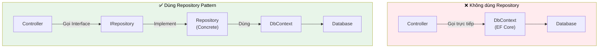

# Phần 6: Nâng cao cấu trúc API với Dependency Injection, Repository Pattern và AutoMapper

Trong hành trình xây dựng các ứng dụng RESTful Web API với ASP.NET Core và Entity Framework Core, việc đạt được hiệu suất tối ưu, khả năng bảo trì cao và cấu trúc mã vững chắc là mục tiêu cốt lõi. Phần này sẽ đưa bạn đi sâu vào ba kỹ thuật thiết yếu: Lập trình bất đồng bộ (`async` và `await`) để tối ưu hóa I/O, Repository Pattern để trừu tượng hóa lớp truy cập dữ liệu, và AutoMapper để đơn giản hóa quá trình ánh xạ đối tượng.

Mục tiêu của chương này là trang bị cho bạn không chỉ kiến thức về cách triển khai các mẫu thiết kế này, mà còn hiểu sâu sắc về **lý do tại sao** chúng lại quan trọng và **cách thức** chúng cải thiện kiến trúc tổng thể của ứng dụng. Chúng ta cũng sẽ khám phá cách tư duy "Vibe Coding" có thể được nâng tầm khi kết hợp với các công cụ AI mạnh mẽ như Antigravity IDE, nơi ý định của lập trình viên được chuyển hóa thành mã chất lượng cao một cách hiệu quả.

## 1. Nâng cao hiệu suất và khả năng mở rộng với Lập trình bất đồng bộ (`async` và `await`)

Trong môi trường API hiện đại, hiệu suất và khả năng phản hồi là yếu tố quyết định sự thành công của một ứng dụng. Các thao tác I/O (Input/Output) như truy vấn cơ sở dữ liệu, gọi dịch vụ mạng bên ngoài, hoặc đọc/ghi tệp có thể mất một khoảng thời gian đáng kể. Nếu không được xử lý đúng cách, chúng sẽ trở thành nút thắt cổ chai, làm giảm khả năng mở rộng của API. Lập trình bất đồng bộ là giải pháp tối ưu cho vấn đề này.

### 1.1. Lập trình đồng bộ vs. Bất đồng bộ: Hiểu rõ cơ chế ngầm

Để hiểu tầm quan trọng của `async` và `await`, chúng ta cần nắm vững sự khác biệt giữa mô hình đồng bộ và bất đồng bộ, cùng với cách thức ASP.NET Core xử lý các yêu cầu.

*   **Lập trình đồng bộ (Synchronous Programming):**
    *   **Cơ chế:** Khi một yêu cầu API đến, ASP.NET Core sẽ chỉ định một luồng (thread) từ Thread Pool để xử lý yêu cầu đó. Trong mô hình đồng bộ, nếu luồng này gặp một thao tác I/O (ví dụ: `_dbContext.Regions.ToList()`), nó sẽ bị **chặn (blocked)**. Điều này có nghĩa là luồng sẽ ngừng mọi hoạt động khác và chờ đợi cho đến khi thao tác I/O hoàn tất và trả về kết quả.
    *   **Hậu quả:** Trong thời gian luồng bị chặn, nó không thể xử lý bất kỳ yêu cầu mới nào khác. Nếu có nhiều yêu cầu đồng thời, các luồng trong Thread Pool sẽ nhanh chóng bị chiếm dụng, dẫn đến tình trạng **thread starvation**. Các yêu cầu mới sẽ phải xếp hàng chờ đợi, làm tăng độ trễ (latency) và giảm khả năng phản hồi của ứng dụng. Khả năng mở rộng (scalability) của ứng dụng bị hạn chế nghiêm trọng.

*   **Lập trình bất đồng bộ (Asynchronous Programming):**
    *   **Cơ chế:** Khi một luồng gặp một thao tác I/O bất đồng bộ (ví dụ: `await _dbContext.Regions.ToListAsync()`), thay vì bị chặn, luồng sẽ được **giải phóng (released)** trở lại Thread Pool. Nó có thể được sử dụng để xử lý các yêu cầu khác hoặc các tác vụ khác trong ứng dụng. Thao tác I/O sẽ được thực hiện ở một luồng I/O đặc biệt (I/O Completion Port - IOCP) hoặc bằng cách sử dụng các cơ chế bất đồng bộ của hệ điều hành. Khi thao tác I/O hoàn tất, một tín hiệu sẽ được gửi trở lại ứng dụng, và một luồng từ Thread Pool (có thể không phải luồng ban đầu) sẽ tiếp tục thực thi phần còn lại của phương thức từ điểm `await`.
    *   **Lợi ích:** Luồng xử lý chính không bị chặn, cho phép ứng dụng xử lý nhiều yêu cầu đồng thời hơn với cùng một số lượng luồng. Điều này giúp cải thiện đáng kể khả năng phản hồi, giảm độ trễ và tăng khả năng mở rộng của API.

> [!NOTE]
> Lập trình bất đồng bộ không làm cho một tác vụ I/O cụ thể chạy *nhanh hơn*. Thay vào đó, nó giúp ứng dụng có khả năng xử lý *nhiều tác vụ hơn trong cùng một khoảng thời gian* bằng cách sử dụng tài nguyên luồng hiệu quả hơn.

### 1.2. Cơ chế `async` và `await` trong C# và .NET

`async` và `await` là các từ khóa cú pháp đường (syntactic sugar) trong C# được xây dựng trên nền tảng của `Task Parallel Library` (TPL) và khái niệm `Task`.

*   **`async`:**
    *   Được đặt trước định nghĩa phương thức để đánh dấu rằng phương thức đó có thể chứa các thao tác `await`.
    *   Khi trình biên dịch nhìn thấy `async`, nó sẽ biến đổi (rewrite) phương thức thành một cỗ máy trạng thái (state machine). Cỗ máy trạng thái này quản lý việc tạm dừng và tiếp tục thực thi phương thức.
    *   Một phương thức `async` phải trả về `void`, `Task`, hoặc `Task<TResult>`. Trong Web API, bạn gần như luôn muốn trả về `Task<IActionResult>` hoặc `Task<TResult>` để đảm bảo kết quả có thể được `await` bởi caller.

*   **`await`:**
    *   Được sử dụng bên trong một phương thức `async` để tạm dừng việc thực thi phương thức cho đến khi một `Task` hoàn tất.
    *   Khi `await` được gọi, nếu `Task` chưa hoàn tất, luồng hiện tại sẽ được giải phóng.
    *   Khi `Task` hoàn tất, phần còn lại của phương thức (sau `await`) sẽ được xếp hàng để tiếp tục thực thi trên một luồng có sẵn từ Thread Pool.

**Cơ chế "Under the Hood":**
Khi bạn gọi `await SomeAsyncMethod()`, C# sẽ:

1.  Kiểm tra xem `SomeAsyncMethod()` đã hoàn thành chưa.
2.  Nếu đã hoàn thành, nó sẽ tiếp tục thực thi ngay lập tức.
3.  Nếu chưa hoàn thành, nó sẽ "bắt giữ" ngữ cảnh hiện tại (ví dụ: `SynchronizationContext` trong ứng dụng UI, nhưng trong ASP.NET Core Web API thường là `TaskScheduler.Default`).
4.  Phương thức hiện tại sẽ trả về một `Task` chưa hoàn thành cho caller.
5.  Luồng hiện tại được trả về Thread Pool.
6.  Khi `SomeAsyncMethod()` hoàn thành, nó sẽ sử dụng ngữ cảnh đã bị bắt giữ để xếp hàng phần còn lại của phương thức gốc để tiếp tục thực thi.

### 1.3. Lợi ích và các trường hợp sử dụng trong ASP.NET Core Web APIs

Việc áp dụng `async` và `await` một cách nhất quán trong ASP.NET Core Web APIs mang lại nhiều lợi ích chiến lược:

*   **Cải thiện khả năng mở rộng (Scalability):** Đây là lợi ích quan trọng nhất. Ứng dụng có thể xử lý đồng thời hàng ngàn yêu cầu mà không cần tăng số lượng luồng, giúp giảm tiêu thụ bộ nhớ và chi phí chuyển đổi ngữ cảnh (context switching).
*   **Tăng khả năng phản hồi (Responsiveness):** Các yêu cầu của người dùng được xử lý nhanh hơn vì không có luồng nào bị chặn chờ I/O, mang lại trải nghiệm tốt hơn cho client.
*   **Sử dụng tài nguyên hiệu quả:** Các luồng của máy chủ (ví dụ: Kestrel trong ASP.NET Core) được sử dụng hiệu quả hơn. Thay vì giữ một luồng "ngủ đông" chờ đợi, luồng đó có thể phục vụ các yêu cầu khác, tối ưu hóa việc sử dụng CPU và bộ nhớ.

> [!TIP]
> **Luôn luôn sử dụng `async` và `await` cho các thao tác I/O trong ASP.NET Core Web API.** Điều này bao gồm truy vấn cơ sở dữ liệu với Entity Framework Core, gọi API bên ngoài (HTTP clients), đọc/ghi tệp, và các hoạt động mạng khác. Hầu hết các thư viện .NET hiện đại đều cung cấp các phiên bản bất đồng bộ của các phương thức I/O.

### 1.4. Triển khai `async` và `await` với Entity Framework Core

Entity Framework Core được thiết kế để hoạt động hiệu quả với lập trình bất đồng bộ. Hầu hết các phương thức thao tác dữ liệu đều có sẵn các phiên bản `Async` tương ứng.

#### Ví dụ: Áp dụng `async` và `await` cho phương thức Controller

Chúng ta sẽ chuyển đổi các phương thức CRUD trong `RegionController` từ đồng bộ sang bất đồng bộ.

**Mã nguồn ban đầu (đồng bộ):**

```csharp
// Trước khi áp dụng async/await
public class RegionController : ControllerBase
{
    private readonly NzWalksDbContext _dbContext;

    public RegionController(NzWalksDbContext dbContext)
    {
        _dbContext = dbContext;
    }

    [HttpGet]
    public IActionResult GetAllRegions()
    {
        var regions = _dbContext.Regions.ToList(); // Blocking call
        // ... ánh xạ và trả về DTO
        return Ok(regions);
    }
    // Các phương thức CRUD khác tương tự
}
```

**Mã nguồn sau khi áp dụng `async` và `await`:**

```csharp
// Sau khi áp dụng async/await
using Microsoft.EntityFrameworkCore; // Cần thiết cho ToListAsync, FirstOrDefaultAsync, v.v.
using Microsoft.AspNetCore.Mvc;
using NzWalks.Data;
using NzWalks.Models.Domain;
using NzWalks.Models.DTO; // Giả định đã có các DTO tương ứng

public class RegionController : ControllerBase
{
    private readonly NzWalksDbContext _dbContext;

    public RegionController(NzWalksDbContext dbContext)
    {
        _dbContext = dbContext;
    }

    [HttpGet]
    public async Task<IActionResult> GetAllRegions()
    {
        // 1. Thêm 'async' vào định nghĩa phương thức
        // 2. Thay đổi kiểu trả về thành Task<IActionResult>
        // 3. Sử dụng 'await' và phiên bản bất đồng bộ ToListAsync()
        var regions = await _dbContext.Regions.ToListAsync(); // Non-blocking call

        // ... logic ánh xạ Domain Model sang DTO (sẽ được cải thiện với AutoMapper sau)
        var regionDtos = new List<RegionDto>();
        foreach (var region in regions)
        {
            regionDtos.Add(new RegionDto
            {
                Id = region.Id,
                Code = region.Code,
                Name = region.Name,
                RegionImageUrl = region.RegionImageUrl
            });
        }
        return Ok(regionDtos);
    }

    [HttpGet]
    [Route("{id:Guid}")]
    public async Task<IActionResult> GetRegionById([FromRoute] Guid id)
    {
        var region = await _dbContext.Regions.FirstOrDefaultAsync(x => x.Id == id);
        if (region == null) return NotFound();
        // ... ánh xạ và trả về DTO
        var regionDto = new RegionDto
        {
            Id = region.Id,
            Code = region.Code,
            Name = region.Name,
            RegionImageUrl = region.RegionImageUrl
        };
        return Ok(regionDto);
    }

    [HttpPost]
    public async Task<IActionResult> CreateRegion([FromBody] AddRegionRequestDto addRegionRequestDto)
    {
        // ... ánh xạ DTO sang Domain Model
        var regionDomainModel = new Region
        {
            Code = addRegionRequestDto.Code,
            Name = addRegionRequestDto.Name,
            RegionImageUrl = addRegionRequestDto.RegionImageUrl
        };

        await _dbContext.Regions.AddAsync(regionDomainModel); // Thêm bất đồng bộ
        await _dbContext.SaveChangesAsync(); // Lưu thay đổi bất đồng bộ

        // ... ánh xạ Domain Model sang DTO và trả về CreatedAtActionResult
        var regionDto = new RegionDto
        {
            Id = regionDomainModel.Id,
            Code = regionDomainModel.Code,
            Name = regionDomainModel.Name,
            RegionImageUrl = regionDomainModel.RegionImageUrl
        };
        return CreatedAtAction(nameof(GetRegionById), new { id = regionDto.Id }, regionDto);
    }

    [HttpPut]
    [Route("{id:Guid}")]
    public async Task<IActionResult> UpdateRegion([FromRoute] Guid id, [FromBody] UpdateRegionRequestDto updateRegionRequestDto)
    {
        var existingRegion = await _dbContext.Regions.FirstOrDefaultAsync(x => x.Id == id);
        if (existingRegion == null) return NotFound();

        // Cập nhật thuộc tính
        existingRegion.Code = updateRegionRequestDto.Code;
        existingRegion.Name = updateRegionRequestDto.Name;
        existingRegion.RegionImageUrl = updateRegionRequestDto.RegionImageUrl;

        await _dbContext.SaveChangesAsync(); // Lưu thay đổi bất đồng bộ

        // ... ánh xạ Domain Model sang DTO và trả về Ok
        var regionDto = new RegionDto
        {
            Id = existingRegion.Id,
            Code = existingRegion.Code,
            Name = existingRegion.Name,
            RegionImageUrl = existingRegion.RegionImageUrl
        };
        return Ok(regionDto);
    }

    [HttpDelete]
    [Route("{id:Guid}")]
    public async Task<IActionResult> DeleteRegion([FromRoute] Guid id)
    {
        var regionToDelete = await _dbContext.Regions.FirstOrDefaultAsync(x => x.Id == id);
        if (regionToDelete == null) return NotFound();

        _dbContext.Regions.Remove(regionToDelete); // Remove() là đồng bộ (chỉ đánh dấu để xóa)
        await _dbContext.SaveChangesAsync(); // Lưu thay đổi bất đồng bộ (thao tác I/O thực sự)

        // ... ánh xạ Domain Model đã xóa sang DTO và trả về Ok
        var regionDto = new RegionDto
        {
            Id = regionToDelete.Id,
            Code = regionToDelete.Code,
            Name = regionToDelete.Name,
            RegionImageUrl = regionToDelete.RegionImageUrl
        };
        return Ok(regionDto);
    }
}
```

> [!CAUTION]
> Luôn nhớ rằng `Remove()` trong Entity Framework Core chỉ đánh dấu một thực thể là "đã bị xóa" trong bộ nhớ. Thao tác I/O thực sự xảy ra khi bạn gọi `SaveChangesAsync()`. Do đó, việc sử dụng `await _dbContext.SaveChangesAsync()` là cực kỳ quan trọng để đảm bảo toàn bộ chuỗi thao tác I/O là bất đồng bộ.

#### 1.5. Vibe Coding và Antigravity IDE: Tự động hóa Async Refactoring

Với Antigravity IDE, việc chuyển đổi mã đồng bộ sang bất đồng bộ có thể trở nên mượt mà hơn rất nhiều.

*   **Ý định (Vibe):** Bạn nhận ra một phương thức đang thực hiện I/O đồng bộ và muốn nó trở thành bất đồng bộ để cải thiện hiệu suất.
*   **Antigravity IDE hỗ trợ:**
    *   **Phân tích mã:** Antigravity có thể quét mã của bạn, xác định các phương thức I/O đồng bộ (ví dụ: `ToList()`, `FirstOrDefault()`, `Add()`, `SaveChanges()`) và đề xuất các phiên bản bất đồng bộ.
    *   **Refactoring tự động:** Với một lệnh đơn giản (ví dụ: "Convert this controller to async"), Antigravity có thể tự động thêm từ khóa `async`, thay đổi kiểu trả về thành `Task<IActionResult>`, và thay thế các lệnh gọi đồng bộ bằng phiên bản `Async` tương ứng với `await`.
    *   **Kiểm tra phụ thuộc:** Antigravity có thể đảm bảo rằng tất cả các phương thức gọi lên chuỗi cũng được chuyển đổi sang bất đồng bộ, tránh các vấn đề "async over sync" tiềm ẩn.
    *   **Đề xuất `using`:** Tự động thêm `using Microsoft.EntityFrameworkCore;` nếu cần.

Điều này cho phép bạn duy trì "vibe" của mình, tập trung vào logic nghiệp vụ thay vì các chi tiết kỹ thuật lặp lại của việc refactor.


*Repository Pattern tách biệt logic truy xuất dữ liệu khỏi Controller. Controller chỉ biết Interface, dễ test và thay đổi.*


## 2. Trừu tượng hóa lớp truy cập dữ liệu với Repository Pattern

Khi ứng dụng phát triển, việc để Controller trực tiếp tương tác với `DbContext` sẽ dẫn đến một kiến trúc khó bảo trì và mở rộng. Repository Pattern là một giải pháp mạnh mẽ để tách biệt các mối quan tâm (Separation of Concerns) và nâng cao chất lượng mã.

### 2.1. Vấn đề "Gắn kết chặt chẽ" (Tight Coupling) và các hệ lụy

Trong ví dụ trước, `RegionController` của chúng ta trực tiếp sử dụng `NzWalksDbContext` để thực hiện tất cả các thao tác CRUD. Đây là một ví dụ điển hình của "gắn kết chặt chẽ" (tight coupling) giữa lớp trình bày (Controller) và lớp truy cập dữ liệu (EF Core `DbContext`).

Các hệ lụy của tight coupling bao gồm:

*   **Khó kiểm thử đơn vị (Unit Testing):** Để kiểm thử `RegionController`, chúng ta cần một thể hiện của `NzWalksDbContext`. Việc này thường đòi hỏi một cơ sở dữ liệu thực sự hoặc một cơ sở dữ liệu trong bộ nhớ (in-memory database), làm cho việc kiểm thử đơn vị trở nên chậm chạp và phức tạp, vì nó không còn là "đơn vị" độc lập nữa mà phụ thuộc vào một tài nguyên bên ngoài.
*   **Thiếu linh hoạt và khả năng thay đổi:** Nếu chúng ta quyết định thay đổi công nghệ lưu trữ dữ liệu (ví dụ: từ SQL Server sang MongoDB, hoặc từ EF Core sang Dapper), chúng ta sẽ phải sửa đổi **tất cả** các Controller nơi `DbContext` được sử dụng trực tiếp. Điều này vi phạm nguyên tắc "Mở rộng nhưng đóng" (Open/Closed Principle).
*   **Mã lặp lại (Code Duplication):** Logic truy cập dữ liệu cụ thể (ví dụ: cách lọc, cách bao gồm các thực thể liên quan) có thể bị lặp lại trong nhiều Controller hoặc nhiều phương thức khác nhau.
*   **Vi phạm Nguyên tắc trách nhiệm đơn nhất (Single Responsibility Principle):** Controller không chỉ xử lý các yêu cầu HTTP mà còn phải lo lắng về chi tiết truy cập dữ liệu, làm mờ đi ranh giới trách nhiệm của nó.

### 2.2. Định nghĩa và mục tiêu của Repository Pattern

Repository Pattern là một mẫu thiết kế trung gian giúp trừu tượng hóa lớp truy cập dữ liệu. Nó tạo ra một lớp trừu tượng (abstraction layer) giữa logic nghiệp vụ của ứng dụng và lớp truy cập dữ liệu (data access layer).

**Mục tiêu chính:**

*   **Tách biệt mối quan tâm (Separation of Concerns):** Controller chỉ tập trung vào việc xử lý yêu cầu HTTP và điều phối logic nghiệp vụ, trong khi Repository tập trung vào việc lưu trữ và truy xuất dữ liệu.
*   **Độc lập với nguồn dữ liệu (Data Source Agnosticism):** Logic nghiệp vụ không cần biết dữ liệu được lưu trữ ở đâu hay bằng cách nào (SQL, NoSQL, in-memory, v.v.). Nó chỉ tương tác với Repository thông qua một giao diện chung.
*   **Tăng khả năng kiểm thử (Improved Testability):** Dễ dàng tạo các triển khai Repository giả (mock/stub) cho mục đích kiểm thử đơn vị, loại bỏ sự phụ thuộc vào cơ sở dữ liệu thực.
*   **Tăng khả năng bảo trì và tái sử dụng:** Logic truy cập dữ liệu được tập trung hóa, dễ dàng quản lý và tái sử dụng.
*   **Kiểm soát luồng dữ liệu:** Repository có thể là nơi để áp dụng các quy tắc nghiệp vụ liên quan đến việc đọc/ghi dữ liệu, caching, phân trang, v.v.

### 2.3. Cấu trúc và thành phần của Repository Pattern

Repository Pattern thường bao gồm hai thành phần chính:

1.  **Giao diện Repository (`IRepository<T>` hoặc `ISpecificRepository`):**
    *   Định nghĩa một hợp đồng (contract) về các thao tác dữ liệu mà Repository sẽ cung cấp (ví dụ: `GetAllAsync`, `GetByIdAsync`, `CreateAsync`, `UpdateAsync`, `DeleteAsync`).
    *   Nó là một giao diện (interface) hoặc một lớp trừu tượng.
    *   Controller sẽ phụ thuộc vào giao diện này, không phải triển khai cụ thể.

2.  **Triển khai Repository cụ thể (`ConcreteRepository`):**
    *   Là một lớp thực thi giao diện Repository.
    *   Chứa logic cụ thể để tương tác với nguồn dữ liệu thực tế (ví dụ: sử dụng `DbContext` của Entity Framework Core).
    *   Chịu trách nhiệm về chi tiết kỹ thuật của việc truy cập dữ liệu.

**Sơ đồ kiến trúc:**

```mermaid
graph TD
    A[Controller] --> B(IRegionRepository);
    B --> C{SQLRegionRepository};
    B --> D{InMemoryRegionRepository};
    C --> E[NzWalksDbContext];
    D --> F[In-Memory Data Structure];
    E --> G[Database (SQL Server)];
    F --> H[Application Memory];
```

Trong sơ đồ trên:

*   `Controller` chỉ biết về `IRegionRepository`.
*   `IRegionRepository` định nghĩa các phương thức chung.
*   `SQLRegionRepository` và `InMemoryRegionRepository` là hai triển khai cụ thể, mỗi loại tương tác với một nguồn dữ liệu khác nhau.
*   Nhờ **Dependency Injection**, chúng ta có thể dễ dàng chuyển đổi giữa các triển khai này mà không cần thay đổi Controller.

### 2.4. Lợi ích sâu sắc của Repository Pattern

Ngoài các lợi ích cơ bản, Repository Pattern còn mang lại những giá trị sâu sắc hơn:

*   **Tăng cường khả năng kiểm thử (Testability):** Đây là một trong những động lực lớn nhất. Bạn có thể tạo các triển khai Repository giả (mock/stub) để kiểm thử Controller mà không cần phụ thuộc vào cơ sở dữ liệu thực. Điều này giúp kiểm thử nhanh hơn, đáng tin cậy hơn và dễ dàng tự động hóa.
*   **Linh hoạt nguồn dữ liệu (Data Source Agnosticism):** Như đã minh họa, bạn có thể dễ dàng chuyển đổi giữa các loại cơ sở dữ liệu hoặc các phương pháp truy cập dữ liệu (ORM, Micro-ORM, Web Service) chỉ bằng cách thay đổi lớp triển khai Repository và cấu hình Dependency Injection.
*   **Tính nhất quán mã (Code Consistency):** Các thao tác truy cập dữ liệu phổ biến được gói gọn trong Repository, đảm bảo rằng chúng được thực hiện một cách nhất quán trên toàn bộ ứng dụng.
*   **Nơi để áp dụng các kỹ thuật tối ưu hóa:** Repository là nơi lý tưởng để triển khai caching, phân trang (pagination), lọc phức tạp (complex filtering), hoặc các chiến lược tải dữ liệu tối ưu (eager/lazy loading) mà không làm ảnh hưởng đến các lớp nghiệp vụ cao hơn.
*   **Đơn giản hóa logic nghiệp vụ:** Controller và các Service Layer (nếu có) tập trung hoàn toàn vào logic nghiệp vụ, thay vì phải lo lắng về chi tiết kỹ thuật của việc tương tác với cơ sở dữ liệu.

### 2.5. Triển khai Repository Pattern trong ASP.NET Core

Chúng ta sẽ triển khai Repository Pattern cho thực thể `Region`.

#### 2.5.1. Tạo Interface Repository (`IRegionRepository`)

Đầu tiên, tạo một thư mục `Repositories` trong dự án của bạn. Sau đó, định nghĩa giao diện `IRegionRepository` bên trong thư mục này.

```csharp
// Repositories/IRegionRepository.cs
using NzWalks.Models.Domain;

namespace NzWalks.Repositories
{
    public interface IRegionRepository
    {
        // Định nghĩa các phương thức bất đồng bộ để phù hợp với async/await
        Task<List<Region>> GetAllAsync();
        Task<Region?> GetByIdAsync(Guid id); // Region? cho phép trả về null
        Task<Region> CreateAsync(Region region);
        Task<Region?> UpdateAsync(Guid id, Region region); // Region? cho phép trả về null (nếu không tìm thấy)
        Task<Region?> DeleteAsync(Guid id); // Region? cho phép trả về null (nếu không tìm thấy)
    }
}
```
**Giải thích:**

*   Các phương thức trả về `Task<T>` để hỗ trợ lập trình bất đồng bộ.
*   Sử dụng `Region?` (nullable reference type) để chỉ rõ rằng phương thức có thể trả về `null` nếu không tìm thấy thực thể, giúp mã an toàn hơn.

#### 2.5.2. Triển khai Repository cụ thể (`SQLRegionRepository`)

Tiếp theo, tạo một lớp triển khai cụ thể, ví dụ `SQLRegionRepository`, cũng trong thư mục `Repositories`. Lớp này sẽ sử dụng `NzWalksDbContext` để tương tác với cơ sở dữ liệu.

```csharp
// Repositories/SQLRegionRepository.cs
using Microsoft.EntityFrameworkCore;
using NzWalks.Data;
using NzWalks.Models.Domain;

namespace NzWalks.Repositories
{
    public class SQLRegionRepository : IRegionRepository
    {
        private readonly NzWalksDbContext _dbContext;

        public SQLRegionRepository(NzWalksDbContext dbContext) // DbContext được tiêm vào constructor
        {
            _dbContext = dbContext;
        }

        public async Task<List<Region>> GetAllAsync()
        {
            return await _dbContext.Regions.ToListAsync();
        }

        public async Task<Region?> GetByIdAsync(Guid id)
        {
            return await _dbContext.Regions.FirstOrDefaultAsync(x => x.Id == id);
        }

        public async Task<Region> CreateAsync(Region region)
        {
            await _dbContext.Regions.AddAsync(region);
            await _dbContext.SaveChangesAsync();
            return region;
        }

        public async Task<Region?> UpdateAsync(Guid id, Region region)
        {
            var existingRegion = await _dbContext.Regions.FirstOrDefaultAsync(x => x.Id == id);
            if (existingRegion == null)
            {
                return null; // Không tìm thấy để cập nhật
            }

            // Cập nhật các thuộc tính
            existingRegion.Code = region.Code;
            existingRegion.Name = region.Name;
            existingRegion.RegionImageUrl = region.RegionImageUrl;

            await _dbContext.SaveChangesAsync();
            return existingRegion;
        }

        public async Task<Region?> DeleteAsync(Guid id)
        {
            var existingRegion = await _dbContext.Regions.FirstOrDefaultAsync(x => x.Id == id);
            if (existingRegion == null)
            {
                return null; // Không tìm thấy để xóa
            }

            _dbContext.Regions.Remove(existingRegion); // Remove() là đồng bộ
            await _dbContext.SaveChangesAsync(); // Lưu thay đổi bất đồng bộ
            return existingRegion;
        }
    }
}
```
**Giải thích:**

*   `SQLRegionRepository` triển khai `IRegionRepository`.
*   Nó nhận `NzWalksDbContext` qua constructor injection, tuân thủ nguyên tắc Dependency Inversion.
*   Tất cả các phương thức đều sử dụng các phiên bản `Async` của EF Core, đảm bảo hiệu suất.

#### 2.5.3. Đăng ký Dependency Injection (DI)

Để ASP.NET Core biết cách cung cấp một thể hiện của `SQLRegionRepository` khi một `IRegionRepository` được yêu cầu, chúng ta cần đăng ký nó trong hệ thống Dependency Injection (DI) trong tệp `Program.cs`.

```csharp
// Program.cs
// ... các cấu hình khác
builder.Services.AddScoped<IRegionRepository, SQLRegionRepository>();
// ...
```
**Cơ chế ngầm của Dependency Injection:**

*   Khi ứng dụng khởi động, DI container (Service Provider) sẽ đọc các đăng ký trong `Program.cs`.
*   Khi `RegionController` được tạo, DI container sẽ kiểm tra constructor của nó. Nó thấy `IRegionRepository` được yêu cầu.
*   Dựa trên đăng ký `AddScoped<IRegionRepository, SQLRegionRepository>()`, container sẽ tạo một thể hiện của `SQLRegionRepository` và tiêm nó vào constructor của `RegionController`.
*   **Vòng đời (Lifetime) của dịch vụ:**
    *   `AddTransient`: Một thể hiện mới được tạo mỗi khi dịch vụ được yêu cầu. Phù hợp cho các dịch vụ nhẹ, không trạng thái.
    *   `AddScoped`: Một thể hiện được tạo một lần cho mỗi yêu cầu HTTP và được sử dụng trong suốt vòng đời của yêu cầu đó. Đây thường là lựa chọn tốt nhất cho Repository và `DbContext` trong ứng dụng web, vì `DbContext` cũng nên có vòng đời scoped để đảm bảo tính nhất quán của các thay đổi trong một yêu cầu.
    *   `AddSingleton`: Một thể hiện duy nhất được tạo khi ứng dụng khởi động và được sử dụng trong suốt vòng đời của ứng dụng. Phù hợp cho các dịch vụ không trạng thái hoặc có trạng thái chia sẻ toàn cầu.

#### 2.5.4. Cập nhật Controller để sử dụng Repository

Bây giờ, chúng ta sẽ cập nhật `RegionController` để tiêm `IRegionRepository` và sử dụng các phương thức của nó thay vì tương tác trực tiếp với `DbContext`.

```csharp
// Controllers/RegionController.cs
using Microsoft.AspNetCore.Mvc;
using NzWalks.Models.Domain;
using NzWalks.Models.DTO;
using NzWalks.Repositories;

namespace NzWalks.Controllers
{
    [Route("api/[controller]")]
    [ApiController]
    public class RegionController : ControllerBase
    {
        private readonly IRegionRepository _regionRepository;
        // private readonly NzWalksDbContext _dbContext; // KHÔNG CÒN CẦN THIẾT!

        public RegionController(IRegionRepository regionRepository) // Tiêm giao diện, không phải lớp cụ thể
        {
            _regionRepository = regionRepository;
        }

        [HttpGet]
        public async Task<IActionResult> GetAll()
        {
            var regionsDomain = await _regionRepository.GetAllAsync();

            // Ánh xạ Domain Model sang DTO (sẽ được cải thiện với AutoMapper)
            var regionsDto = new List<RegionDto>();
            foreach (var regionDomain in regionsDomain)
            {
                regionsDto.Add(new RegionDto
                {
                    Id = regionDomain.Id,
                    Code = regionDomain.Code,
                    Name = regionDomain.Name,
                    RegionImageUrl = regionDomain.RegionImageUrl
                });
            }
            return Ok(regionsDto);
        }

        [HttpGet]
        [Route("{id:Guid}")]
        public async Task<IActionResult> GetById([FromRoute] Guid id)
        {
            var regionDomain = await _regionRepository.GetByIdAsync(id);
            if (regionDomain == null)
            {
                return NotFound();
            }

            // Ánh xạ Domain Model sang DTO
            var regionDto = new RegionDto
            {
                Id = regionDomain.Id,
                Code = regionDomain.Code,
                Name = regionDomain.Name,
                RegionImageUrl = regionDomain.RegionImageUrl
            };
            return Ok(regionDto);
        }

        [HttpPost]
        public async Task<IActionResult> Create([FromBody] AddRegionRequestDto addRegionRequestDto)
        {
            // Ánh xạ DTO sang Domain Model
            var regionDomainModel = new Region
            {
                Code = addRegionRequestDto.Code,
                Name = addRegionRequestDto.Name,
                RegionImageUrl = addRegionRequestDto.RegionImageUrl
            };

            regionDomainModel = await _regionRepository.CreateAsync(regionDomainModel);

            // Ánh xạ Domain Model sang DTO
            var regionDto = new RegionDto
            {
                Id = regionDomainModel.Id,
                Code = regionDomainModel.Code,
                Name = regionDomainModel.Name,
                RegionImageUrl = regionDomainModel.RegionImageUrl
            };
            return CreatedAtAction(nameof(GetById), new { id = regionDto.Id }, regionDto);
        }

        [HttpPut]
        [Route("{id:Guid}")]
        public async Task<IActionResult> Update([FromRoute] Guid id, [FromBody] UpdateRegionRequestDto updateRegionRequestDto)
        {
            // Ánh xạ DTO sang Domain Model (chú ý: đây là cách đơn giản, thực tế có thể cần ánh xạ cẩn thận hơn)
            var regionDomainModel = new Region
            {
                Code = updateRegionRequestDto.Code,
                Name = updateRegionRequestDto.Name,
                RegionImageUrl = updateRegionRequestDto.RegionImageUrl
            };

            regionDomainModel = await _regionRepository.UpdateAsync(id, regionDomainModel);

            if (regionDomainModel == null)
            {
                return NotFound();
            }

            // Ánh xạ Domain Model sang DTO
            var regionDto = new RegionDto
            {
                Id = regionDomainModel.Id,
                Code = regionDomainModel.Code,
                Name = regionDomainModel.Name,
                RegionImageUrl = regionDomainModel.RegionImageUrl
            };
            return Ok(regionDto);
        }

        [HttpDelete]
        [Route("{id:Guid}")]
        public async Task<IActionResult> Delete([FromRoute] Guid id)
        {
            var regionDomainModel = await _regionRepository.DeleteAsync(id);

            if (regionDomainModel == null)
            {
                return NotFound();
            }

            // Ánh xạ Domain Model đã xóa sang DTO
            var regionDto = new RegionDto
            {
                Id = regionDomainModel.Id,
                Code = regionDomainModel.Code,
                Name = regionDomainModel.Name,
                RegionImageUrl = regionDomainModel.RegionImageUrl
            };
            return Ok(regionDto);
        }
    }
}
```
**Lưu ý quan trọng về Update:**
Trong phương thức `Update`, việc tạo một `new Region` từ `updateRegionRequestDto` và truyền nó vào `_regionRepository.UpdateAsync` là một cách tiếp cận đơn giản. Tuy nhiên, trong các tình huống thực tế, bạn thường sẽ lấy `existingRegion` từ cơ sở dữ liệu, sau đó **cập nhật các thuộc tính** của `existingRegion` đó bằng dữ liệu từ DTO, và sau đó gọi `_dbContext.SaveChangesAsync()`. Cách triển khai trong `SQLRegionRepository` đã làm điều này. Controller chỉ cần tạo một Domain Model tạm thời để truyền dữ liệu cập nhật, và Repository sẽ xử lý việc tìm và cập nhật thực thể hiện có.

#### 2.5.5. Minh họa khả năng thay đổi nguồn dữ liệu (In-Memory vs. SQL)

Đây là minh chứng rõ ràng nhất cho lợi ích của Repository Pattern.

1.  **Tạo `InMemoryRegionRepository`:**

    ```csharp
    // Repositories/InMemoryRegionRepository.cs
    using NzWalks.Models.Domain;

    namespace NzWalks.Repositories
    {
        public class InMemoryRegionRepository : IRegionRepository
        {
            // Dữ liệu giả lập trong bộ nhớ
            private List<Region> _regions = new List<Region>
            {
                new Region { Id = Guid.Parse("f6b4a8e0-1c7b-4d7a-8c5e-0a1b2c3d4e5f"), Code = "NCR", Name = "Northland (In-Memory)", RegionImageUrl = "northland.jpg" },
                new Region { Id = Guid.Parse("a1b2c3d4-e5f6-7a8b-9c0d-1e2f3a4b5c6d"), Code = "AKL", Name = "Auckland (In-Memory)", RegionImageUrl = "auckland.jpg" }
            };

            public Task<Region> CreateAsync(Region region)
            {
                region.Id = Guid.NewGuid(); // Gán ID mới
                _regions.Add(region);
                return Task.FromResult(region);
            }

            public Task<Region?> DeleteAsync(Guid id)
            {
                var region = _regions.FirstOrDefault(x => x.Id == id);
                if (region != null)
                {
                    _regions.Remove(region);
                }
                return Task.FromResult(region);
            }

            public Task<List<Region>> GetAllAsync()
            {
                return Task.FromResult(_regions);
            }

            public Task<Region?> GetByIdAsync(Guid id)
            {
                return Task.FromResult(_regions.FirstOrDefault(x => x.Id == id));
            }

            public Task<Region?> UpdateAsync(Guid id, Region region)
            {
                var existingRegion = _regions.FirstOrDefault(x => x.Id == id);
                if (existingRegion == null)
                {
                    return Task.FromResult<Region?>(null);
                }

                existingRegion.Code = region.Code;
                existingRegion.Name = region.Name;
                existingRegion.RegionImageUrl = region.RegionImageUrl;

                return Task.FromResult(existingRegion);
            }
        }
    }
    ```
2.  **Thay đổi đăng ký DI trong `Program.cs`:**

    ```csharp
    // Program.cs
    // ...
    // builder.Services.AddScoped<IRegionRepository, SQLRegionRepository>(); // Comment hoặc xóa dòng này
    builder.Services.AddScoped<IRegionRepository, InMemoryRegionRepository>(); // Sử dụng triển khai trong bộ nhớ
    // ...
    ```
Chỉ với một thay đổi nhỏ trong `Program.cs`, ứng dụng của bạn sẽ chuyển đổi nguồn dữ liệu mà không cần sửa đổi bất kỳ dòng mã nào trong Controller. Điều này minh họa rõ ràng tính linh hoạt và khả năng bảo trì mà Repository Pattern mang lại.

#### 2.6. Vibe Coding và Antigravity IDE: Tạo và quản lý Repositories

Antigravity IDE có thể là một trợ thủ đắc lực trong việc áp dụng Repository Pattern:

*   **Ý định (Vibe):** "Tôi muốn triển khai Repository Pattern cho tất cả các Domain Model của mình."
*   **Antigravity IDE hỗ trợ:**
    *   **Tự động tạo Interface và Class:** Dựa trên các Domain Model hiện có, Antigravity có thể tự động tạo `IRegionRepository` và `SQLRegionRepository` (hoặc `InMemoryRegionRepository`) với các phương thức CRUD bất đồng bộ cơ bản.
    *   **Đăng ký DI:** Tự động thêm dòng `builder.Services.AddScoped<IRegionRepository, SQLRegionRepository>();` vào `Program.cs`.
    *   **Refactoring Controller:** Quét các Controller đang trực tiếp sử dụng `DbContext` và tự động refactor để tiêm `IRegionRepository` và sử dụng các phương thức của nó.
    *   **Tạo Mock cho Unit Tests:** Nếu bạn muốn viết unit test cho Controller, Antigravity có thể tạo các lớp mock cho `IRegionRepository` để bạn dễ dàng kiểm thử.

Với Antigravity, bạn không cần phải tự mình gõ từng dòng mã boilerplate để tạo Repository, đăng ký DI hay refactor Controller. Bạn chỉ cần thể hiện ý định, và Antigravity sẽ biến ý định đó thành hiện thực, giúp bạn duy trì "vibe" tập trung vào kiến trúc và logic nghiệp vụ.

## 3. Đơn giản hóa ánh xạ đối tượng với AutoMapper

Như bạn đã thấy trong các ví dụ trước, việc ánh xạ thủ công giữa Domain Models và DTOs là một công việc lặp đi lặp lại, tẻ nhạt và dễ gây lỗi. AutoMapper là một thư viện mạnh mẽ giúp tự động hóa quá trình này, giảm thiểu mã boilerplate và tăng cường sự rõ ràng.

### 3.1. Nhu cầu ánh xạ đối tượng trong API và vấn đề mã lặp lại (Boilerplate)

Trong kiến trúc API hiện đại, chúng ta thường phân biệt rõ ràng giữa:

*   **Domain Models:** Đại diện cho các thực thể nghiệp vụ cốt lõi của ứng dụng, thường ánh xạ trực tiếp với cấu trúc bảng trong cơ sở dữ liệu (ví dụ: `Region` trong Entity Framework Core).
*   **Data Transfer Objects (DTOs):** Các đối tượng được sử dụng để truyền dữ liệu qua mạng (từ client đến API, hoặc từ API đến client). DTOs được thiết kế để phù hợp với yêu cầu của API và client, có thể khác biệt so với Domain Models (ví dụ: chỉ chứa một tập hợp con các thuộc tính, có các thuộc tính tổng hợp, hoặc có tên thuộc tính khác).

Sự khác biệt này đòi hỏi chúng ta phải chuyển đổi dữ liệu giữa Domain Model và DTO ở lớp Controller hoặc Service Layer. Việc này bao gồm:

*   Ánh xạ DTO nhận được từ yêu cầu HTTP (`AddRegionRequestDto`, `UpdateRegionRequestDto`) sang Domain Model (`Region`) để lưu vào cơ sở dữ liệu.
*   Ánh xạ Domain Model (`Region`) nhận được từ cơ sở dữ liệu sang DTO (`RegionDto`) để trả về cho client.

Mỗi khi có một thực thể mới hoặc một DTO mới, chúng ta phải viết lại logic ánh xạ thủ công, thường là một chuỗi các lệnh gán thuộc tính. Điều này dẫn đến:

*   **Mã lặp lại (Boilerplate Code):** Nhiều dòng mã chỉ để sao chép dữ liệu.
*   **Khó đọc và bảo trì:** Mã Controller bị che lấp bởi logic ánh xạ, làm giảm sự rõ ràng của logic nghiệp vụ.
*   **Dễ gây lỗi:** Việc gán nhầm thuộc tính hoặc quên gán thuộc tính là điều dễ xảy ra, đặc biệt khi có nhiều thuộc tính.
*   **Phức tạp khi thay đổi:** Bất kỳ thay đổi nào trong cấu trúc của Domain Model hoặc DTO đều đòi hỏi phải cập nhật thủ công tất cả các điểm ánh xạ.

### 3.2. AutoMapper là gì và cách nó hoạt động

AutoMapper là một thư viện ánh xạ đối tượng dựa trên cấu hình (convention-based object-object mapper). Thay vì viết mã ánh xạ thủ công, bạn định nghĩa các quy tắc ánh xạ một lần ở một nơi tập trung (gọi là "Profile"). Khi bạn yêu cầu AutoMapper ánh xạ giữa hai đối tượng, nó sẽ sử dụng các quy tắc đã cấu hình để tự động sao chép giá trị từ các thuộc tính có tên và kiểu tương thích.

**Cách nó hoạt động (Under the Hood):**
Khi bạn định nghĩa một ánh xạ (`CreateMap<Source, Destination>()`), AutoMapper không thực hiện ánh xạ ngay lập tức. Thay vào đó, nó xây dựng một biểu đồ ánh xạ (mapping plan). Lần đầu tiên bạn gọi `_mapper.Map<Destination>(source)`, AutoMapper sẽ:

1.  Sử dụng reflection để kiểm tra các thuộc tính của `Source` và `Destination`.
2.  Tạo một biểu thức LINQ (Expression Tree) hoặc một hàm ánh xạ được biên dịch (compiled delegate) để thực hiện việc sao chép dữ liệu.
3.  Lưu trữ hàm này trong bộ nhớ đệm (cache) để các lần ánh xạ tiếp theo cho cùng một cặp kiểu sẽ cực kỳ nhanh.

Điều này có nghĩa là AutoMapper rất hiệu quả về hiệu suất sau lần ánh xạ đầu tiên.

### 3.3. Lợi ích cốt lõi của AutoMapper

*   **Giảm thiểu mã boilerplate:** Loại bỏ hoàn toàn nhu cầu viết mã ánh xạ thủ công, giúp mã sạch hơn và dễ đọc hơn.
*   **Tăng cường khả năng bảo trì:** Các quy tắc ánh xạ được định nghĩa tập trung trong các Profile, giúp dễ dàng quản lý và cập nhật khi có thay đổi trong cấu trúc đối tượng.
*   **Giảm lỗi:** Tự động hóa quá trình ánh xạ giúp giảm thiểu lỗi do lập trình viên gây ra khi sao chép dữ liệu thủ công.
*   **Tính nhất quán:** Đảm bảo rằng việc ánh xạ được thực hiện nhất quán trên toàn bộ ứng dụng.
*   **Tăng cường khả năng kiểm thử:** Mặc dù không trực tiếp liên quan đến kiểm thử Controller như Repository, việc giảm mã ánh xạ thủ công giúp Controller tập trung hơn vào logic nghiệp vụ, làm cho việc kiểm thử Controller dễ dàng hơn.

### 3.4. Triển khai AutoMapper trong ASP.NET Core

#### 3.4.1. Cài đặt gói NuGet

Để sử dụng AutoMapper trong ASP.NET Core, bạn cần cài đặt gói NuGet `AutoMapper.Extensions.Microsoft.DependencyInjection`. Gói này bao gồm cả `AutoMapper` và các tiện ích mở rộng để tích hợp với hệ thống Dependency Injection của Microsoft.

```bash
dotnet add package AutoMapper.Extensions.Microsoft.DependencyInjection
```

#### 3.4.2. Tạo Profile ánh xạ (`AutoMapperProfiles`)

AutoMapper sử dụng khái niệm "Profile" để định nghĩa các quy tắc ánh xạ. Bạn nên tạo một thư mục `Mappings` hoặc `Profiles` trong dự án của mình và thêm một lớp kế thừa từ `AutoMapper.Profile`.

```csharp
// Mappings/AutoMapperProfiles.cs
using AutoMapper;
using NzWalks.Models.Domain;
using NzWalks.Models.DTO;

namespace NzWalks.Mappings
{
    public class AutoMapperProfiles : Profile
    {
        public AutoMapperProfiles()
        {
            // Định nghĩa ánh xạ từ Domain Model sang DTO và ngược lại
            // Tên thuộc tính phải giống nhau để AutoMapper tự động ánh xạ
            CreateMap<Region, RegionDto>().ReverseMap();

            // Ánh xạ từ DTO thêm mới sang Domain Model và ngược lại
            CreateMap<AddRegionRequestDto, Region>().ReverseMap();

            // Ánh xạ từ DTO cập nhật sang Domain Model và ngược lại
            CreateMap<UpdateRegionRequestDto, Region>().ReverseMap();

            // Ví dụ về cấu hình ánh xạ tường minh khi tên thuộc tính khác nhau:
            // Giả sử Region có 'Name' và RegionDto có 'RegionName'
            // CreateMap<Region, RegionDto>()
            //     .ForMember(dest => dest.RegionName, opt => opt.MapFrom(src => src.Name));
            // CreateMap<RegionDto, Region>()
            //     .ForMember(dest => dest.Name, opt => opt.MapFrom(src => src.RegionName));

            // Sử dụng ReverseMap() cũng có thể được cấu hình tường minh:
            // CreateMap<Region, RegionDto>()
            //     .ForMember(dest => dest.RegionName, opt => opt.MapFrom(src => src.Name))
            //     .ReverseMap() // Ánh xạ ngược lại cũng cần cấu hình nếu có sự khác biệt
            //     .ForMember(dest => dest.Name, opt => opt.MapFrom(src => src.RegionName));
        }
    }
}
```
**Giải thích:**

*   `CreateMap<Source, Destination>()`: Định nghĩa một quy tắc ánh xạ từ kiểu `Source` sang kiểu `Destination`. AutoMapper sẽ cố gắng ánh xạ các thuộc tính có cùng tên và kiểu.
*   `ReverseMap()`: Là một phương thức tiện lợi để tự động tạo quy tắc ánh xạ ngược lại (từ `Destination` sang `Source`), giả định rằng các thuộc tính có cùng tên và kiểu.
*   `ForMember(dest => dest.PropertyName, opt => opt.MapFrom(src => src.OtherPropertyName))`: Được sử dụng để cấu hình ánh xạ cho một thuộc tính cụ thể khi có sự khác biệt về tên, kiểu dữ liệu, hoặc khi bạn muốn áp dụng logic tùy chỉnh (ví dụ: chuyển đổi kiểu, nối chuỗi, v.v.).

#### 3.4.3. Đăng ký AutoMapper với Dependency Injection

Để AutoMapper hoạt động, bạn cần đăng ký nó trong `Program.cs`. Phương thức mở rộng `AddAutoMapper` sẽ quét các assembly để tìm các Profile kế thừa từ `AutoMapper.Profile`.

```csharp
// Program.cs
using NzWalks.Mappings; // Đảm bảo namespace của AutoMapperProfiles được import

// ... các cấu hình khác
builder.Services.AddAutoMapper(typeof(AutoMapperProfiles).Assembly);
// ...
```
**Cơ chế ngầm:**
`typeof(AutoMapperProfiles).Assembly` lấy ra assembly chứa lớp `AutoMapperProfiles`. `AddAutoMapper` sau đó sẽ quét assembly này (và các assembly được tham chiếu khác, tùy thuộc vào overload) để tìm tất cả các lớp kế thừa từ `Profile` và đăng ký chúng với AutoMapper. Sau đó, nó đăng ký `IMapper` vào DI container, cho phép bạn tiêm `IMapper` vào các lớp khác.

#### 3.4.4. Sử dụng AutoMapper trong Controller

Cuối cùng, tiêm interface `IMapper` vào Controller của bạn và sử dụng phương thức `Map()` để thực hiện ánh xạ.

```csharp
// Controllers/RegionController.cs
using AutoMapper; // Đảm bảo namespace của AutoMapper được import
using Microsoft.AspNetCore.Mvc;
using NzWalks.Models.Domain;
using NzWalks.Models.DTO;
using NzWalks.Repositories;

namespace NzWalks.Controllers
{
    [Route("api/[controller]")]
    [ApiController]
    public class RegionController : ControllerBase
    {
        private readonly IRegionRepository _regionRepository;
        private readonly IMapper _mapper; // Tiêm IMapper

        public RegionController(IRegionRepository regionRepository, IMapper mapper)
        {
            _regionRepository = regionRepository;
            _mapper = mapper; // Gán IMapper
        }

        [HttpGet]
        public async Task<IActionResult> GetAll()
        {
            var regionsDomain = await _regionRepository.GetAllAsync();

            // Sử dụng AutoMapper để ánh xạ danh sách Domain Model sang danh sách DTO
            var regionsDto = _mapper.Map<List<RegionDto>>(regionsDomain);
            return Ok(regionsDto);
        }

        [HttpGet]
        [Route("{id:Guid}")]
        public async Task<IActionResult> GetById([FromRoute] Guid id)
        {
            var regionDomain = await _regionRepository.GetByIdAsync(id);
            if (regionDomain == null)
            {
                return NotFound();
            }

            // Sử dụng AutoMapper để ánh xạ Domain Model sang DTO
            var regionDto = _mapper.Map<RegionDto>(regionDomain);
            return Ok(regionDto);
        }

        [HttpPost]
        public async Task<IActionResult> Create([FromBody] AddRegionRequestDto addRegionRequestDto)
        {
            // Sử dụng AutoMapper để ánh xạ DTO sang Domain Model
            var regionDomainModel = _mapper.Map<Region>(addRegionRequestDto);

            regionDomainModel = await _regionRepository.CreateAsync(regionDomainModel);

            // Sử dụng AutoMapper để ánh xạ Domain Model đã tạo sang DTO để trả về
            var regionDto = _mapper.Map<RegionDto>(regionDomainModel);
            return CreatedAtAction(nameof(GetById), new { id = regionDto.Id }, regionDto);
        }

        [HttpPut]
        [Route("{id:Guid}")]
        public async Task<IActionResult> Update([FromRoute] Guid id, [FromBody] UpdateRegionRequestDto updateRegionRequestDto)
        {
            // Sử dụng AutoMapper để ánh xạ DTO sang Domain Model
            // Lưu ý: Repository sẽ tìm thực thể hiện có và cập nhật nó.
            // Chúng ta chỉ cần một Domain Model chứa dữ liệu cập nhật để truyền vào Repository.
            var regionDomainModel = _mapper.Map<Region>(updateRegionRequestDto);

            regionDomainModel = await _regionRepository.UpdateAsync(id, regionDomainModel);

            if (regionDomainModel == null)
            {
                return NotFound();
            }

            // Sử dụng AutoMapper để ánh xạ Domain Model đã cập nhật sang DTO
            var regionDto = _mapper.Map<RegionDto>(regionDomainModel);
            return Ok(regionDto);
        }

        [HttpDelete]
        [Route("{id:Guid}")]
        public async Task<IActionResult> Delete([FromRoute] Guid id)
        {
            var regionDomainModel = await _regionRepository.DeleteAsync(id);

            if (regionDomainModel == null)
            {
                return NotFound();
            }

            // Sử dụng AutoMapper để ánh xạ Domain Model đã xóa sang DTO
            // Việc trả về DTO của đối tượng đã xóa là một thực hành tốt.
            var regionDto = _mapper.Map<RegionDto>(regionDomainModel);
            return Ok(regionDto);
        }
    }
}
```
Với AutoMapper, mã trong Controller trở nên sạch sẽ, tập trung hơn vào logic nghiệp vụ của API, thay vì các chi tiết ánh xạ dữ liệu.

#### 3.5. Vibe Coding và Antigravity IDE: Tự động hóa ánh xạ đối tượng

Antigravity IDE có thể biến việc cấu hình AutoMapper từ một nhiệm vụ thủ công thành một quy trình tự động, phù hợp với tư duy Vibe Coding:

*   **Ý định (Vibe):** "Tôi có một Domain Model `Region` và các DTO `RegionDto`, `AddRegionRequestDto`, `UpdateRegionRequestDto`. Hãy tạo các quy tắc ánh xạ AutoMapper và tích hợp chúng."
*   **Antigravity IDE hỗ trợ:**
    *   **Phân tích cấu trúc:** Antigravity có thể phân tích cấu trúc của các lớp Domain Model và DTO của bạn.
    *   **Đề xuất và tạo Profile:** Dựa trên phân tích, nó có thể đề xuất các ánh xạ `CreateMap` cần thiết và tự động tạo lớp `AutoMapperProfiles` với các cấu hình cơ bản (bao gồm cả `ReverseMap()` nếu phù hợp).
    *   **Xử lý khác biệt:** Nếu phát hiện các thuộc tính có tên khác nhau nhưng có vẻ tương đương (ví dụ: `Name` và `RegionName`), nó có thể gợi ý sử dụng `ForMember` và thậm chí tự động tạo cấu hình đó.
    *   **Tích hợp DI:** Tự động thêm dòng `builder.Services.AddAutoMapper(...)` vào `Program.cs`.
    *   **Refactoring Controller:** Quét các Controller đang thực hiện ánh xạ thủ công và tự động thay thế chúng bằng các lệnh gọi `_mapper.Map<T>()`.

Bằng cách này, bạn có thể tập trung vào việc định nghĩa các Domain Model và DTOs, và Antigravity IDE sẽ lo phần "cầu nối" giữa chúng, giúp bạn duy trì "vibe" sáng tạo và hiệu quả.

## Tóm tắt Phần 6: Nâng cao cấu trúc API và Tư duy Vibe Coding với Antigravity IDE

Trong chương này, chúng ta đã khám phá ba kỹ thuật nền tảng để xây dựng các RESTful Web API mạnh mẽ, hiệu quả và dễ bảo trì với ASP.NET Core:

*   **Lập trình bất đồng bộ (`async` và `await`):**
    *   Là yếu tố then chốt để tối ưu hóa việc xử lý các thao tác I/O, giúp ứng dụng không bị chặn luồng chính, từ đó cải thiện đáng kể khả năng mở rộng và phản hồi.
    *   Cơ chế `async/await` biến đổi mã thành cỗ máy trạng thái, giải phóng luồng để xử lý các yêu cầu khác trong khi chờ I/O hoàn tất.
    *   Entity Framework Core cung cấp các phiên bản bất đồng bộ của hầu hết các phương thức quan trọng.
    *   **Vibe Coding với Antigravity:** Cho phép bạn thể hiện ý định "làm cho cái này bất đồng bộ", và Antigravity IDE sẽ tự động refactor mã, thêm từ khóa, thay đổi kiểu trả về và sử dụng các phương thức `Async` phù hợp, giải phóng bạn khỏi công việc lặp lại.

*   **Repository Pattern:**
    *   Là một mẫu thiết kế kiến trúc giúp trừu tượng hóa lớp truy cập dữ liệu, tách biệt nó khỏi logic nghiệp vụ của ứng dụng.
    *   Bao gồm một `Interface Repository` (ví dụ: `IRegionRepository`) định nghĩa hợp đồng và một `Concrete Repository` (ví dụ: `SQLRegionRepository`) triển khai hợp đồng đó bằng cách tương tác với nguồn dữ liệu.
    *   Mang lại lợi ích vượt trội về khả năng kiểm thử, linh hoạt trong việc thay đổi nguồn dữ liệu, tính nhất quán của mã và tuân thủ nguyên tắc trách nhiệm đơn nhất.
    *   Được tích hợp vào ASP.NET Core thông qua Dependency Injection (DI), nơi `IRepository` được tiêm vào Controller và `Concrete Repository` được đăng ký với vòng đời thích hợp (`AddScoped`).
    *   **Vibe Coding với Antigravity:** Bạn có thể "nhờ" Antigravity IDE tự động tạo cấu trúc Repository (interface, triển khai), đăng ký DI và refactor Controller để sử dụng Repository. Điều này giúp bạn tập trung vào thiết kế kiến trúc cấp cao hơn thay vì các chi tiết triển khai.

*   **AutoMapper:**
    *   Là một thư viện ánh xạ đối tượng dựa trên cấu hình, giúp tự động hóa quá trình chuyển đổi dữ liệu giữa các đối tượng có cấu trúc khác nhau (Domain Model và DTO).
    *   Giảm thiểu đáng kể mã boilerplate cho việc ánh xạ thủ công, giúp mã sạch hơn, dễ đọc và dễ bảo trì hơn.
    *   Được cấu hình thông qua các `Profile` ánh xạ, nơi bạn định nghĩa các quy tắc `CreateMap` và có thể sử dụng `ReverseMap()` hoặc `ForMember()` cho các trường hợp phức tạp.
    *   Tích hợp dễ dàng vào hệ thống Dependency Injection của ASP.NET Core, cho phép `IMapper` được tiêm vào Controller để thực hiện ánh xạ với phương thức `Map()`.
    *   **Vibe Coding với Antigravity:** Antigravity IDE có thể phân tích các mô hình và DTO của bạn để đề xuất và tự động tạo các `Profile` ánh xạ AutoMapper, sau đó refactor các Controller để sử dụng `IMapper`, giảm thiểu công sức cấu hình và ánh xạ thủ công.

Bằng cách áp dụng những kỹ thuật này, bạn không chỉ xây dựng các Web API ASP.NET Core hiệu quả hơn, có cấu trúc tốt hơn, mà còn nâng cao tư duy Vibe Coding của mình. Antigravity IDE, với khả năng tự chạy script ngầm, gọi subagent trình duyệt, đọc ghi file và lập kế hoạch tự động, hoạt động như một đối tác lập trình thông minh. Nó cho phép bạn tập trung vào **ý định** và **thiết kế kiến trúc** của mình, trong khi nó xử lý các tác vụ lặp lại, áp dụng các mẫu thiết kế và refactor mã theo các nguyên tắc tốt nhất. Đây chính là sức mạnh của việc kết hợp trí tuệ con người với khả năng tự động hóa của AI trong quá trình phát triển phần mềm hiện đại.

<!-- REVIEWED_BY_AGENT -->
