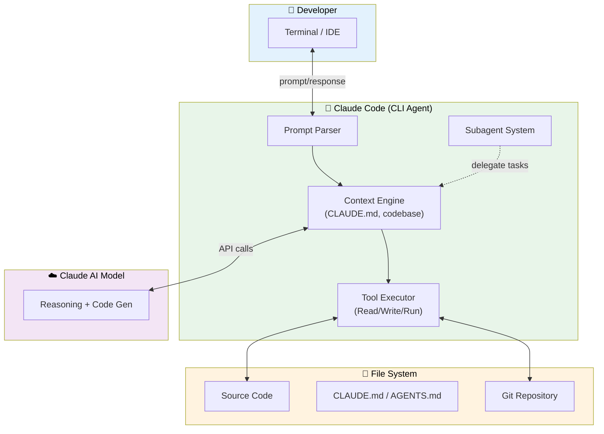

# Chương 1: Giới Thiệu Khóa Học và Thiết Lập Môi Trường Claude Code

Chương này cung cấp một cái nhìn tổng quan về khóa học và giới thiệu công cụ Claude Code, đồng thời hướng dẫn chi tiết quy trình thiết lập ban đầu. Mục tiêu là trang bị cho người học một nền tảng vững chắc để bắt đầu hành trình sử dụng Claude Code một cách hiệu quả, không chỉ về mặt lý thuyết mà còn thông qua các ứng dụng thực tế. Chúng ta sẽ khám phá Claude Code là gì, tầm quan trọng của nó đối với lập trình viên hiện đại, và cách thiết lập môi trường phát triển một cách an toàn và tối ưu.

## 1. Claude Code: Công Cụ AI Mạnh Mẽ Cho Lập Trình Viên

Claude Code là một công cụ giao diện dòng lệnh (CLI) tiên tiến được phát triển bởi Anthropic, chuyên dụng để tạo, sửa đổi và phân tích mã nguồn với sự hỗ trợ của Trí tuệ Nhân tạo (AI). Nó được thiết kế để nâng cao năng suất và chất lượng mã cho các nhà phát triển thông qua tương tác trực tiếp và có kiểm soát.

### 1.1. Claude Code Là Gì và Tầm Quan Trọng Của CLI

Claude Code là một ứng dụng CLI, cho phép người dùng tương tác trực tiếp với các mô hình AI tiên tiến của Anthropic thông qua terminal. Thay vì giao diện đồ họa người dùng (GUI), CLI cung cấp một phương thức tương tác mạnh mẽ, linh hoạt và có khả năng tự động hóa cao.

> [!NOTE] **Sức Mạnh của CLI (Command Line Interface)**
> CLI là một chương trình tương tác với người dùng thông qua các lệnh văn bản được nhập vào một terminal. Với CLI, lập trình viên có thể:
> *   **Tự động hóa tác vụ:** Viết script để thực hiện chuỗi lệnh phức tạp, tiết kiệm thời gian và giảm thiểu lỗi.
> *   **Hiệu quả cao:** Thực hiện các tác vụ nhanh hơn nhiều so với việc điều hướng qua các menu và cửa sổ GUI.
> *   **Tích hợp dễ dàng:** Dễ dàng tích hợp vào các quy trình CI/CD (Continuous Integration/Continuous Delivery), script build, hoặc các công cụ tự động hóa khác.
> *   **Kiểm soát chi tiết:** Cung cấp quyền kiểm soát sâu sắc hơn đối với hệ thống và ứng dụng.
>
> Claude Code tận dụng những ưu điểm này để mang lại một công cụ AI tạo mã vừa mạnh mẽ vừa linh hoạt, cho phép lập trình viên nhúng AI vào sâu trong quy trình làm việc của họ.

Mặc dù Claude Code chủ yếu là CLI, nó được thiết kế để có khả năng tích hợp mượt mà với các trình soạn thảo mã phổ biến (như Visual Studio Code), mang lại trải nghiệm làm việc liền mạch hơn bằng cách kết hợp sự linh hoạt của dòng lệnh với sự tiện lợi của môi trường phát triển tích hợp (IDE).

### 1.2. Hai Phương Pháp Tiếp Cận AI Tạo Mã: "Vibe Coding" và "Agentic Engineering"

Khi làm việc với các công cụ AI tạo mã như Claude Code, có hai triết lý tiếp cận chính mà lập trình viên có thể áp dụng, mỗi phương pháp có ưu nhược điểm riêng và phù hợp với các tình huống khác nhau.

#### 1.2.1. "Vibe Coding" (Lập trình Trực giác)

"Vibe Coding" là phương pháp nơi bạn phó thác một phần lớn hoặc toàn bộ quá trình viết mã cho AI. Người dùng đưa ra một yêu cầu tổng quát, mơ hồ hoặc chỉ là một "ý tưởng" (vibe), và AI sẽ cố gắng tạo ra mã hoàn chỉnh dựa trên sự hiểu biết ngữ cảnh và khả năng suy luận của nó.

*   **Ưu điểm:** Rất nhanh chóng cho các tác vụ đơn giản, tạo bản nháp ban đầu, hoặc khi bạn muốn khám phá các ý tưởng mà không cần đi sâu vào chi tiết. Nó giảm thiểu gánh nặng tư duy chi tiết cho lập trình viên.
*   **Nhược điểm:** Đòi hỏi sự tin tưởng cao vào khả năng của AI. Mã tạo ra có thể thiếu kiểm soát về cấu trúc, mẫu thiết kế cụ thể, hoặc không tuân thủ các quy tắc mã hóa nghiêm ngặt của dự án. Việc sửa đổi và bảo trì có thể phức tạp nếu mã không đạt chuẩn.

#### 1.2.2. "Agentic Engineering" (Kỹ thuật Tác nhân)

"Agentic Engineering" là phương pháp mà khóa học này khuyến khích và tập trung. Bạn duy trì quyền kiểm soát chặt chẽ đối với toàn bộ quá trình tạo mã. Mặc dù AI vẫn có thể tạo ra phần lớn mã, bạn sẽ cung cấp cho nó những hướng dẫn rõ ràng và chi tiết, đóng vai trò là kiến trúc sư và người giám sát:

*   **Định nghĩa rõ ràng:** Cung cấp các quy tắc kinh doanh, quy tắc mã hóa, thư viện/framework cụ thể, và mẫu thiết kế cần tuân theo.
*   **Phân rã tác vụ:** Chia nhỏ các tác vụ phức tạp thành các bước nhỏ hơn, dễ quản lý hơn để AI thực hiện.
*   **Đánh giá liên tục:** Thường xuyên xem xét, tinh chỉnh và kiểm tra mã do AI tạo ra để đảm bảo chất lượng, bảo mật và khả năng bảo trì.

> [!TIP] Phương pháp "Agentic Engineering" giúp tăng cường khả năng tạo ra mã chất lượng cao, đáng tin cậy và dễ bảo trì hơn, vì bạn luôn là người dẫn dắt và kiểm soát quá trình phát triển. Nó biến AI từ một công cụ "thay thế" thành một "cộng sự" mạnh mẽ, tăng cường năng lực của lập trình viên.

#### 1.2.3. Antigravity IDE: Cầu Nối Giữa "Vibe Coding" và "Agentic Engineering"

Trong bối cảnh của các hệ thống AI siêu việt như **Antigravity IDE** mà bạn đang trực tiếp sử dụng, ranh giới giữa "Vibe Coding" và "Agentic Engineering" trở nên linh hoạt hơn. Antigravity IDE là một hệ thống AI tác nhân cấp cao có khả năng:

*   **Lập kế hoạch tự động:** Phân tích yêu cầu tổng quát và tự động tạo ra một kế hoạch thực thi chi tiết.
*   **Chạy script ngầm:** Thực thi các lệnh, script shell, và tương tác với hệ thống tệp.
*   **Gọi Sub-agents:** Triệu tập các tác nhân phụ chuyên biệt (ví dụ: tác nhân duyệt web để tìm kiếm thông tin, tác nhân kiểm thử để chạy unit test).
*   **Đọc/Ghi file:** Tương tác trực tiếp với mã nguồn và tài nguyên dự án.

**Antigravity IDE cho phép bạn trải nghiệm "Vibe Coding" ở một cấp độ mới:**
Bạn có thể đưa ra một "vibe" rất cao cấp (ví dụ: "Tạo một tính năng đăng nhập đầy đủ với xác thực email và mật khẩu, sử dụng Next.js và Tailwind CSS, tích hợp với Firebase Auth"). Antigravity, với bản chất "Agentic Engineering" sâu bên trong, sẽ tự động:

1.  **Phân tích Vibe:** Hiểu ý định tổng quát.
2.  **Lập kế hoạch Agentic:** Chia nhỏ yêu cầu thành các bước cụ thể (ví dụ: "Tạo component form đăng nhập", "Viết API route cho Firebase", "Thiết lập CSS", "Viết unit test").
3.  **Sử dụng Công cụ:** Triệu tập các công cụ cần thiết. Ở đây, Antigravity có thể sử dụng **Claude Code CLI** như một trong những công cụ mạnh mẽ của mình để **sinh ra các khối mã cụ thể** (ví dụ: mã cho component form, hoặc các hàm xử lý xác thực).
4.  **Thực thi và Kiểm thử:** Chạy các bước đã lập kế hoạch, tự động sửa lỗi, và kiểm thử.

Bằng cách này, Antigravity IDE cho phép bạn duy trì tư duy "Vibe Coding" ở tầng giao tiếp với AI, trong khi hệ thống tự động thực hiện "Agentic Engineering" ở tầng thực thi. Điều này giúp bạn đạt được kết quả nhanh chóng với chất lượng cao, vì bạn đang giao tiếp ở mức độ trừu tượng cao nhất, và Antigravity đảm bảo các chi tiết kỹ thuật được xử lý một cách có hệ thống và chính xác, có thể tận dụng các công cụ như Claude Code để tối ưu hóa việc tạo mã.


*Kiến trúc Claude Code: Developer tương tác qua CLI → Context Engine đọc codebase + rules → gọi AI Model → thực thi tools (đọc/ghi/chạy code).*


## 2. Mục Tiêu Khóa Học và Lộ Trình Học Tập Chuyên Sâu

Mục tiêu chính của khóa học này là cung cấp cho bạn một cái nhìn toàn diện và chuyên sâu về Claude Code, từ những khái niệm cơ bản đến các tính năng nâng cao. Chúng tôi sẽ trang bị cho bạn tất cả các công cụ và kiến thức cần thiết để tăng cường khả năng tạo ra mã chất lượng cao với sự hỗ trợ của AI, đặc biệt là thông qua phương pháp "Agentic Engineering".

**Trong suốt khóa học, bạn sẽ học cách:**

*   **Thiết lập và Cấu hình Ban Đầu:** Nắm vững các cài đặt quan trọng, cách cấu hình Claude Code và các phương pháp sử dụng tổng quát.
*   **Quản lý Ngữ cảnh Hiệu quả:** Đi sâu vào cách bắt đầu và quản lý các phiên làm việc mới, cũng như cách quản lý bộ nhớ và ngữ cảnh giữa các phiên để Claude Code hiểu rõ hơn về dự án và các yêu cầu phức tạp của bạn.
*   **Xây dựng Sub-agents (Tác nhân phụ):** Khám phá khái niệm về các tác nhân phụ, khi nào và tại sao nên sử dụng chúng để phân chia các tác vụ phức tạp thành các module AI chuyên biệt.
*   **Kỹ năng Tác nhân (Agent Skills):** Học cách xây dựng và áp dụng các kỹ năng cụ thể cho tác nhân AI của bạn để tự động hóa các quy trình lặp đi lặp lại hoặc thực hiện các tác vụ chuyên biệt, nâng cao khả năng tự chủ của AI.
*   **Tính năng Nâng cao và Mở rộng:** Tìm hiểu về Claude Code hooks (các điểm mở rộng cho phép tùy chỉnh hành vi của Claude Code) và khám phá khái niệm đằng sau plugins để mở rộng khả năng của Claude Code thông qua các công cụ bên ngoài.
*   **Mẫu và Trường hợp Sử dụng Thực tế:** Chúng tôi sẽ chia sẻ các mẫu sử dụng Claude Code hiệu quả, cùng với các trường hợp sử dụng cụ thể nơi Claude Code và các tính năng của nó có thể phát huy tối đa sức mạnh trong các dự án thực tế.

Tất cả các kiến thức này sẽ được minh họa thông qua việc xây dựng một dự án ví dụ hoàn chỉnh, giúp bạn thấy các tính năng của Claude Code hoạt động trong thực tế, thay vì chỉ là lý thuyết khô khan.

## 3. Thiết Lập Môi Trường Phát Triển Với Claude Code

Để bắt đầu sử dụng Claude Code, bước đầu tiên và quan trọng nhất là thiết lập môi trường làm việc của bạn.

### 3.1. Yêu Cầu Hệ Thống và Quy Trình Cài Đặt Chi Tiết

*   **Khả năng tương thích:** Claude Code được thiết kế để hoạt động trên tất cả các hệ điều hành phổ biến: Windows, macOS và Linux.
*   **Quy trình cài đặt:**
    1.  **Truy cập hướng dẫn chính thức:** Luôn tham khảo trang tài liệu chính thức của Anthropic để có hướng dẫn cài đặt chi tiết và cập nhật nhất. Tại đó, bạn có thể sao chép và dán các lệnh cài đặt phù hợp với hệ điều hành của mình.
    2.  **Cài đặt qua dòng lệnh:** Là một công cụ CLI, Claude Code được cài đặt và quản lý thông qua terminal của bạn, thường là qua các trình quản lý gói hệ thống (ví dụ: `npm`, `pip`, `brew` tùy thuộc vào cách Anthropic đóng gói).

    > [!NOTE] **Yêu cầu API Key: Cổng vào AI của Anthropic**
    > Hầu hết các công cụ AI CLI như Claude Code đều yêu cầu bạn thiết lập một khóa API (API Key). Khóa API này đóng vai trò là:
    > *   **Xác thực:** Chứng minh bạn là người dùng hợp lệ và được ủy quyền truy cập các dịch vụ AI của Anthropic.
    > *   **Ủy quyền:** Xác định quyền truy cập của bạn (ví dụ: mô hình AI nào bạn có thể sử dụng, giới hạn tốc độ yêu cầu).
    > *   **Thanh toán:** Liên kết các yêu cầu của bạn với tài khoản thanh toán để tính phí sử dụng dịch vụ AI.
    >
    > Đảm bảo bạn đã đăng ký tài khoản Anthropic, tạo và cấu hình khóa API này theo hướng dẫn cài đặt chính thức. Thông thường, khóa API sẽ được lưu trữ dưới dạng biến môi trường (ví dụ: `ANTHROPIC_API_KEY`) hoặc trong một tệp cấu hình chuyên dụng để Claude Code có thể tự động tìm thấy và sử dụng nó. **Tuyệt đối không nhúng trực tiếp API Key vào mã nguồn hoặc chia sẻ công khai.**

### 3.2. Tương Tác và Tích Hợp Claude Code

Claude Code chủ yếu là một công cụ dòng lệnh và không có giao diện người dùng đồ họa (GUI) độc lập. Bạn sẽ tương tác với nó thông qua terminal, nơi bạn nhập các lệnh và nhận phản hồi văn bản từ AI.

Tuy nhiên, để tối ưu hóa trải nghiệm, Claude Code có thể hoạt động tích hợp với một số trình soạn thảo mã (ví dụ: thông qua các tiện ích mở rộng hoặc chế độ tích hợp terminal). Điều này mang lại trải nghiệm gần giống GUI cho một số chức năng nhất định, cho phép bạn:

*   Gọi Claude Code trực tiếp từ IDE.
*   Chèn mã do AI tạo ra vào trình soạn thảo hiện tại.
*   Sử dụng ngữ cảnh từ các tệp đang mở trong IDE để cung cấp cho AI.

### 3.3. Chuẩn Bị Dự Án Mẫu: Next.js và Visual Studio Code

Trong khóa học này, chúng ta sẽ sử dụng Visual Studio Code (VS Code) làm trình soạn thảo mã chính và một dự án Next.js cơ bản làm ví dụ thực hành.

*   **Visual Studio Code (VS Code):** Đây là một trình soạn thảo mã nguồn mạnh mẽ, miễn phí và mã nguồn mở, được phát triển bởi Microsoft. Nó hỗ trợ hàng trăm ngôn ngữ lập trình, có một hệ sinh thái tiện ích mở rộng phong phú và là lựa chọn phổ biến hàng đầu trong cộng đồng phát triển.
*   **Dự án Next.js:** Chúng ta sẽ bắt đầu với một dự án Next.js cơ bản để minh họa cách Claude Code hỗ trợ phát triển web full-stack.

    > [!NOTE] **Next.js là gì?**
    > Next.js là một framework React mã nguồn mở phổ biến để xây dựng các ứng dụng web full-stack hiệu suất cao. Nó nổi bật với các tính năng như:
    > *   **Server-Side Rendering (SSR) và Static Site Generation (SSG):** Giúp cải thiện SEO và tốc độ tải trang.
    > *   **API Routes:** Cho phép bạn xây dựng các API backend trực tiếp trong dự án Next.js.
    > *   **Tối ưu hóa hình ảnh, font chữ:** Tích hợp sẵn để nâng cao hiệu suất.
    >
    > Việc sử dụng Next.js làm nền tảng sẽ giúp chúng ta khám phá khả năng của Claude Code trong việc xử lý cả mã frontend và backend, cũng như các tác vụ liên quan đến cấu hình framework.

*   **Mở Terminal trong VS Code:** Trong VS Code, bạn có thể dễ dàng mở terminal tích hợp bằng cách vào `View > Terminal` hoặc sử dụng phím tắt `Ctrl + \` (trên Windows/Linux) hoặc `Cmd + \` (trên macOS). Đây là nơi bạn sẽ nhập các lệnh Claude Code và tương tác với AI.

### 3.4. Khởi Chạy Claude Code và Nguyên Tắc Bảo Mật Quan Trọng

Khi bạn chạy Claude Code lần đầu tiên trong một thư mục dự án mới, bạn sẽ thường nhận được một cảnh báo hoặc yêu cầu xác nhận về việc "tin cậy thư mục này". Đây là một tính năng bảo mật thiết yếu.

> [!WARNING] **Cảnh báo Bảo mật Quan trọng: Hiểu Rõ Quyền Hạn của Claude Code**
> Claude Code, với tư cách là một công cụ AI tác nhân, sẽ hoạt động trực tiếp trên dự án của bạn. Điều này có nghĩa là nó không chỉ có khả năng *viết mã* và *chỉnh sửa các tệp hiện có*, mà còn có thể *đọc bất kỳ tệp nào* trong thư mục dự án và *thực thi các lệnh hệ thống* (ví dụ: chạy thử nghiệm tự động, cài đặt gói phụ thuộc, xóa tệp) trong ngữ cảnh của thư mục đó.
>
> **Do đó, bạn TUYỆT ĐỐI không nên chạy Claude Code trên bất kỳ thư mục nào không đáng tin cậy hoặc có thể chứa phần mềm độc hại.** Luôn đảm bảo bạn tin tưởng hoàn toàn vào dự án, nguồn gốc của nó, và các thành phần bên trong trước khi cho phép Claude Code tương tác. Việc cấp quyền cho một AI chạy lệnh và sửa đổi tệp trong một môi trường không an toàn có thể dẫn đến:
> *   **Mất dữ liệu:** Xóa hoặc sửa đổi tệp không mong muốn.
> *   **Rò rỉ thông tin:** AI đọc và gửi dữ liệu nhạy cảm ra ngoài.
> *   **Thực thi mã độc:** AI vô tình (hoặc cố ý nếu bị khai thác) thực thi các script độc hại có trong dự án.
>
> Hãy luôn coi Claude Code như một lập trình viên đồng nghiệp có toàn quyền truy cập vào dự án của bạn và hành động cẩn trọng tương ứng.

Dưới đây là ví dụ về cách bạn sẽ khởi chạy Claude Code trong terminal của dự án và tương tác ban đầu:

```bash
# Giả sử bạn đang ở trong thư mục gốc của dự án Next.js của mình
# Mở Terminal trong Visual Studio Code (hoặc bất kỳ terminal nào bạn chọn)

# Lệnh cơ bản để khởi động phiên Claude Code
# Lần đầu tiên chạy trong một dự án, Claude Code sẽ yêu cầu bạn xác nhận tin cậy thư mục này.
claude

# Sau khi bạn xác nhận tin cậy thư mục, bạn sẽ vào giao diện tương tác của Claude Code.
# Giao diện này có thể là một dấu nhắc lệnh đặc biệt hoặc một chế độ tương tác.
# Từ đây, bạn có thể bắt đầu nhập các yêu cầu (prompts) của mình để AI tạo mã.

# Ví dụ về một yêu cầu (prompt) bạn có thể nhập trong phiên Claude Code:
# > create a new React component called 'Card' in 'components/Card.tsx'.
# > It should accept 'title' and 'description' as props and display them within a styled div.
# > Use a simple CSS module for basic styling with a border, padding, and subtle shadow.

# Claude Code sẽ phân tích yêu cầu này, tạo mã tương ứng, và có thể đề xuất các thay đổi
# hoặc yêu cầu xác nhận trước khi áp dụng chúng vào dự án của bạn.
# Nó có thể hỏi thêm các câu hỏi làm rõ để đảm bảo mã đúng với ý định của bạn.

# Để thoát khỏi phiên Claude Code (trong trường hợp tương tác bằng terminal),
# bạn thường có thể sử dụng tổ hợp phím Ctrl+C hoặc một lệnh cụ thể như 'exit' hoặc 'quit' nếu được hỗ trợ.
```

## Tóm Tắt Chương 1: Giới Thiệu Khóa Học và Thiết Lập Ban Đầu

*   **Claude Code** là một công cụ AI CLI mạnh mẽ từ Anthropic, được thiết kế để hỗ trợ lập trình viên trong việc sinh mã, sửa đổi và phân tích. Sức mạnh của CLI nằm ở khả năng tự động hóa và kiểm soát chi tiết.
*   Khóa học tập trung vào **"Agentic Engineering"**, một phương pháp tiếp cận có kiểm soát, nơi bạn hướng dẫn AI với các yêu cầu chi tiết để tạo ra mã chất lượng cao, đáng tin cậy.
*   **"Vibe Coding"** là phương pháp tiếp cận trực giác hơn, nơi AI nhận yêu cầu tổng quát. **Antigravity IDE** là một hệ thống AI tác nhân siêu việt có thể giúp bạn áp dụng tư duy "Vibe Coding" ở cấp độ cao, trong khi nó tự động thực hiện "Agentic Engineering" ở cấp độ thực thi, có thể sử dụng Claude Code như một công cụ cốt lõi.
*   Mục tiêu của khóa học là cung cấp kiến thức toàn diện về Claude Code, bao gồm thiết lập, quản lý ngữ cảnh, sub-agents, skills, hooks và plugins, thông qua một dự án thực tế.
*   **Thiết lập Claude Code** bao gồm cài đặt CLI trên mọi hệ điều hành và cấu hình API Key cần thiết để xác thực và truy cập dịch vụ AI.
*   **Bảo mật** là yếu tố tối quan trọng: chỉ chạy Claude Code trên các dự án đáng tin cậy do khả năng đọc/ghi tệp và thực thi lệnh hệ thống.
*   **Visual Studio Code** và một dự án **Next.js** cơ bản sẽ là môi trường phát triển chính cho các ví dụ và thực hành trong khóa học.

<!-- REVIEWED_BY_AGENT -->
