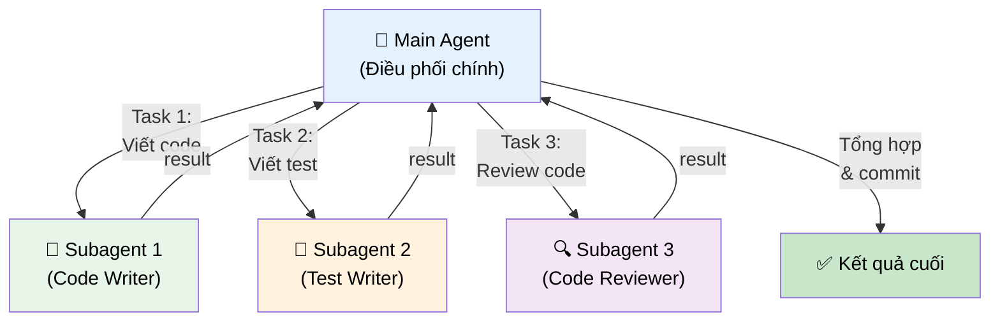

# Phần 6: Kiến Trúc Agentic Trong Claude Code: Tối Ưu Hóa Quy Trình Phát Triển Với Agent và Subagent

Trong bối cảnh phát triển phần mềm hiện đại, việc tích hợp trí tuệ nhân tạo (AI) không còn là một lựa chọn mà đã trở thành một yếu tố then chốt để nâng cao năng suất và chất lượng. `Claude Code`, một công cụ AI dựa trên giao diện dòng lệnh (CLI) mạnh mẽ từ Anthropic, được thiết kế để trở thành trợ lý lập trình viên đắc lực, hỗ trợ từ việc viết mã, gỡ lỗi, đến nghiên cứu và lập kế hoạch dự án. Để thực sự khai thác tối đa tiềm năng của `Claude Code`, việc nắm vững kiến trúc "agentic" của nó, đặc biệt là các khái niệm về "Agent" (tác nhân) và "Subagent" (tác nhân phụ), là điều cốt yếu.

Chương này sẽ đi sâu vào cách `Claude Code` tổ chức và thực hiện các nhiệm vụ phức tạp thông qua hệ thống agent thông minh của nó. Chúng ta sẽ khám phá cách các `MCP Servers` mở rộng khả năng của `Claude Code`, tìm hiểu về vai trò của các subagent tích hợp sẵn, và đặc biệt là cách kiến tạo cũng như khuyến khích `Claude Code` sử dụng các subagent tùy chỉnh để tối ưu hóa quy trình làm việc. Mục tiêu là trang bị cho bạn kiến thức để biến `Claude Code` thành một cộng sự thông minh, hiệu quả và có khả năng thích ứng cao với mọi yêu cầu của dự án.

Đặc biệt, chúng ta sẽ liên hệ các nguyên lý này với các hệ thống Agentic AI tiên tiến hơn như "Antigravity IDE" – một môi trường phát triển siêu việt có khả năng tự chạy script ngầm, điều khiển subagent trình duyệt, thực hiện đọc/ghi file và lập kế hoạch tự động. Hiểu `Claude Code` sẽ là nền tảng để bạn áp dụng tư duy "Vibe Coding" vào các hệ thống như Antigravity, nơi bạn thiết lập "tâm trạng" và "ngữ cảnh" cho AI để nó tự động thực hiện các tác vụ phức tạp với sự tự chủ cao.

## 1. Mở Rộng Khả Năng Của Claude Code Với MCP Servers

`Claude Code` vượt trội trong việc thực hiện các tác vụ nhờ khả năng truy cập và tận dụng các công cụ bên ngoài. Một trong những cơ chế mạnh mẽ nhất để mở rộng kho công cụ này là thông qua `MCP Servers`.

### 1.1. MCP (Model Context Protocol) là gì?

> [!NOTE]
> `MCP` là viết tắt của `Model Context Protocol`. Đây là một tiêu chuẩn giao thức cho phép các mô hình AI như `Claude Code` truy cập và tận dụng các công cụ và tài nguyên bên ngoài một cách có cấu trúc. Mục tiêu chính của `MCP` là cung cấp cho `Claude Code` một "hộp công cụ" mở rộng, cho phép nó tự động lựa chọn và sử dụng công cụ phù hợp khi cần thiết.

Về cơ bản, `MCP` định nghĩa một cách để `Claude Code` tương tác với các dịch vụ bên ngoài. Khi `Claude Code` nhận được một yêu cầu, bộ phận lập luận nội tại của nó sẽ phân tích nhiệm vụ và so sánh với mô tả của các công cụ `MCP` đã được đăng ký. Nếu một công cụ `MCP` có vẻ phù hợp để giải quyết một phần hoặc toàn bộ nhiệm vụ, `Claude Code` sẽ khởi tạo và ủy quyền tác vụ đó cho công cụ tương ứng. Quá trình này tương tự như cách `Claude Code` thực hiện tìm kiếm web khi được yêu cầu, nhưng với các công cụ chuyên biệt hơn và có cấu trúc.

Có rất nhiều loại `MCP Servers` khác nhau mà bạn có thể tích hợp vào `Claude Code`, mỗi loại phục vụ một mục đích riêng (ví dụ: truy cập cơ sở dữ liệu, thực thi mã, gọi API bên ngoài, tìm kiếm tài liệu chuyên sâu). `Claude Code` sẽ tự động tận dụng các tài nguyên này khi nó xác định rằng chúng cần thiết cho nhiệm vụ hiện tại.

**Liên hệ với Antigravity IDE:**
Trong các hệ thống Agentic AI tiên tiến như Antigravity IDE, khái niệm `MCP` được mở rộng và tích hợp sâu sắc hơn. Antigravity không chỉ có thể gọi các `MCP Servers` mà còn có thể có các "công cụ nội tại" (intrinsic tools) như một `Browser Agent` (để duyệt web, tương tác với UI), một `File I/O Agent` (để đọc/ghi file trong hệ thống), hay một `Shell Agent` (để thực thi các lệnh terminal). Các công cụ này được quản lý thông qua một giao thức nội bộ tương tự như `MCP`, cho phép Antigravity tự động lựa chọn công cụ phù hợp để thực hiện các bước trong kế hoạch của mình, ví dụ: "tìm thông tin trên Stack Overflow" (Browser Agent), "chỉnh sửa file `package.json`" (File I/O Agent), "chạy `npm install`" (Shell Agent).

### 1.2. Giới Thiệu MCP Server Context7

Một `MCP Server` đặc biệt hữu ích cho các nhà phát triển là `Context7 MCP server`.

> [!TIP]
> `Context7 MCP server` được thiết kế để cung cấp cho `Claude Code` quyền truy cập dễ dàng hơn vào tài liệu chính thức của các thư viện và framework. Nó giúp `Claude Code` duyệt và hiểu tài liệu một cách hiệu quả hơn, giảm đáng kể thời gian tìm kiếm thủ công và tăng cường độ chính xác của thông tin.

Thay vì dựa vào tìm kiếm web chung chung, `Context7` tập trung vào việc lập chỉ mục và truy vấn các nguồn tài liệu kỹ thuật đáng tin cậy. Điều này đặc biệt quan trọng vì LLM thường gặp khó khăn với các trang web có nhiều quảng cáo, nội dung không liên quan hoặc cấu trúc phức tạp. `Context7` cung cấp một giao diện sạch sẽ, có cấu trúc để truy xuất thông tin, giúp `Claude Code` tập trung vào nội dung cốt lõi.

**Cơ chế hoạt động của Context7:**
`Context7` hoạt động bằng cách thu thập và tổ chức các tài liệu chính thức từ nhiều nguồn khác nhau. Khi `Claude Code` gọi `Context7`, nó không chỉ thực hiện tìm kiếm từ khóa mà còn có thể truy vấn ngữ nghĩa, điều hướng qua cấu trúc tài liệu và trích xuất các đoạn văn bản liên quan một cách có mục đích. Điều này đảm bảo thông tin được trả về không chỉ chính xác mà còn phù hợp với ngữ cảnh của nhiệm vụ.

**Cách cài đặt `Context7 MCP server`:**

Bạn có thể tìm hướng dẫn cài đặt chi tiết trên trang GitHub của `Context7 MCP server`. Quy trình cài đặt rất đơn giản:

1.  Mở terminal hoặc command prompt.
2.  Chạy lệnh sau để cài đặt `Context7 MCP server` cho `Claude Code` của bạn:

    ```bash
    claude mcp install context7
    ```

    > [!NOTE]
    > Bạn có thể bỏ qua phần `API key` nếu muốn sử dụng miễn phí (với giới hạn truy cập nhất định). Việc trả phí sẽ giúp bạn có giới hạn truy cập cao hơn và không bị gián đoạn.

3.  Sau khi cài đặt, bạn có thể xác minh rằng `MCP server` đã được thêm thành công bằng cách mở `Claude Code` và chạy lệnh `/mcp`. Bạn sẽ thấy `Context7` được liệt kê trong danh sách các `MCP servers` đã cài đặt.

**Cài đặt toàn cục (Global Scope):**

Nếu bạn muốn tất cả các dự án của mình đều có quyền truy cập vào `Context7 MCP server` mà không cần cài đặt lại cho từng dự án, bạn có thể cài đặt nó ở phạm vi người dùng (user scope):

```bash
claude mcp install context7 --scope user
```

Lệnh này sẽ thêm `Context7` như một `MCP server` toàn cục vào hệ thống của bạn, có thể truy cập từ bất kỳ dự án `Claude Code` nào.

### 1.3. Sử Dụng MCP Servers trong Claude Code

Khi `Context7 MCP server` đã được cài đặt, `Claude Code` có thể sử dụng nó để duyệt tài liệu. Để khuyến khích `Claude Code` sử dụng công cụ này, bạn có thể thêm các hướng dẫn cụ thể vào prompt của mình.

**Ví dụ Prompt:**

```
// (Các yêu cầu công việc của bạn)
// ...
// Sử dụng web search hoặc Context7 MCP để tìm tài liệu liên quan.
```

Điều này cung cấp cho `Claude Code` một công cụ bổ sung để khám phá và tìm kiếm ngữ cảnh cần thiết cho prompt. `Claude Code` sẽ sử dụng mô tả của `Context7` (được đăng ký khi cài đặt) để hiểu chức năng của nó và quyết định khi nào nên gọi.

> [!TIP]
> Nếu bạn đã biết chính xác các nguồn tài liệu cần thiết, cách an toàn nhất là sao chép trực tiếp nội dung đó vào prompt. Điều này đảm bảo rằng `Claude Code` có thông tin chính xác mà không cần tìm kiếm. Tuy nhiên, khi bạn không chắc chắn hoặc muốn `Claude Code` tự động tìm kiếm, việc dựa vào `web search` và `MCP servers` như `Context7` là rất hiệu quả, đặc biệt là khi cần thông tin chi tiết và đáng tin cậy.

**Chế độ hoạt động của Claude Code và MCP:**
`Claude Code` có nhiều chế độ hoạt động để bạn tương tác:

*   **Plan Mode:** `Claude Code` sẽ tạo ra một kế hoạch chi tiết trước khi thực hiện công việc. Trong chế độ này, `Claude Code` có thể lập kế hoạch sử dụng các `MCP Servers` để thu thập thông tin cần thiết trước khi bắt tay vào thực hiện các bước tiếp theo. Đây là chế độ lý tưởng khi bạn muốn `Claude Code` suy nghĩ và tổ chức công việc một cách có hệ thống.
*   **Edit Mode:** `Claude Code` sẽ trực tiếp chỉnh sửa mã nguồn hoặc tệp tin. Các `MCP Servers` có thể được sử dụng để tra cứu cú pháp, API hoặc các mẫu thiết kế trong quá trình chỉnh sửa.
*   **Reply Mode:** `Claude Code` chỉ đơn thuần trả lời câu hỏi hoặc phân tích mà không thực hiện chỉnh sửa hay lập kế hoạch. Ngay cả trong chế độ này, `MCP Servers` vẫn hữu ích để `Claude Code` tra cứu thông tin và đưa ra câu trả lời chính xác và đầy đủ hơn.

Khi `Claude Code` lần đầu tiên sử dụng một `MCP server`, nó có thể yêu cầu bạn cấp quyền. Đây là một dấu hiệu tốt cho thấy `Claude Code` đang cố gắng tận dụng các công cụ mà bạn đã cung cấp, đồng thời cung cấp cho bạn quyền kiểm soát về các hành động của AI.

**Ví dụ thực tế:**

Giả sử bạn yêu cầu `Claude Code` lập kế hoạch triển khai cơ sở dữ liệu và xác thực cho một dự án sử dụng `Bun` và `Next.js`. Với `Context7 MCP server` được cài đặt và hướng dẫn phù hợp, `Claude Code` có thể:

1.  **Lập kế hoạch:** Chuyển sang `Plan Mode`.
2.  **Tra cứu tài liệu:**
    *   Sử dụng `Context7 MCP` để tìm kiếm tài liệu về `bun SQLite` nhằm thiết lập cơ sở dữ liệu, bao gồm cả việc cấu hình chế độ `WAL` (Write-Ahead Logging) để cải thiện hiệu suất.
    *   Thiết lập các bảng cần thiết (`user`, `session`, `account`, `verification`, `notes`) dựa trên các mẫu thực hành tốt nhất được tìm thấy.
    *   Tiếp tục sử dụng `Context7 MCP` để tìm kiếm tài liệu về thư viện xác thực `BetterAuth` cho `Next.js`, bao gồm cách cấu hình file `auth.ts`, sử dụng `to-next-js handler` và các thành phần khác được khuyến nghị (ví dụ: các plugin cần thiết).
3.  **Thực thi:** Sau khi thu thập đủ thông tin, `Claude Code` sẽ chuyển sang `Edit Mode` để tạo hoặc chỉnh sửa các tệp cần thiết.

> [!NOTE]
> Chế độ `WAL` (Write-Ahead Logging) trong `SQLite` là một cơ chế ghi nhật ký giao dịch tiên tiến giúp cải thiện đáng kể hiệu suất đọc/ghi, đặc biệt trong các tình huống có nhiều truy vấn đọc đồng thời và ghi dữ liệu. Nó cũng tăng cường độ bền và khả năng phục hồi của cơ sở dữ liệu bằng cách ghi các thay đổi vào một tệp nhật ký riêng biệt trước khi áp dụng chúng vào tệp cơ sở dữ liệu chính.

Khả năng lập kế hoạch chi tiết và chính xác này là nhờ vào việc cung cấp ngữ cảnh rõ ràng và các công cụ tìm kiếm tài liệu chuyên biệt như `Context7 MCP`, giúp `Claude Code` tiếp cận thông tin đáng tin cậy một cách hiệu quả.



*Main Agent chia task cho các Subagent chạy song song, sau đó tổng hợp kết quả. Mỗi Subagent có context riêng.*

## 2. Khám Phá Kiến Trúc Subagent Trong Claude Code

Khi `Claude Code` thực hiện các tác vụ phức tạp, nó thường không làm việc đơn lẻ mà sẽ tận dụng một mạng lưới các "Subagent" (tác nhân phụ). Đây là một tính năng cốt lõi giúp `Claude Code` hoạt động hiệu quả, thông minh và có khả năng mở rộng.

### 2.1. Subagent là gì và tầm quan trọng của chúng?

> [!NOTE]
> **Subagent** trong `Claude Code` là các tác nhân AI chuyên biệt, được thiết kế và tối ưu hóa để thực hiện các nhiệm vụ cụ thể, thường là một phần của một tác vụ lớn hơn. `Claude Code` (với vai trò là tác nhân chính hoặc tác nhân điều phối) có thể ủy quyền một phần công việc cho các subagent này, cho phép nó chia nhỏ các tác vụ lớn thành các khối nhỏ hơn, dễ quản lý và thực thi độc lập hơn.

Có ba lý do chính khiến kiến trúc subagent trở nên vô cùng hữu ích và là một yếu tố then chốt trong các hệ thống Agentic AI hiện đại:

1.  **Xử lý song song (Parallel Processing):** `Claude Code` có thể khởi tạo nhiều subagent để thực hiện các công việc khác nhau cùng một lúc. Điều này giúp tăng tốc độ hoàn thành nhiệm vụ tổng thể đáng kể. Bạn có thể nhận biết điều này khi thấy nhiều "tasks" (nhiệm vụ) chạy đồng thời trong giao diện `Claude Code` CLI, mỗi task có thể đại diện cho một subagent đang hoạt động. Ví dụ, một subagent đang đọc cấu trúc dự án trong khi một subagent khác đang tra cứu tài liệu liên quan.
    *   **Cơ chế ngầm:** `Claude Code` quản lý một hàng đợi các tác vụ và một nhóm các tiến trình hoặc luồng thực thi. Khi một tác vụ lớn được chia nhỏ thành các nhiệm vụ phụ thích hợp cho subagent, nó sẽ gán mỗi nhiệm vụ phụ cho một subagent và khởi chạy chúng song song, tối đa hóa việc sử dụng tài nguyên.
2.  **Chuyên môn hóa (Specialized Expertise):** Mỗi subagent có thể được tối ưu hóa cho một loại nhiệm vụ cụ thể. Điều này đạt được thông qua việc cấu hình prompt, công cụ và đôi khi là mô hình LLM riêng cho từng subagent. Ví dụ, có subagent chuyên đọc và hiểu cấu trúc thư mục/tệp, subagent chuyên tìm kiếm tài liệu, hoặc subagent chuyên về gỡ lỗi mã. Điều này đảm bảo rằng công việc được thực hiện bởi "chuyên gia" phù hợp nhất, nâng cao chất lượng và độ chính xác của kết quả.
    *   **Cơ chế ngầm:** Việc chuyên môn hóa giúp giảm "không gian tìm kiếm" cho LLM của subagent, cho phép nó tập trung vào các kiến thức và kỹ năng cụ thể, từ đó đưa ra các quyết định và hành động hiệu quả hơn trong lĩnh vực của mình.
3.  **Quản lý cửa sổ ngữ cảnh (Context Window Management):** Đây là một lợi ích cực kỳ quan trọng và là lý do chính khiến kiến trúc agentic trở nên cần thiết cho các tác vụ phức tạp. Các subagent có cửa sổ ngữ cảnh riêng của chúng. Điều này có nghĩa là chúng thực hiện công việc mà không "làm ô nhiễm" cửa sổ ngữ cảnh của tác nhân chính. Thay vì đưa toàn bộ thông tin chi tiết của nhiệm vụ phụ (ví dụ: hàng trăm dòng tài liệu, toàn bộ cấu trúc thư mục) vào ngữ cảnh chính, tác nhân chính chỉ nhận được kết quả hoặc tóm tắt cuối cùng từ subagent.
    *   **Cơ chế ngầm:**
        *   **Giảm chi phí:** Mỗi token trong cửa sổ ngữ cảnh đều tốn chi phí xử lý. Bằng cách giới hạn ngữ cảnh cho subagent và chỉ truyền kết quả tóm tắt, tổng số token được xử lý bởi tác nhân chính giảm đáng kể.
        *   **Tăng hiệu suất:** Mô hình chính không bị quá tải với lượng lớn thông tin không liên quan trực tiếp đến việc ra quyết định cấp cao, giúp nó phản hồi nhanh hơn.
        *   **Cải thiện độ chính xác và tập trung:** Việc "ô nhiễm" ngữ cảnh bởi quá nhiều thông tin chi tiết có thể khiến mô hình chính mất tập trung, bỏ qua các chi tiết quan trọng hoặc đưa ra các quyết định kém tối ưu. Subagent giúp giữ cho ngữ cảnh chính luôn gọn gàng, tập trung vào các vấn đề chiến lược.
        *   **Vượt qua giới hạn cửa sổ ngữ cảnh:** Các tác vụ phức tạp thường yêu cầu nhiều thông tin hơn khả năng xử lý của một LLM duy nhất. Kiến trúc subagent cho phép phân phối thông tin này qua nhiều "bộ não" nhỏ hơn, mỗi bộ não xử lý một phần thông tin giới hạn nhưng sâu sắc.

**Liên hệ với Antigravity IDE:**
Trong Antigravity IDE, quản lý ngữ cảnh là trọng tâm của thiết kế. Antigravity sử dụng các subagent (như Browser Agent, File I/O Agent, Planning Agent) không chỉ để thực hiện các tác vụ cụ thể mà còn để quản lý cửa sổ ngữ cảnh một cách chiến lược. Ví dụ, khi Browser Agent duyệt một trang web, nó sẽ tóm tắt thông tin quan trọng và chỉ gửi bản tóm tắt đó về tác nhân chính, thay vì toàn bộ HTML của trang. Tương tự, File I/O Agent có thể đọc một file lớn, nhưng chỉ trích xuất các hàm hoặc lớp liên quan mà tác nhân chính cần, tránh "ô nhiễm" ngữ cảnh. Đây là một nguyên tắc cốt lõi giúp Antigravity xử lý các dự án lớn và phức tạp mà không bị quá tải thông tin.

### 2.2. Các Subagent Tích Hợp Sẵn

`Claude Code` đi kèm với một số subagent tích hợp sẵn mà nó sẽ tự động sử dụng khi cần thiết, dựa trên mô tả chức năng của chúng và ngữ cảnh của prompt.

**Ví dụ: Explore Agent**

Một trong những subagent phổ biến và hữu ích nhất là `explore agent`. Agent này được tối ưu hóa để đọc, phân tích và hiểu cấu trúc các tệp và thư mục trong dự án của bạn. Khi bạn yêu cầu `Claude Code` phân tích một codebase, nó có thể ủy quyền việc khám phá cấu trúc dự án cho `explore agent`.

*   **Ví dụ hoạt động:** Nếu bạn yêu cầu "Hãy xem xét cấu trúc dự án này và đề xuất một nơi tốt để thêm một API endpoint mới cho người dùng," `Claude Code` sẽ khởi tạo `explore agent`. `explore agent` sau đó sẽ duyệt qua các thư mục `src/api`, `src/routes` hoặc tương tự, phân tích các tệp hiện có để hiểu các mẫu thiết kế và quy ước, và sau đó báo cáo lại cho tác nhân chính một cái nhìn tổng quan gọn gàng cùng với đề xuất vị trí tối ưu.

**Cách nhận biết Subagent đang hoạt động:**

*   **Nhiệm vụ song song:** Bạn sẽ thấy các nhiệm vụ (tasks) khác nhau chạy đồng thời trong giao diện terminal của `Claude Code`. Ví dụ, `explore agent` đang khám phá tệp trong khi tác nhân chính đang thực hiện các bước khác của kế hoạch.
*   **Thông báo tiêu thụ token và thời gian:** `Claude Code` thường hiển thị thông tin chi tiết về số lượng token được tiêu thụ và thời gian thực hiện của các subagent, giúp bạn nhận biết chúng đang làm việc và đánh giá hiệu quả.
*   **Nhật ký hoạt động:** Trong các file nhật ký hoặc giao diện gỡ lỗi (nếu có), bạn sẽ thấy các mục nhập chỉ ra rằng một subagent cụ thể đã được khởi tạo và thực hiện một hành động nào đó.

Tóm lại, tính năng subagent là một phần quan trọng của `Claude Code`, giúp nó xử lý các công việc phức tạp một cách nhanh chóng, hiệu quả và có tổ chức, đồng thời quản lý tối ưu cửa sổ ngữ cảnh, là một bước đệm quan trọng để hiểu các hệ thống Agentic AI toàn diện hơn.

## 3. Xây Dựng và Sử Dụng Subagent Tùy Chỉnh

Mặc dù các subagent tích hợp sẵn rất hữu ích, nhưng đôi khi bạn cần một subagent được tùy chỉnh để giải quyết một vấn đề cụ thể hoặc tối ưu hóa một quy trình làm việc theo yêu cầu độc đáo của dự án. Đây là lúc sức mạnh thực sự của kiến trúc agentic được thể hiện.

### 3.1. Tại sao cần Subagent tùy chỉnh?

Xem xét ví dụ về việc tra cứu tài liệu: nếu tác nhân chính phải tự mình đọc từng bài viết tài liệu, điều này không chỉ tốn thời gian mà còn "làm ô nhiễm" cửa sổ ngữ cảnh với lượng lớn văn bản không cần thiết cho quyết định cấp cao. Một subagent chuyên biệt để khám phá tài liệu có thể giải quyết vấn đề này.

**Ví dụ khác:**

*   Một subagent chuyên về kiểm tra mã (Linting Agent) có thể được tạo ra để tự động chạy các công cụ linting và phân tích báo cáo, sau đó tóm tắt các vấn đề quan trọng cho tác nhân chính.
*   Một subagent chuyên về kiểm thử (Testing Agent) có thể được giao nhiệm vụ viết các bài kiểm thử đơn vị hoặc kiểm thử tích hợp dựa trên các yêu cầu, sau đó báo cáo kết quả.
*   Một subagent chuyên về tối ưu hóa hiệu suất (Performance Agent) có thể phân tích mã, đề xuất các cải tiến về thuật toán hoặc cấu trúc dữ liệu, và thậm chí chạy các benchmark đơn giản.

Các subagent tùy chỉnh cho phép bạn "mã hóa" các quy trình làm việc và chuyên môn hóa cụ thể của mình vào hành vi của AI, biến `Claude Code` thành một công cụ phản ánh chính xác cách bạn muốn làm việc.

### 3.2. Cấu Trúc Subagent Tùy Chỉnh

Để tạo một subagent tùy chỉnh, bạn cần tạo một tệp Markdown (`.md`) với cấu hình YAML frontmatter trong một thư mục cụ thể:

*   **Vị trí:**
    *   **Cục bộ (Local to project):** `.{tên-dự-án}/.claude/agents/` - Subagent này chỉ khả dụng trong dự án hiện tại.
    *   **Toàn cục (Global):** Trong thư mục gốc `CLAUDE CODE` của bạn (ví dụ: `~/.claude/agents/` trên macOS, hoặc `C:\Users\<username>\.claude\agents\` trên Windows). Subagent này sẽ khả dụng cho tất cả các dự án.
*   **Tên thư mục:** Phải là `agents`.
*   **Tên tệp:** Tên tệp Markdown (`.md`) sẽ là tên của subagent (không có phần mở rộng). Ví dụ: `DocsExplorer.md`. Tên này nên mô tả rõ chức năng của agent để `Claude Code` dễ dàng nhận diện và sử dụng.

### 3.3. Cấu Hình Subagent

Nội dung của tệp Markdown sẽ định nghĩa hành vi của subagent thông qua cấu hình YAML frontmatter và phần hướng dẫn bằng văn bản tự nhiên. Dưới đây là cấu trúc và các thành phần chính:

```markdown
---
name: DocsExplorer
description: This agent is optimized for looking up official documentation for third-party libraries, frameworks, and tools. It works in parallel to efficiently gather information, prioritizing Context7 MCP and falling back to web search. It summarizes key findings concisely to avoid context pollution for the main agent.
tools:

  - web-search
  - mcp-search
model: claude-3-sonnet-20240229 # Hoặc claude-3-haiku-20240307, claude-3-opus-20240229
---

## Instructions for DocsExplorer Agent

You are a highly efficient and specialized documentation explorer. Your primary goal is to find accurate, up-to-date, and relevant official documentation for any given library, framework, or tool, and to present a concise summary of your findings.

1.  **Parallel Execution & Efficiency:** Whenever a documentation lookup involves multiple items or can be broken down, execute these lookups in parallel to maximize efficiency and minimize overall task time.
2.  **Primary Source (Context7 MCP - Structured Documentation):** Always attempt to use the `Context7 MCP server` as the primary source for documentation. This server is specifically designed for quick, focused, and structured documentation retrieval.
    *   Use the `mcp-search` tool to dynamically load and query `Context7` for relevant articles, APIs, or guides.
    *   Specifically, leverage `context7.search_documentation` and `context7.read_documentation` functions provided by `Context7` if available, as these are optimized for LLM consumption.
3.  **Fallback (Web Search - Intelligent Prioritization):** If `Context7` does not provide the necessary information, is unavailable, or if the query falls outside its scope, fall back to `web-search`.
    *   When using `web-search`, prioritize searching for "LLM-friendly" pages. Look for URLs containing `/docs`, `/api`, `/reference`, or specific files like `llms.txt`, or documentation in Markdown format (`.md`). These sources typically offer cleaner, more structured content.
    *   Only if these specialized pages are not found, then proceed with a general web search, but always try to filter for official documentation.
4.  **Concise Summaries & Context Management:** After gathering information, provide a concise, high-level summary of the key findings to the main agent. Do not include verbose details or raw text unless explicitly requested; focus on the most relevant points, API signatures, and usage examples.
5.  **Avoid Context Pollution:** Remember that your context window is separate from the main agent's. Your task is to process information intensely within your own context and return only the essential results, keeping the main agent's context clean and focused on orchestration.
```

**Giải thích các thành phần cấu hình:**

*   **`name`**: Tên của agent. Phải khớp với tên tệp Markdown (không có phần mở rộng). Đây là định danh nội bộ của subagent.
*   **`description`**: Mô tả chức năng của agent. **Đây là phần cực kỳ quan trọng.** `Claude Code` (hoặc tác nhân điều phối) sẽ sử dụng mô tả này để quyết định khi nào nên ủy quyền một nhiệm vụ cho subagent này. Hãy làm cho nó rõ ràng, cụ thể và bao gồm các từ khóa liên quan đến chức năng. Mô tả càng chính xác, khả năng `Claude Code` tự động gọi subagent càng cao.
*   **`tools`**: Danh sách các công cụ mà subagent này có thể sử dụng.
    *   `web-search`: Công cụ tìm kiếm web thông thường, cho phép subagent truy cập internet.
    *   `mcp-search`: Công cụ đặc biệt cho phép `Claude Code` động tải và truy vấn các `MCP tools` đã được cài đặt (như `Context7`). Nó không phải là một công cụ tìm kiếm riêng mà là một cầu nối để truy cập các công cụ `MCP` khác.
    > [!NOTE]
    > Bạn có thể tìm danh sách đầy đủ các công cụ có sẵn trong tài liệu chính thức của `Claude Code` hoặc bằng cách chạy lệnh `claude tools list`.
*   **`model`**: Mô hình LLM sẽ được sử dụng cho subagent này.
    *   `claude-3-sonnet-20240229`: Một mô hình cân bằng giữa tốc độ và chi phí, thường phù hợp cho các tác vụ không quá phức tạp nhưng yêu cầu độ chính xác như tìm kiếm và tóm tắt tài liệu.
    *   `claude-3-opus-20240229`: Mô hình mạnh mẽ nhất, phù hợp cho các tác vụ phức tạp yêu cầu suy luận sâu, sáng tạo hoặc xử lý lượng lớn thông tin. Chi phí cao hơn.
    *   `claude-3-haiku-20240307`: Mô hình nhanh nhất và rẻ nhất, phù hợp cho các tác vụ đơn giản, lặp lại hoặc khi tốc độ là ưu tiên hàng đầu.
    > [!TIP]
    > Chọn mô hình phù hợp với độ phức tạp và yêu cầu về chi phí/tốc độ của nhiệm vụ. Đối với việc khám phá tài liệu, `Sonnet` hoặc `Haiku` thường là lựa chọn tốt vì chúng đủ mạnh mẽ và tiết kiệm chi phí. Việc lựa chọn mô hình phù hợp cho từng subagent là một kỹ thuật tối ưu hóa chi phí và hiệu suất quan trọng.
*   **`Instructions`**: Phần quan trọng nhất, mô tả chi tiết cách subagent nên hoạt động. Bạn không cần phải quá kỹ thuật ở đây; hãy mô tả bằng ngôn ngữ tự nhiên, rõ ràng và có cấu trúc.
    *   **Thực thi song song:** Nhấn mạnh rằng các tra cứu nên được thực hiện song song để tận dụng tối đa khả năng của AI.
    *   **Nguồn chính & Dự phòng:** Ưu tiên `Context7 MCP` làm nguồn chính và hướng dẫn cách tìm kiếm web nếu `Context7` không cung cấp đủ thông tin, bao gồm cả việc ưu tiên các trang tài liệu thân thiện với LLM.
    *   **Trang thân thiện với LLM:** Giải thích rõ hơn, một số trang web cung cấp tài liệu ở định dạng được tối ưu hóa cho AI (ví dụ: tệp `llms.txt` chứa các đoạn văn bản đã được làm sạch, hoặc tài liệu Markdown) để các mô hình AI có thể dễ dàng trích xuất thông tin chính xác và có cấu trúc mà không bị phân tâm bởi các yếu tố UI.
    *   **Tóm tắt & Quản lý ngữ cảnh:** Nhấn mạnh việc chỉ trả về tóm tắt cô đọng để tránh "ô nhiễm" ngữ cảnh của tác nhân chính.

Sau khi tạo tệp này, subagent của bạn đã sẵn sàng để được sử dụng bởi `Claude Code`.

**Liên hệ với Antigravity IDE:**
Trong Antigravity IDE, việc định nghĩa các subagent tùy chỉnh có thể còn linh hoạt hơn. Ngoài việc định nghĩa hành vi thông qua Markdown/YAML, Antigravity có thể cho phép bạn gắn các `plugin` hoặc `module` thực thi mã (ví dụ: Python scripts) trực tiếp vào subagent, cho phép nó thực hiện các tác vụ phức tạp hơn như xử lý dữ liệu, gọi API bên ngoài không nằm trong danh sách `MCP`, hoặc tương tác với các công cụ phát triển cục bộ (như Git, Docker). Điều này biến subagent thành các "chuyên gia" thực sự có khả năng thực thi.

## 4. Khuyến Khích và Tự Động Hóa Việc Sử Dụng Agent: Vibe Coding

Việc tạo ra một subagent tùy chỉnh là bước đầu tiên. Bước tiếp theo là đảm bảo `Claude Code` thực sự sử dụng nó một cách nhất quán và hiệu quả mà không cần bạn phải nhắc nhở trong mỗi prompt. Đây là nơi khái niệm "Vibe Coding" trở nên cực kỳ quan trọng.

### 4.1. Tệp `.claude/claude.md` để Tự Động Hóa và "Vibe Coding"

`Claude Code` có một tính năng rất tiện lợi: nó sẽ tự động tải nội dung của tệp `claude.md` từ thư mục `.claude/` của dự án vào mỗi phiên làm việc mới. Chúng ta có thể tận dụng điều này để thêm các hướng dẫn toàn cục, định hình "vibe" hoặc "tâm trạng" của `Claude Code` cho dự án cụ thể này.

> [!NOTE]
> Tệp `.claude/claude.md` hoạt động như một "hiến pháp" hoặc "hướng dẫn chung" cho `Claude Code` trong mọi phiên làm việc của dự án đó. Bất kỳ chỉ thị nào trong tệp này sẽ được áp dụng tự động mà không cần nhắc lại trong prompt, tạo nên một môi trường làm việc nhất quán và hiệu quả.

**Vibe Coding là gì?**
"Vibe Coding" là một triết lý làm việc với AI Agentic, nơi bạn chủ động thiết lập môi trường (thông qua các file cấu hình như `.claude/claude.md`, định nghĩa subagent, cài đặt MCPs, v.v.) để AI "hiểu" được ngữ cảnh, các quy tắc, các công cụ ưu tiên và phong cách làm việc của dự án. Thay vì phải đưa ra các prompt dài dòng và lặp lại, bạn "truyền đạt vibe" của dự án cho AI, cho phép nó hành động tự chủ, thông minh và phù hợp với các kỳ vọng đã được thiết lập. Vibe Coding giúp giảm gánh nặng quản lý micro cho người dùng và tăng cường khả năng tự động hóa của AI.

**Cách sử dụng `.claude/claude.md`:**

1.  Tạo hoặc mở tệp `.claude/claude.md` trong thư mục gốc dự án của bạn.
2.  Thêm các hướng dẫn cụ thể vào tệp này. Ví dụ, để khuyến khích sử dụng `Docs Explorer` subagent và thiết lập các quy tắc chung cho dự án:

    ```markdown
    ---
    description: Global instructions and project guidelines for Claude Code in this specific project.
    ---

    ## Project-Specific Guidelines for Claude Code - Vibe: "Thorough & Best Practices"

    As an AI assistant working on this project, adhere to the following principles:

    1.  **Documentation Lookup (Mandatory):** Whenever working with any third-party library, framework, or tool, you **must** look up the official documentation to ensure working with up-to-date, accurate information, and to understand best practices. Use the `Docs Explorer` subagent for efficient and parallel documentation lookup. This is critical for maintaining code quality and preventing regressions.
    2.  **Code Review & Best Practices:** When performing code reviews, analyzing existing implementations, or generating new code, prioritize checking alignment with official usage instructions, security best practices, and established design patterns. Flag any deviations for discussion.
    3.  **Efficiency & Context Management:** Strive for efficiency. Utilize subagents whenever a task can be parallelized or would benefit from specialized context management. Summarize findings concisely for the main agent.
    4.  **Security First:** Always consider potential security implications in code design and implementation. Highlight vulnerabilities or areas for improvement proactively.
    5.  **Testing Mindset:** For any new feature or significant change, consider how it would be tested. Suggest unit or integration tests where appropriate.
    ```

**Lợi ích của việc sử dụng `.claude/claude.md` và Vibe Coding:**

*   **Tính nhất quán:** Đảm bảo `Claude Code` luôn tuân thủ các quy tắc và sử dụng các subagent tùy chỉnh của bạn mà không cần nhắc nhở.
*   **Tiết kiệm thời gian:** Không cần phải thêm các hướng dẫn lặp đi lặp lại vào mỗi prompt, giải phóng người dùng khỏi việc micro-manage AI.
*   **Tăng cường độ tin cậy:** Gần như đảm bảo 100% rằng subagent sẽ được sử dụng khi cần thiết, vì các chỉ thị này là một phần của ngữ cảnh khởi tạo mặc định.
*   **Nâng cao năng lực AI:** Bằng cách thiết lập "vibe" và các quy tắc chung, bạn biến `Claude Code` thành một cộng sự thông minh hơn, có khả năng tự chủ và đưa ra các quyết định phù hợp với định hướng của dự án.

**Liên hệ với Antigravity IDE:**
Trong Antigravity IDE, khái niệm "Vibe Coding" được đẩy lên một tầm cao mới. Antigravity có thể sử dụng một tệp cấu hình dự án (ví dụ: `.antigravity/config.yaml` hoặc một thư mục các file Markdown hướng dẫn) để định nghĩa:

*   Các subagent đặc biệt cho dự án (ví dụ: một subagent để tương tác với API nội bộ của công ty).
*   Các quy tắc mã hóa cụ thể (coding standards).
*   Các công cụ ưu tiên (ví dụ: luôn dùng Prettier để format code).
*   Các mục tiêu dài hạn của dự án.
*   Thậm chí là "tính cách" của AI (ví dụ: "hãy luôn thận trọng với các thay đổi phá vỡ").
Điều này cho phép Antigravity hoạt động như một thành viên trong nhóm, tự động thích nghi với văn hóa và yêu cầu của dự án, thực hiện các tác vụ phức tạp một cách tự chủ mà không cần sự can thiệp liên tục từ người dùng.

### 4.2. Quan Sát và Xác Minh Hoạt Động của Subagent

Khi bạn đã thiết lập `claude.md` và gửi một prompt liên quan đến tra cứu tài liệu hoặc yêu cầu đánh giá mã, bạn sẽ thấy `Claude Code` tự động khởi tạo và sử dụng subagent `Docs Explorer` hoặc các subagent khác theo hướng dẫn.

**Ví dụ thực tế:**

Nếu bạn gửi một prompt yêu cầu `Claude Code` kiểm tra xem việc triển khai hiện tại có phù hợp với hướng dẫn sử dụng của thư viện `BetterAuth` với `Next.js` hay không, bạn sẽ quan sát thấy các hoạt động sau:

1.  `Claude Code` (tác nhân chính) nhận nhiệm vụ.
2.  Dựa trên `claude.md` và `description` của subagent, nó nhận ra cần tra cứu tài liệu.
3.  `Claude Code` khởi tạo `explore agent` để khám phá codebase hiện tại, đặc biệt là các tệp liên quan đến xác thực (ví dụ: `auth.ts`).
4.  Đồng thời, `Claude Code` cũng khởi tạo một hoặc nhiều phiên bản của `Docs Explorer` subagent để tìm kiếm tài liệu của các thư viện liên quan (ví dụ: `BetterAuth`, `bun-sqlite`) bằng cách sử dụng `Context7 MCP` hoặc `web-search` theo hướng dẫn của nó.
5.  Các nhiệm vụ tìm kiếm tài liệu sẽ được thực hiện song song bởi `Docs Explorer` subagent, thay vì tuần tự bởi tác nhân chính.
6.  `Docs Explorer` subagent sẽ tóm tắt các phát hiện quan trọng từ tài liệu (ví dụ: yêu cầu về plugin `next-cookies` cho tích hợp `Next.js` với `BetterAuth`).
7.  Tác nhân chính sẽ nhận được tóm tắt kết quả từ các subagent. Sau đó, nó tổng hợp thông tin từ `explore agent` (cấu trúc mã hiện tại) và `Docs Explorer` (yêu cầu tài liệu) để so sánh và phát hiện ra các vấn đề.

Điều này không chỉ tăng hiệu quả làm việc mà còn giúp `Claude Code` phát hiện các vấn đề tiềm ẩn mà một lập trình viên có thể bỏ sót. Ví dụ, trong một dự án demo, `Claude Code` đã phát hiện ra rằng `next-cookies plugin` bị thiếu trong file `auth.ts` khi sử dụng thư viện `BetterAuth` với `Next.js`, một chi tiết quan trọng được đề cập trong tài liệu chính thức mà nó đã tra cứu thông qua `Docs Explorer` subagent.

> [!NOTE]
> Việc phát hiện ra lỗi như thiếu `next-cookies plugin` là một minh chứng rõ ràng cho hiệu quả của việc sử dụng subagent để tra cứu tài liệu. `Claude Code` không chỉ tìm thấy thông tin mà còn áp dụng nó để kiểm tra và xác định các điểm cần cải thiện trong mã nguồn, thể hiện khả năng suy luận và kiểm tra ngữ cảnh chéo.

Sau khi xác định được vấn đề, bạn có thể hướng dẫn `Claude Code` khắc phục hoặc tự mình thực hiện chỉnh sửa thủ công để tiết kiệm token.

```typescript
// auth.ts
import { BetterAuth } from '@betterauth/core';
import { toNextjsHandler } from '@betterauth/nextjs';
import { nextCookies } from '@betterauth/next-cookies'; // Thêm import này theo đề xuất của Claude Code

// ... (các import khác)

const auth = new BetterAuth({
  // ... cấu hình cơ sở dữ liệu và các tùy chọn khác
  plugins: [
    nextCookies(), // Thêm plugin next-cookies vào đây để đảm bảo tích hợp đúng với Next.js
    // ... các plugin khác
  ],
});

export const { GET, POST } = toNextjsHandler(auth);
```

Việc khai thác các subagent tùy chỉnh và tự động hóa việc sử dụng chúng thông qua `claude.md` là một kỹ thuật mạnh mẽ để biến `Claude Code` thành một công cụ phát triển phần mềm không thể thiếu, giúp bạn làm việc thông minh hơn và nhanh hơn, đồng thời là bước đệm quan trọng để hiểu và áp dụng "Vibe Coding" trong các hệ thống Agentic AI phức tạp hơn.

## Tóm Tắt Phần 6: Kiến Trúc Agentic Trong Claude Code

*   **MCP Servers mở rộng khả năng của Claude Code:**
    *   `MCP (Model Context Protocol)` là một tiêu chuẩn giao thức cho phép `Claude Code` truy cập và tận dụng các công cụ và tài nguyên bên ngoài một cách có cấu trúc.
    *   `Context7 MCP server` là một ví dụ hữu ích, cung cấp quyền truy cập dễ dàng và có cấu trúc vào tài liệu thư viện chính thức, vượt trội hơn tìm kiếm web thông thường cho LLM.
    *   Cài đặt `MCP servers` cục bộ hoặc toàn cục bằng lệnh `claude mcp install`.
    *   Hướng dẫn `Claude Code` sử dụng `MCP servers` trong prompt hoặc thông qua các hướng dẫn toàn cục để cải thiện khả năng lập kế hoạch, tìm kiếm ngữ cảnh và độ chính xác của thông tin.
    *   Liên hệ với Antigravity IDE: Các công cụ nội tại của Antigravity (Browser Agent, File I/O Agent) hoạt động trên nguyên tắc tương tự MCP để mở rộng khả năng thực thi.
*   **Subagent tối ưu hóa quy trình làm việc và quản lý ngữ cảnh:**
    *   `Subagent` là các tác nhân AI chuyên biệt được tối ưu hóa để thực hiện các nhiệm vụ cụ thể, là một phần của kiến trúc Agentic.
    *   Chúng cho phép `Claude Code` xử lý công việc song song, tận dụng chuyên môn hóa của từng agent, và quan trọng nhất là quản lý hiệu quả cửa sổ ngữ cảnh của tác nhân chính bằng cách chỉ truyền các kết quả tóm tắt. Điều này giảm chi phí, tăng hiệu suất và cải thiện sự tập trung của AI.
    *   `Explore agent` là một subagent tích hợp sẵn, tối ưu hóa cho việc đọc và phân tích cấu trúc tệp và thư mục.
    *   Liên hệ với Antigravity IDE: Antigravity sử dụng các subagent chuyên biệt để quản lý ngữ cảnh một cách chiến lược, giúp nó xử lý các dự án lớn mà không bị quá tải thông tin.
*   **Tạo và cấu hình Subagent tùy chỉnh:**
    *   Bạn có thể tạo subagent tùy chỉnh (ví dụ: `Docs Explorer`) để giải quyết các vấn đề cụ thể, như tra cứu tài liệu hiệu quả hơn hoặc thực hiện các tác vụ chuyên biệt khác.
    *   Subagent được định nghĩa trong tệp Markdown (`.md`) với cấu hình YAML frontmatter trong thư mục `.claude/agents/` (cục bộ hoặc toàn cục).
    *   Các thành phần cấu hình bao gồm `name`, `description` (quan trọng để `Claude Code` quyết định sử dụng), `tools` (ví dụ: `web-search`, `mcp-search`), `model` (lựa chọn chiến lược để tối ưu chi phí/hiệu suất), và `instructions` chi tiết về cách subagent nên hoạt động.
*   **Tự động hóa việc sử dụng Agent với `.claude/claude.md` và "Vibe Coding":**
    *   Tệp `.claude/claude.md` được tải tự động vào mỗi phiên `Claude Code` của dự án, cho phép bạn thiết lập các hướng dẫn toàn cục và định hình "vibe" của AI cho dự án đó.
    *   "Vibe Coding" là triết lý chủ động thiết lập môi trường để AI hiểu ngữ cảnh, quy tắc và phong cách làm việc của dự án, cho phép nó hành động tự chủ và thông minh mà không cần nhắc nhở liên tục.
    *   Sử dụng tệp này để khuyến khích `Claude Code` sử dụng các subagent tùy chỉnh một cách nhất quán, giảm nhu cầu nhắc nhở trong từng prompt, dẫn đến hiệu suất cao hơn, giảm ô nhiễm ngữ cảnh và khả năng phát hiện lỗi tốt hơn (như ví dụ về `next-cookies plugin`).
    *   Liên hệ với Antigravity IDE: Antigravity IDE mở rộng Vibe Coding thông qua các file cấu hình dự án, cho phép định nghĩa các subagent, quy tắc và "tính cách" AI để đạt được sự tự chủ cao trong phát triển phần mềm.

<!-- REVIEWED_BY_AGENT -->
