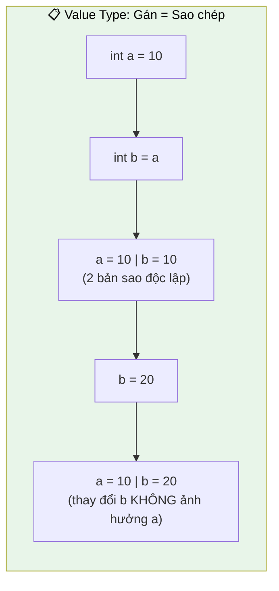
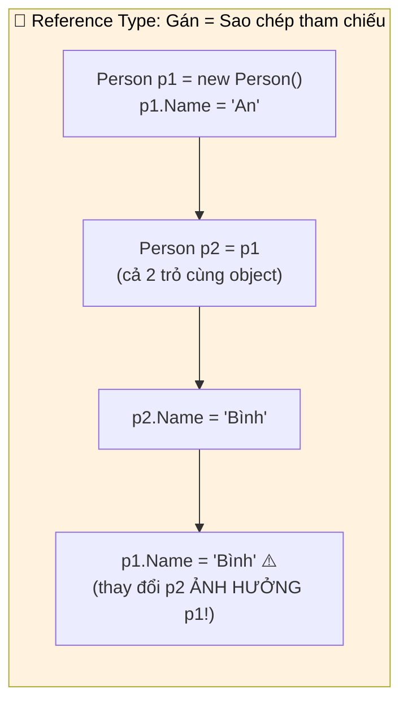

# Phần 6: Kiểu tham chiếu và Kiểu giá trị

Trong hành trình khám phá C#, việc thấu hiểu sự khác biệt giữa Kiểu tham chiếu (Reference Types) và Kiểu giá trị (Value Types) là một cột mốc quan trọng. Đây không chỉ là một khái niệm lý thuyết mà còn là nền tảng chi phối cách C# quản lý bộ nhớ, hiệu suất chương trình và hành vi dữ liệu. Nắm vững điều này sẽ giúp bạn viết mã nguồn mạnh mẽ, dễ bảo trì, và giải quyết các vấn đề liên quan đến bộ nhớ một cách hiệu quả. Chương này sẽ đi sâu vào định nghĩa, cơ chế cấp phát bộ nhớ, và những hệ quả thực tế khi làm việc với từng loại kiểu dữ liệu.

## 1. Nền tảng Kiểu dữ liệu trong C#: Giá trị và Tham chiếu

Trong C#, mọi kiểu dữ liệu đều thuộc về một trong hai loại chính: Kiểu giá trị hoặc Kiểu tham chiếu. Sự phân loại này quyết định cách dữ liệu được lưu trữ, cách các biến tương tác khi gán giá trị, và cách chúng được truyền vào các phương thức.

### 1.1. Kiểu giá trị (Value Types)

Kiểu giá trị là các kiểu dữ liệu mà biến của chúng **trực tiếp chứa giá trị** của dữ liệu. Khi bạn thao tác với một biến kiểu giá trị, bạn đang làm việc trực tiếp với dữ liệu đó. Khi một biến kiểu giá trị được gán cho một biến khác, một bản sao hoàn toàn mới của giá trị sẽ được tạo ra. Hai biến sau đó hoàn toàn độc lập với nhau.

**Đặc điểm chính của Kiểu giá trị:**

*   **Lưu trữ:** Giá trị thực sự của dữ liệu được lưu trữ trực tiếp trong vùng bộ nhớ dành cho biến đó.
*   **Vị trí bộ nhớ:** Thường được cấp phát trên **Stack** (ngăn xếp), một vùng bộ nhớ có tốc độ truy cập rất nhanh và được quản lý tự động, hiệu quả.
*   **Cơ chế sao chép:** Khi gán hoặc truyền tham số, một **bản sao hoàn chỉnh của giá trị** được tạo ra.
*   **Xóa bộ nhớ:** Bộ nhớ được giải phóng tự động và ngay lập tức khi biến ra khỏi phạm vi (scope) của nó.
*   **Cấu trúc nền tảng:** Hầu hết các kiểu giá trị được định nghĩa là `struct` trong C#.

**Ví dụ về Kiểu giá trị:**

*   **Các kiểu dữ liệu nguyên thủy (Primitive Types):** `int`, `float`, `double`, `char`, `bool`, `byte`, `short`, `long`, `decimal`, v.v.
*   **Các kiểu liệt kê (`enum`):** Ví dụ: `enum Days { Mon, Tue, Wed }`.
*   **Các kiểu cấu trúc (`struct`) tùy chỉnh:** Ví dụ: `struct Point { public int X; public int Y; }`.



*Minh họa: Với Value Type, mỗi biến giữ bản sao riêng. Thay đổi `b` không ảnh hưởng `a`.*

### 1.2. Kiểu tham chiếu (Reference Types)

Kiểu tham chiếu là các kiểu dữ liệu mà biến của chúng **không trực tiếp chứa giá trị**, mà thay vào đó chứa một "tham chiếu" (hay địa chỉ bộ nhớ) đến nơi lưu trữ giá trị thực sự của đối tượng trong bộ nhớ. Khi bạn gán một biến kiểu tham chiếu cho một biến khác, chỉ có địa chỉ bộ nhớ được sao chép, không phải toàn bộ đối tượng. Điều này có nghĩa là cả hai biến sẽ cùng trỏ đến (tham chiếu đến) cùng một đối tượng trong bộ nhớ. Do đó, việc thay đổi đối tượng thông qua một biến sẽ ảnh hưởng đến đối tượng khi truy cập qua biến kia.

**Đặc điểm chính của Kiểu tham chiếu:**

*   **Lưu trữ:** Giá trị thực sự của đối tượng được lưu trữ trên **Heap** (vùng bộ nhớ heap), trong khi biến tham chiếu (chứa địa chỉ của đối tượng) được lưu trữ trên **Stack**.
*   **Cơ chế sao chép:** Khi gán hoặc truyền tham số, một **bản sao của tham chiếu (địa chỉ bộ nhớ)** được tạo ra.
*   **Cấp phát bộ nhớ:** Yêu cầu sử dụng từ khóa `new` để cấp phát bộ nhớ cho đối tượng trên Heap.
*   **Xóa bộ nhớ:** Không được giải phóng ngay lập tức khi ra khỏi phạm vi. Việc quản lý bộ nhớ trên Heap được thực hiện bởi **Garbage Collector (Bộ thu gom rác)** của .NET Runtime (CLR). Garbage Collector sẽ định kỳ tìm kiếm và giải phóng các đối tượng không còn được tham chiếu.
*   **Cấu trúc nền tảng:** Hầu hết các kiểu tham chiếu được định nghĩa là `class` trong C#.

**Ví dụ về Kiểu tham chiếu:**

*   **Các kiểu lớp (`class`) tùy chỉnh:** Ví dụ: `class Person { public string Name; }`.
*   **`string` (chuỗi ký tự):** Mặc dù có hành vi đặc biệt, `string` vẫn là kiểu tham chiếu.
*   **`array` (mảng):** Bất kỳ loại mảng nào (ví dụ: `int[]`, `string[]`).
*   **Các kiểu `interface` và `delegate`**.
*   **`object`:** Kiểu cơ sở cho tất cả các kiểu trong C#.


*Minh họa: Với Reference Type, cả 2 biến trỏ đến cùng 1 object. Thay đổi qua `p2` cũng thay đổi `p1`.*


> [!NOTE]
> **Đặc điểm bất biến (Immutability) của `string`:**
> `string` là một kiểu tham chiếu, nhưng nó có một đặc điểm quan trọng là **bất biến**. Điều này có nghĩa là khi bạn thực hiện các thao tác "thay đổi" chuỗi (ví dụ: nối chuỗi, thay thế ký tự), thực chất một **chuỗi mới** sẽ được tạo ra trên Heap, và biến tham chiếu sẽ được cập nhật để trỏ đến chuỗi mới đó. Chuỗi ban đầu vẫn tồn tại trên Heap cho đến khi Garbage Collector thu gom nó nếu không còn tham chiếu nào khác.
>
> **Ví dụ `string` bất biến:**
> ```csharp
> string s1 = "Hello"; // s1 trỏ đến chuỗi "Hello" trên Heap
> string s2 = s1;      // s2 cũng trỏ đến "Hello"
>
> s1 += " World";     // KHÔNG thay đổi chuỗi "Hello".
>                     // Thay vào đó, một chuỗi MỚI "Hello World" được tạo ra trên Heap.
>                     // s1 bây giờ trỏ đến chuỗi MỚI này.
>
> Console.WriteLine(s1); // Output: Hello World
> Console.WriteLine(s2); // Output: Hello
> // Giải thích: s2 vẫn trỏ đến chuỗi "Hello" ban đầu.
> // Dù s1 là kiểu tham chiếu, hành vi gán giá trị mới cho nó (s1 += ...)
> // đã làm cho nó trỏ đến một đối tượng chuỗi hoàn toàn mới.
> ```

## 2. Đi sâu vào Quản lý Bộ nhớ: Stack và Heap

Để thực sự hiểu cách kiểu giá trị và kiểu tham chiếu hoạt động, chúng ta cần hình dung rõ hơn về hai vùng bộ nhớ chính mà C# sử dụng: Stack và Heap.

### 2.1. Stack (Ngăn xếp)

Stack là một vùng bộ nhớ được tổ chức theo cơ chế LIFO (Last-In, First-Out - Vào sau, ra trước). Hãy hình dung Stack như một chồng đĩa: bạn chỉ có thể thêm một đĩa mới lên trên cùng (push) hoặc lấy đĩa ở trên cùng ra (pop).

**Stack được sử dụng để lưu trữ:**

*   **Biến kiểu giá trị:** Giá trị thực tế của biến được lưu trữ trực tiếp trên Stack.
*   **Biến tham chiếu:** Địa chỉ bộ nhớ của đối tượng trên Heap được lưu trữ trên Stack.
*   **Khung ngăn xếp (Stack Frame):** Mỗi khi một phương thức được gọi, một Stack Frame mới được tạo ra trên Stack. Khung này chứa:
    *   Các tham số của phương thức.
    *   Các biến cục bộ được khai báo bên trong phương thức (bao gồm cả biến kiểu giá trị và biến tham chiếu).
    *   Địa chỉ trả về để chương trình biết phải tiếp tục thực thi ở đâu sau khi phương thức kết thúc.

**Đặc điểm của Stack:**

*   **Tốc độ:** Cực kỳ nhanh vì việc cấp phát và giải phóng bộ nhớ chỉ đơn giản là điều chỉnh một con trỏ (Stack Pointer). Không có sự tìm kiếm phức tạp.
*   **Kích thước:** Thường có kích thước cố định và tương đối nhỏ (vài MB). Nếu Stack bị tràn (Stack Overflow), chương trình sẽ gặp lỗi.
*   **Quản lý:** Hoàn toàn tự động bởi CLR. Khi một phương thức kết thúc, toàn bộ Stack Frame của nó sẽ bị "pop" ra khỏi Stack, và bộ nhớ của tất cả các biến trong đó (cả giá trị và tham chiếu) sẽ bị giải phóng ngay lập tức.
*   **Độ an toàn luồng (Thread-safe):** Mỗi luồng (thread) trong chương trình có Stack riêng, giúp tránh xung đột dữ liệu.

### 2.2. Heap (Vùng nhớ Heap)

Heap là một vùng bộ nhớ lớn hơn, linh hoạt hơn, được sử dụng để lưu trữ các đối tượng kiểu tham chiếu. Không giống như Stack, Heap không có cấu trúc LIFO; bạn có thể cấp phát và giải phóng bộ nhớ ở bất kỳ đâu trong Heap. Hãy hình dung Heap như một kho chứa lớn với nhiều ngăn trống, bạn có thể cất hoặc lấy đồ ở bất kỳ vị trí nào.

**Heap được sử dụng để lưu trữ:**

*   **Đối tượng kiểu tham chiếu:** Giá trị thực sự của các `class`, `array`, `string`, `delegate`, v.v.

**Đặc điểm của Heap:**

*   **Tốc độ:** Chậm hơn Stack vì việc tìm kiếm một khối bộ nhớ đủ lớn và phù hợp để cấp phát cho một đối tượng mới đòi hỏi nhiều thao tác hơn.
*   **Kích thước:** Lớn và động, có thể tăng hoặc giảm tùy theo nhu cầu của chương trình.
*   **Quản lý:** Được quản lý bởi **Garbage Collector (GC)**. GC sẽ định kỳ kiểm tra các đối tượng trên Heap. Nếu một đối tượng không còn bất kỳ tham chiếu nào từ Stack hoặc từ các đối tượng khác trên Heap, nó sẽ bị đánh dấu là "rác" và được giải phóng bộ nhớ. Quá trình này giúp tránh rò rỉ bộ nhớ (memory leak) nhưng cũng có thể gây ra độ trễ nhỏ (pause) trong quá trình thực thi chương trình khi GC hoạt động.
*   **Phân mảnh (Fragmentation):** Do việc cấp phát và giải phóng không theo thứ tự, Heap có thể bị phân mảnh, tạo ra nhiều "lỗ hổng" nhỏ. GC cũng có nhiệm vụ nén (compact) Heap để tối ưu hóa không gian.

> [!TIP]
> **Tóm tắt đơn giản:**
> *   **Stack:** Nhanh, nhỏ, tự động, cho kiểu giá trị và địa chỉ tham chiếu. Giống như một chồng sách được sắp xếp gọn gàng.
> *   **Heap:** Chậm hơn, lớn, linh hoạt, cho đối tượng kiểu tham chiếu. Được quản lý bởi GC. Giống như một thư viện khổng lồ, cần người quản lý để sắp xếp và dọn dẹp.

## 3. Tương tác với Kiểu dữ liệu: Sao chép và Truyền Tham số

Sự khác biệt trong cách quản lý bộ nhớ giữa kiểu giá trị và kiểu tham chiếu dẫn đến những hành vi rất khác nhau khi bạn sao chép biến hoặc truyền chúng làm đối số cho các phương thức.

### 3.1. Hành vi khi Sao chép biến (Assignment)

#### 3.1.1. Sao chép Kiểu giá trị: "Sao chép giá trị" (Copy by Value)

Khi bạn gán một biến kiểu giá trị cho một biến khác, một bản sao độc lập của giá trị đó sẽ được tạo ra và gán cho biến mới.

**Cơ chế:**

1.  Biến `a` được tạo trên Stack và chứa giá trị `10`.
2.  Khi `int b = a;`, một vị trí bộ nhớ mới được tạo trên Stack cho `b`, và giá trị `10` từ `a` được sao chép sang `b`.
3.  Khi `b` được thay đổi (ví dụ: `b++`), chỉ giá trị trong vị trí bộ nhớ của `b` bị ảnh hưởng. Giá trị của `a` vẫn giữ nguyên.

**Ví dụ:**

```csharp
using System;

public class Program
{
    public static void Main(string[] args)
    {
        // Khởi tạo một biến kiểu giá trị (int)
        int a = 10;

        // Sao chép giá trị của 'a' sang 'b'
        int b = a;

        // Tăng giá trị của 'b'
        b++; // b bây giờ là 11

        Console.WriteLine($"Giá trị của a: {a}"); // Output: Giá trị của a: 10
        Console.WriteLine($"Giá trị của b: {b}"); // Output: Giá trị của b: 11

        // Giải thích: 'a' và 'b' là hai biến độc lập trên Stack.
        // Thay đổi 'b' không ảnh hưởng đến 'a'.
    }
}
```

**Minh họa bộ nhớ (Stack):**

```
1. int a = 10;
   Stack:
   | a: 10 |
   -------

2. int b = a;
   Stack:
   | b: 10 |  <- Bản sao của giá trị 'a'
   | a: 10 |
   -------

3. b++;
   Stack:
   | b: 11 |  <- Giá trị của 'b' được cập nhật
   | a: 10 |
   -------
```

#### 3.1.2. Sao chép Kiểu tham chiếu: "Sao chép tham chiếu" (Copy by Reference)

Khi bạn gán một biến kiểu tham chiếu cho một biến khác, chỉ địa chỉ bộ nhớ (tham chiếu) của đối tượng trên Heap được sao chép. Cả hai biến sẽ cùng trỏ đến một đối tượng duy nhất trên Heap.

**Cơ chế:**

1.  Khi `int[] array1 = new int[] { 1, 2, 3 };`, một đối tượng mảng thực sự được tạo trên Heap chứa `{1, 2, 3}`. Biến `array1` được tạo trên Stack và chứa địa chỉ của đối tượng mảng đó (ví dụ: `Address_X`).
2.  Khi `int[] array2 = array1;`, một vị trí mới trên Stack được tạo cho `array2`, và địa chỉ bộ nhớ `Address_X` từ `array1` được sao chép sang `array2`. Bây giờ, cả `array1` và `array2` đều trỏ đến *cùng một* đối tượng mảng trên Heap.
3.  Khi `array2[0] = 0;`, đối tượng mảng trên Heap được sửa đổi thông qua tham chiếu `array2`. Vì `array1` cũng trỏ đến cùng đối tượng đó, nên khi truy cập `array1[0]`, bạn sẽ thấy giá trị đã thay đổi.

**Ví dụ:**

```csharp
using System;

public class Program
{
    public static void Main(string[] args)
    {
        // Khởi tạo một biến kiểu tham chiếu (mảng)
        int[] array1 = new int[] { 1, 2, 3 };

        // Sao chép tham chiếu của 'array1' sang 'array2'
        int[] array2 = array1;

        // Thay đổi phần tử đầu tiên của 'array2'
        array2[0] = 0; // Đối tượng trên Heap bây giờ là {0, 2, 3}

        Console.WriteLine($"Phần tử đầu tiên của array1: {array1[0]}"); // Output: Phần tử đầu tiên của array1: 0
        Console.WriteLine($"Phần tử đầu tiên của array2: {array2[0]}"); // Output: Phần tử đầu tiên của array2: 0

        // Giải thích: 'array1' và 'array2' cùng tham chiếu đến một đối tượng mảng trên Heap.
        // Thay đổi thông qua 'array2' sẽ ảnh hưởng đến đối tượng mà 'array1' tham chiếu đến.
    }
}
```

**Minh họa bộ nhớ (Stack và Heap):**

```
1. int[] array1 = new int[] { 1, 2, 3 };
   Stack:                 Heap:
   | array1: Address_X |  | Address_X: {1, 2, 3} |
   --------------------  ------------------------

2. int[] array2 = array1;
   Stack:                 Heap:
   | array2: Address_X |  | Address_X: {1, 2, 3} |
   | array1: Address_X |
   --------------------  ------------------------

3. array2[0] = 0; (thông qua 'array2', đối tượng tại Address_X trên Heap bị sửa đổi)
   Stack:                 Heap:
   | array2: Address_X |  | Address_X: {0, 2, 3} |
   | array1: Address_X |
   --------------------  ------------------------
```

### 3.2. Hành vi khi Truyền tham số vào phương thức (Passing Arguments)

Trong C#, theo mặc định, tất cả các tham số đều được truyền **theo giá trị (pass by value)**. Điều này có nghĩa là một bản sao của tham số luôn được tạo ra cho phương thức. Tuy nhiên, "giá trị" được sao chép lại khác nhau đối với kiểu giá trị và kiểu tham chiếu.

#### 3.2.1. Truyền Kiểu giá trị làm tham số: "Truyền bản sao giá trị"

Khi một kiểu giá trị được truyền làm tham số, một bản sao của giá trị đó được tạo ra và gán cho tham số trong phương thức. Mọi thay đổi đối với tham số bên trong phương thức sẽ chỉ ảnh hưởng đến bản sao đó, không phải biến gốc bên ngoài.

**Cơ chế:**

1.  Biến `number` trong `Main` được tạo trên Stack với giá trị `1`.
2.  Khi `Increment(number)` được gọi, một bản sao của giá trị `1` được tạo ra và gán cho tham số `num` của phương thức `Increment`. `num` là một biến cục bộ mới nằm trong Stack Frame của `Increment`.
3.  Khi `num += 10;` được thực hiện, chỉ giá trị của `num` bên trong phương thức `Increment` thay đổi (thành `11`).
4.  Khi phương thức `Increment` kết thúc, `num` bị hủy khỏi Stack. Biến `number` trong `Main` vẫn giữ giá trị gốc là `1`.

**Ví dụ:**

```csharp
using System;

public class Program
{
    public static void Increment(int num)
    {
        num += 10; // Thay đổi giá trị của bản sao 'num' (biến cục bộ của phương thức)
        Console.WriteLine($"Trong Increment: num = {num}"); // Output: Trong Increment: num = 11
    }

    public static void Main(string[] args)
    {
        int number = 1;

        Console.WriteLine($"Trước khi gọi Increment: number = {number}"); // Output: Trước khi gọi Increment: number = 1
        Increment(number);
        Console.WriteLine($"Sau khi gọi Increment: number = {number}");   // Output: Sau khi gọi Increment: number = 1

        // Giải thích: 'number' (trong Main) và 'num' (trong Increment) là hai biến độc lập.
        // Thay đổi 'num' không ảnh hưởng đến 'number'.
    }
}
```

#### 3.2.2. Truyền Kiểu tham chiếu làm tham số: "Truyền bản sao tham chiếu"

Khi một kiểu tham chiếu được truyền làm tham số, một bản sao của *tham chiếu* (địa chỉ bộ nhớ) được tạo ra và gán cho tham số trong phương thức. Điều này có nghĩa là cả biến gốc và tham số trong phương thức đều trỏ đến *cùng một đối tượng* trên Heap. Mọi thay đổi đối với **trạng thái (nội dung)** của đối tượng thông qua tham số sẽ ảnh hưởng đến đối tượng gốc.

> [!CAUTION]
> Cần phân biệt rõ:
> *   Nếu bạn thay đổi **nội dung** của đối tượng mà tham số đang trỏ tới (ví dụ: `p.Age = 30;`), thì sự thay đổi này sẽ được nhìn thấy từ bên ngoài phương thức vì cả biến gốc và tham số đều trỏ đến cùng một đối tượng.
> *   Nếu bạn gán một đối tượng **mới** cho tham số bên trong phương thức (ví dụ: `p = new Person { Age = 100 };`), thì tham số đó sẽ trỏ đến đối tượng mới, nhưng biến gốc bên ngoài phương thức vẫn trỏ đến đối tượng cũ. Sự thay đổi này chỉ cục bộ trong phương thức.

**Cơ chế:**

1.  Khi `Person person = new Person { Age = 20 };`, một đối tượng `Person` được tạo trên Heap. Biến `person` trong `Main` chứa địa chỉ của đối tượng đó (ví dụ: `Address_P`).
2.  Khi `MakeOld(person)` được gọi, một bản sao của địa chỉ bộ nhớ `Address_P` từ `person` được tạo ra và gán cho tham số `p` của phương thức `MakeOld`. Bây giờ, cả `person` (trong `Main`) và `p` (trong `MakeOld`) đều trỏ đến *cùng một* đối tượng `Person` trên Heap.
3.  Khi `p.Age += 10;` được thực hiện, đối tượng `Person` trên Heap được sửa đổi thông qua tham chiếu `p`. Tuổi của đối tượng đó tăng lên `30`.
4.  Khi phương thức `MakeOld` kết thúc, `p` bị hủy khỏi Stack. Tuy nhiên, đối tượng trên Heap vẫn tồn tại với tuổi đã thay đổi, và `person` trong `Main` vẫn trỏ đến nó.

**Ví dụ (Thay đổi trạng thái đối tượng):**

```csharp
using System;

// Định nghĩa một lớp Person (kiểu tham chiếu)
public class Person
{
    public int Age { get; set; }
}

public class Program
{
    public static void MakeOld(Person p)
    {
        p.Age += 10; // Thay đổi thuộc tính của đối tượng mà 'p' tham chiếu đến
        Console.WriteLine($"Trong MakeOld: Tuổi của người = {p.Age}"); // Output: Trong MakeOld: Tuổi của người = 30
    }

    public static void Main(string[] args)
    {
        Person person = new Person { Age = 20 };

        Console.WriteLine($"Trước khi gọi MakeOld: Tuổi của người = {person.Age}"); // Output: Trước khi gọi MakeOld: Tuổi của người = 20
        MakeOld(person);
        Console.WriteLine($"Sau khi gọi MakeOld: Tuổi của người = {person.Age}");   // Output: Sau khi gọi MakeOld: Tuổi của người = 30

        // Giải thích: 'person' (trong Main) và 'p' (trong MakeOld) cùng tham chiếu đến một đối tượng Person trên Heap.
        // Thay đổi thuộc tính của đối tượng thông qua 'p' sẽ ảnh hưởng đến đối tượng mà 'person' tham chiếu đến.
    }
}
```

**Ví dụ (Gán đối tượng mới cho tham số):**

```csharp
using System;

public class Person
{
    public string Name { get; set; }
}

public class Program
{
    public static void ReassignPerson(Person p)
    {
        p = new Person { Name = "New Person" }; // 'p' bây giờ trỏ đến một đối tượng Person MỚI
        Console.WriteLine($"Trong ReassignPerson: Tên của p = {p.Name}"); // Output: Trong ReassignPerson: Tên của p = New Person
    }

    public static void Main(string[] args)
    {
        Person originalPerson = new Person { Name = "Original Person" };

        Console.WriteLine($"Trước khi gọi ReassignPerson: Tên của originalPerson = {originalPerson.Name}"); // Output: Original Person
        ReassignPerson(originalPerson);
        Console.WriteLine($"Sau khi gọi ReassignPerson: Tên của originalPerson = {originalPerson.Name}");   // Output: Original Person

        // Giải thích: 'originalPerson' vẫn trỏ đến đối tượng ban đầu.
        // Việc gán đối tượng mới cho 'p' chỉ ảnh hưởng đến bản sao tham chiếu 'p' trong phương thức.
    }
}
```

> [!NOTE]
> Để thực sự thay đổi biến tham chiếu gốc (tức là làm cho biến gốc trỏ đến một đối tượng *mới* được tạo trong phương thức), bạn cần sử dụng từ khóa `ref` hoặc `out` khi truyền tham số. Điều này cho phép phương thức thao tác trực tiếp với biến tham chiếu gốc, thay vì chỉ bản sao của nó. Tuy nhiên, đây là một chủ đề nâng cao hơn và sẽ được đề cập chi tiết trong các chương sau.

## 4. Lựa chọn giữa Struct và Class: Hướng dẫn Thực hành

Việc lựa chọn giữa `struct` và `class` là một quyết định thiết kế quan trọng, ảnh hưởng đến hiệu suất và hành vi của chương trình. Dưới đây là một số hướng dẫn chung:

*   **Sử dụng `struct` khi (Kiểu giá trị):**
    *   **Kích thước nhỏ:** Dữ liệu có kích thước nhỏ (thường dưới 16 byte, tối đa 24-32 byte tùy kiến trúc). Việc sao chép toàn bộ giá trị nhanh hơn và ít tốn kém hơn việc sao chép tham chiếu và quản lý đối tượng trên Heap.
    *   **Tính chất giá trị (Value Semantics):** Dữ liệu đại diện cho một giá trị đơn lẻ, tự đủ (ví dụ: điểm tọa độ, màu sắc, ngày tháng, tiền tệ). Khi bạn gán `Point b = a;`, bạn muốn `b` là một điểm hoàn toàn mới, độc lập với `a`.
    *   **Bất biến (Immutability):** Thường được sử dụng cho các kiểu bất biến hoặc ít thay đổi, vì việc thay đổi một trường trong `struct` thực chất là tạo ra một bản sao mới (trừ khi bạn đang thao tác trực tiếp với `struct` đó thông qua `ref`).
    *   **Tránh chi phí GC:** Giúp giảm số lượng đối tượng trên Heap, từ đó giảm tần suất và áp lực lên Garbage Collector, có thể cải thiện hiệu suất trong các kịch bản tạo ra nhiều đối tượng nhỏ.
    *   **Không cần `null`:** `struct` không thể có giá trị `null` (trừ `Nullable<T>`), phù hợp khi bạn luôn mong đợi một giá trị hợp lệ.
    *   **Không cần kế thừa:** `struct` không hỗ trợ kế thừa từ `class` khác (chỉ có thể triển khai `interface`).

*   **Sử dụng `class` khi (Kiểu tham chiếu):**
    *   **Kích thước lớn hoặc phức tạp:** Dữ liệu có nhiều trường, hoặc yêu cầu cấp phát bộ nhớ động. Chi phí sao chép tham chiếu (4 hoặc 8 byte) luôn rẻ hơn sao chép một đối tượng lớn.
    *   **Tính chất đối tượng/định danh (Identity Semantics):** Dữ liệu đại diện cho một "thực thể" với định danh riêng (ví dụ: `Person`, `Customer`, `Order`). Khi bạn gán `Person b = a;`, bạn muốn `b` và `a` cùng chỉ đến *một người* duy nhất.
    *   **Thay đổi trạng thái (Mutable):** Đối tượng cần được thay đổi trạng thái sau khi được tạo và những thay đổi đó cần được nhìn thấy bởi tất cả các tham chiếu khác đến cùng đối tượng.
    *   **Cần kế thừa và đa hình:** `class` là nền tảng cho Lập trình Hướng đối tượng, hỗ trợ kế thừa, đa hình và các tính năng nâng cao khác.
    *   **Cần `null`:** Cho phép biểu thị sự vắng mặt của một đối tượng.
    *   **Sử dụng tài nguyên bên ngoài:** Các đối tượng cần quản lý tài nguyên không phải bộ nhớ (như file, kết nối cơ sở dữ liệu) thường là `class` để có thể triển khai `IDisposable`.

> [!TIP]
> **Quy tắc ngón tay cái:**
> 1.  Nếu kiểu dữ liệu của bạn có thể được biểu diễn như một giá trị đơn lẻ, nhỏ gọn, và bạn muốn hành vi sao chép giá trị, hãy xem xét `struct`.
> 2.  Nếu kiểu dữ liệu của bạn đại diện cho một "thực thể" phức tạp hơn, cần có định danh, hỗ trợ kế thừa, và bạn muốn hành vi sao chép tham chiếu, hãy sử dụng `class`.
>
> Trong đa số trường hợp, `class` là lựa chọn mặc định. Chỉ nên cân nhắc `struct` khi có lý do rõ ràng về hiệu suất hoặc ngữ nghĩa dữ liệu.

## 5. Tư duy Vibe Coding và Antigravity IDE trong quản lý bộ nhớ C#

Là một lập trình viên sử dụng Antigravity IDE, việc nắm vững cơ chế kiểu giá trị và kiểu tham chiếu không chỉ là lý thuyết mà còn là chìa khóa để áp dụng tư duy Vibe Coding một cách hiệu quả, đặc biệt khi làm việc với một hệ thống AI mạnh mẽ.

**Vibe Coding** ở đây không chỉ là "cảm giác" mà là khả năng phát triển một trực giác sâu sắc về cách mã nguồn tương tác với hệ thống, bao gồm cả bộ nhớ. Khi bạn viết một dòng code, Vibe Coding giúp bạn "cảm nhận" được điều gì sẽ xảy ra ở cấp độ bộ nhớ: liệu một đối tượng mới có được tạo không? Liệu một tham chiếu có bị thay đổi không? Liệu có tiềm ẩn side effect nào không?

**Antigravity IDE** với khả năng agentic AI, tự chạy script ngầm, gọi subagent trình duyệt, đọc ghi file, và lập kế hoạch tự động, có thể trở thành một công cụ cực kỳ mạnh mẽ để phát triển và kiểm chứng "Vibe" này:

1.  **Kiểm chứng Trực giác về Bộ nhớ:**
    *   **Yêu cầu Antigravity mô phỏng:** Bạn có thể viết một đoạn mã C# ngắn liên quan đến kiểu giá trị và kiểu tham chiếu, sau đó yêu cầu Antigravity "giải thích chi tiết từng bước cấp phát bộ nhớ trên Stack và Heap" cho đoạn mã đó. Antigravity có thể cung cấp một "minh họa bộ nhớ" bằng văn bản hoặc thậm chí là một sơ đồ ASCII.
    *   **Dự đoán kết quả:** Trước khi chạy một đoạn mã phức tạp, hãy sử dụng Vibe Coding để dự đoán giá trị của các biến sau một loạt các phép gán hoặc lời gọi phương thức liên quan đến cả hai loại kiểu. Sau đó, yêu cầu Antigravity "dự đoán output và giải thích lý do" để so sánh với trực giác của bạn.

2.  **Phát hiện và Khắc phục Side Effects:**
    *   **Nhận diện rủi ro:** Với kiểu tham chiếu, side effects (tác dụng phụ) là một mối lo ngại lớn. Vibe Coding giúp bạn "ngửi thấy" nguy cơ khi một đối tượng được chia sẻ và có thể bị thay đổi không mong muốn.
    *   **Sử dụng Antigravity để phân tích luồng dữ liệu:** Nếu bạn nghi ngờ có side effect, hãy cung cấp đoạn mã cho Antigravity và yêu cầu nó "phân tích luồng dữ liệu của đối tượng X và liệt kê tất cả các điểm mà nó có thể bị thay đổi." Antigravity có thể sử dụng các subagent để phân tích mã và thậm chí đề xuất các biện pháp phòng ngừa (ví dụ: tạo bản sao sâu - deep copy, hoặc sử dụng kiểu bất biến).

3.  **Tối ưu hóa Hiệu suất và Quản lý Bộ nhớ:**
    *   **Đánh giá chi phí GC:** Với Vibe Coding, bạn có thể cảm nhận được khi nào chương trình có thể tạo ra quá nhiều đối tượng ngắn hạn trên Heap, gây áp lực lên Garbage Collector.
    *   **Sử dụng Antigravity để kiểm tra:** Yêu cầu Antigravity "viết một script C# đơn giản để đo thời gian cấp phát và thu gom rác cho N đối tượng kiểu class và M đối tượng kiểu struct." Antigravity có thể tự động chạy script này, thu thập dữ liệu và trình bày kết quả, giúp bạn định lượng cảm nhận của mình.
    *   **Gợi ý tối ưu hóa:** Nếu một phần mã có vẻ chậm chạp, bạn có thể hỏi Antigravity "có cách nào để tối ưu hóa việc sử dụng bộ nhớ trong hàm này không, đặc biệt là liên quan đến kiểu giá trị/kiểu tham chiếu?"

4.  **Học hỏi và Thử nghiệm tương tác:**
    *   **Tạo kịch bản học tập:** Yêu cầu Antigravity "tạo ra một kịch bản phức tạp với struct và class, sau đó hỏi tôi các câu hỏi về trạng thái bộ nhớ ở các điểm khác nhau."
    *   **Thử nghiệm với `ref` và `out`:** Khi bạn đã sẵn sàng cho các khái niệm nâng cao, hãy yêu cầu Antigravity tạo ví dụ về cách `ref` và `out` thay đổi hành vi truyền tham số, và sau đó giải thích chi tiết cơ chế bộ nhớ.

Bằng cách tích hợp tư duy Vibe Coding với khả năng phân tích và thực thi của Antigravity IDE, bạn không chỉ học được lý thuyết mà còn phát triển một sự hiểu biết thực tế, có thể kiểm chứng được về cách C# quản lý bộ nhớ, giúp bạn viết mã nguồn không chỉ đúng mà còn hiệu quả và đáng tin cậy.

## Tóm tắt Phần 6: Kiểu tham chiếu và Kiểu giá trị

*   **Hai loại chính:** Trong C#, có Kiểu giá trị (Value Types) và Kiểu tham chiếu (Reference Types).
*   **Cấu trúc nền tảng:** Kiểu giá trị thường được định nghĩa bằng `struct` (ví dụ: `int`, `float`, `bool`, `enum`, `Point`), còn Kiểu tham chiếu được định nghĩa bằng `class` (ví dụ: `string`, `array`, `Person`).
*   **Quản lý bộ nhớ:**
    *   **Kiểu giá trị:** Lưu trữ trực tiếp giá trị trên **Stack**. Bộ nhớ được cấp phát và giải phóng tự động, ngay lập tức khi biến ra khỏi phạm vi.
    *   **Kiểu tham chiếu:** Lưu trữ đối tượng thực sự trên **Heap**. Biến tham chiếu (trên Stack) chứa địa chỉ của đối tượng trên Heap. Bộ nhớ trên Heap được quản lý bởi **Garbage Collector (GC)**, giải phóng đối tượng khi không còn tham chiếu.
*   **Sao chép biến (Assignment):**
    *   **Kiểu giá trị:** Khi sao chép, một **bản sao độc lập của giá trị** được tạo ra. Thay đổi một biến không ảnh hưởng đến biến kia.
    *   **Kiểu tham chiếu:** Khi sao chép, **tham chiếu (địa chỉ bộ nhớ)** được sao chép. Cả hai biến cùng trỏ đến **một đối tượng duy nhất** trên Heap. Thay đổi đối tượng thông qua một tham chiếu sẽ được nhìn thấy qua tham chiếu còn lại.
*   **Truyền tham số cho phương thức (Pass by Value):**
    *   **Kiểu giá trị:** Được truyền **theo giá trị** (bản sao của giá trị). Thay đổi tham số bên trong phương thức không ảnh hưởng đến biến gốc.
    *   **Kiểu tham chiếu:** Được truyền **theo giá trị** (bản sao của tham chiếu). Cả biến gốc và tham số đều trỏ đến cùng một đối tượng. Thay đổi *trạng thái* (nội dung) của đối tượng bên trong phương thức sẽ ảnh hưởng đến đối tượng gốc. Tuy nhiên, gán một đối tượng mới cho tham số sẽ không ảnh hưởng đến biến gốc.
*   **Lựa chọn phù hợp (`struct` vs. `class`):**
    *   Sử dụng `struct` cho các kiểu dữ liệu nhỏ, đơn giản, bất biến hoặc có tính chất giá trị, khi cần hiệu suất cao và tránh chi phí GC.
    *   Sử dụng `class` cho các kiểu dữ liệu lớn, phức tạp, mutable, cần kế thừa, đa hình và có tính chất đối tượng.
*   **Vibe Coding & Antigravity IDE:** Phát triển trực giác về luồng dữ liệu và quản lý bộ nhớ. Sử dụng Antigravity để mô phỏng, dự đoán, phân tích side effects, và tối ưu hóa hiệu suất, biến AI thành đối tác trong việc kiểm chứng và phát triển "Vibe" về mã nguồn.

Việc hiểu rõ và áp dụng đúng đắn sự khác biệt này là nền tảng cho mọi lập trình viên C# muốn viết mã nguồn hiệu quả, đáng tin cậy và dễ bảo trì. Trong phần tiếp theo, chúng ta sẽ bắt đầu khám phá luồng điều khiển trong C#, cho phép bạn viết các chương trình có khả năng ra quyết định và thực hiện các hành động phức tạp hơn.

<!-- REVIEWED_BY_AGENT -->
