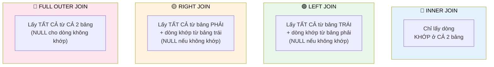

# Bài 7: Kết Nối Dữ Liệu Với JOIN và Khám Phá Các Cú Pháp Nâng Cao

Trong thế giới của các hệ quản trị cơ sở dữ liệu quan hệ (RDBMS), việc tổ chức dữ liệu thành nhiều bảng riêng biệt là một nguyên tắc thiết yếu. Mỗi bảng được thiết kế để lưu trữ thông tin về một thực thể cụ thể, giúp tối ưu hóa việc lưu trữ, giảm thiểu dữ liệu trùng lặp (redundancy) và duy trì tính toàn vẹn dữ liệu thông qua các ràng buộc. Tuy nhiên, trong thực tế, các câu hỏi nghiệp vụ hiếm khi chỉ giới hạn trong một bảng duy nhất. Chúng ta thường xuyên cần tổng hợp thông tin từ nhiều thực thể khác nhau để có được một cái nhìn toàn diện.

Ví dụ, bạn có thể muốn:

*   Xem nội dung một bình luận cùng với tên của người đã viết bình luận đó.
*   Hiển thị một bức ảnh kèm theo tất cả các bình luận liên quan đến nó.
*   Liệt kê tất cả các cuốn sách của một tác giả cụ thể.

Để giải quyết những bài toán này, SQL cung cấp một kỹ thuật truy vấn mạnh mẽ: **JOIN**. JOIN cho phép bạn kết hợp các hàng từ hai hoặc nhiều bảng dựa trên một mối quan hệ logic giữa chúng. Phần này sẽ đi sâu vào khái niệm JOIN, khám phá cơ chế hoạt động của `INNER JOIN` và giới thiệu các cú pháp thay thế giúp truy vấn trở nên rõ ràng và hiệu quả hơn. Chúng ta cũng sẽ tìm hiểu cách tư duy "Vibe Coding" và khả năng của các hệ thống AI như Antigravity IDE có thể hỗ trợ bạn trong việc xây dựng và kiểm thử các truy vấn JOIN phức tạp.

## 1. Chuẩn Bị Môi Trường Dữ Liệu: Các Bảng `users`, `photos`, và `comments`

Để thực hành và minh họa các truy vấn JOIN, chúng ta sẽ làm việc với một tập dữ liệu ví dụ bao gồm ba bảng có mối quan hệ chặt chẽ, mô phỏng một phần của ứng dụng mạng xã hội đơn giản.

### 1.1. Định Nghĩa Cấu Trúc Bảng (Schema)

Các bảng này được thiết kế với các khóa chính (Primary Key - PK) và khóa ngoại (Foreign Key - FK) để thiết lập mối quan hệ:

*   **`users`**: Lưu trữ thông tin cơ bản về người dùng.
    *   `id` (PRIMARY KEY, SERIAL): Định danh duy nhất cho người dùng.
    *   `username` (VARCHAR(50) UNIQUE NOT NULL): Tên đăng nhập của người dùng.

*   **`photos`**: Lưu trữ thông tin về các bức ảnh được tải lên.
    *   `id` (PRIMARY KEY, SERIAL): Định danh duy nhất cho bức ảnh.
    *   `url` (VARCHAR(255) NOT NULL): Đường dẫn URL đến bức ảnh.
    *   `user_id` (FOREIGN KEY): Liên kết bức ảnh với người dùng đã tải lên nó.

*   **`comments`**: Lưu trữ thông tin về các bình luận.
    *   `id` (PRIMARY KEY, SERIAL): Định danh duy nhất cho bình luận.
    *   `content` (TEXT NOT NULL): Nội dung của bình luận.
    *   `user_id` (FOREIGN KEY): Liên kết bình luận với người dùng đã tạo ra nó.
    *   `photo_id` (FOREIGN KEY): Liên kết bình luận với bức ảnh mà nó được thêm vào.

### 1.2. Tạo Bảng và Chèn Dữ Liệu Mẫu

Để bạn có thể trực tiếp thực hành, dưới đây là các câu lệnh SQL chuẩn PostgreSQL để tạo các bảng và chèn dữ liệu mẫu vào cơ sở dữ liệu của bạn.

```sql
-- Tạo bảng users
CREATE TABLE users (
    id SERIAL PRIMARY KEY,
    username VARCHAR(50) UNIQUE NOT NULL
);

-- Tạo bảng photos
CREATE TABLE photos (
    id SERIAL PRIMARY KEY,
    url VARCHAR(255) NOT NULL,
    user_id INTEGER NOT NULL,
    FOREIGN KEY (user_id) REFERENCES users(id) ON DELETE CASCADE
);

-- Tạo bảng comments
CREATE TABLE comments (
    id SERIAL PRIMARY KEY,
    content TEXT NOT NULL,
    user_id INTEGER NOT NULL,
    photo_id INTEGER NOT NULL,
    FOREIGN KEY (user_id) REFERENCES users(id) ON DELETE CASCADE,
    FOREIGN KEY (photo_id) REFERENCES photos(id) ON DELETE CASCADE
);

-- Chèn dữ liệu mẫu vào bảng users
INSERT INTO users (username) VALUES
('nguyenvana'),
('lethib'),
('phamvanc');

-- Chèn dữ liệu mẫu vào bảng photos
INSERT INTO photos (url, user_id) VALUES
('http://example.com/photo1.jpg', 1), -- user_id 1: nguyenvana
('http://example.com/photo2.png', 1), -- user_id 1: nguyenvana
('http://example.com/photo3.gif', 2), -- user_id 2: lethib
('http://example.com/photo4.jpeg', 3); -- user_id 3: phamvanc

-- Chèn dữ liệu mẫu vào bảng comments
INSERT INTO comments (content, user_id, photo_id) VALUES
('Bức ảnh đẹp quá!', 2, 1), -- lethib bình luận ảnh của nguyenvana
('Thật tuyệt vời!', 1, 3), -- nguyenvana bình luận ảnh của lethib
('Yêu thích bức ảnh này!', 3, 1), -- phamvanc bình luận ảnh của nguyenvana
('Tuyệt vời!', 2, 2), -- lethib bình luận ảnh của nguyenvana
('Ảnh này có ý nghĩa!', 1, 4); -- nguyenvana bình luận ảnh của phamvanc
```

> [!NOTE]
> Các khóa ngoại (Foreign Key) là nền tảng của các phép JOIN. Chúng không chỉ định nghĩa mối quan hệ giữa các bảng mà còn đảm bảo tính toàn vẹn tham chiếu (referential integrity). Khi bạn thực hiện JOIN, cơ sở dữ liệu sử dụng thông tin từ khóa ngoại để xác định cách các hàng từ các bảng khác nhau được liên kết một cách logic. Mệnh đề `ON DELETE CASCADE` đảm bảo rằng nếu một người dùng hoặc ảnh bị xóa, tất cả các bình luận liên quan cũng sẽ bị xóa tự động, giữ cho dữ liệu luôn nhất quán.



*Tóm tắt 4 loại JOIN. INNER = giao, LEFT = ưu tiên trái, RIGHT = ưu tiên phải, FULL = tất cả.*

## 2. Tổng Quan về JOIN và Aggregations: Hai Kỹ Thuật Đắc Lực

Trước khi đi sâu vào cú pháp, hãy hiểu rõ vai trò của JOIN và cách nó khác biệt (và bổ trợ) cho Aggregations.

### 2.1. JOIN: Kết Nối Các Thực Thể Dữ Liệu

**JOIN** là một phép toán quan trọng trong đại số quan hệ, cho phép bạn kết hợp các hàng từ hai hoặc nhiều bảng dựa trên một điều kiện khớp nối. Mục tiêu chính của JOIN là tạo ra một tập hợp kết quả duy nhất bằng cách hợp nhất thông tin từ các hàng có liên quan từ các bảng khác nhau, cung cấp một cái nhìn tổng hợp hơn về dữ liệu.

Khi bạn cần trả lời một câu hỏi mà thông tin liên quan nằm rải rác trên nhiều bảng (ví dụ: "Hãy cho tôi biết tên tác giả của mỗi cuốn sách"), đó là một dấu hiệu rõ ràng cho thấy bạn cần sử dụng JOIN. JOIN giúp bạn "ghép" các mảnh thông tin lại với nhau để tạo thành một bức tranh hoàn chỉnh.

### 2.2. Aggregations (Tổng Hợp): Rút Gọn Dữ Liệu Thành Giá Trị Đơn Lẻ

**Aggregations** là quá trình lấy một tập hợp các hàng và tính toán một giá trị duy nhất từ tập hợp đó. Các hàm tổng hợp (aggregate functions) như `COUNT()`, `SUM()`, `AVG()`, `MAX()`, `MIN()` thường được sử dụng để thực hiện các phép tính thống kê.

**Ví dụ:**

*   Đếm tổng số bình luận.
*   Tính số lượng ảnh trung bình mỗi người dùng.
*   Tìm bình luận dài nhất.

> [!TIP]
> Trong chương này, chúng ta sẽ tập trung hoàn toàn vào JOIN. Kỹ thuật Aggregations thường được sử dụng *kết hợp* với JOIN để thực hiện các phân tích phức tạp hơn (ví dụ: "Đếm số bình luận của mỗi người dùng"). JOIN là bước đầu tiên và thiết yếu để gom đủ dữ liệu từ nhiều nguồn trước khi có thể tổng hợp chúng.

## 3. Thực Hành `INNER JOIN` Cơ Bản: Ghép Nối Dữ Liệu Trực Quan

`INNER JOIN` là loại JOIN phổ biến nhất và thường là mặc định khi bạn chỉ sử dụng từ khóa `JOIN`. Nó chỉ trả về các hàng có sự khớp nối (match) ở cả hai bảng dựa trên điều kiện `ON` được chỉ định.

### 3.1. Bài Toán 1: Hiển thị Nội Dung Bình Luận và Tên Người Dùng

**Yêu cầu:** Với mỗi bình luận, chúng ta muốn hiển thị nội dung của bình luận đó và tên người dùng của người đã viết bình luận.

**Phân tích (Vibe Coding Perspective):**

1.  **Mục tiêu:** Hiển thị nội dung bình luận (`comments.content`) và tên người dùng (`users.username`).
2.  **Các thực thể liên quan:** Bảng `comments` và bảng `users`.
3.  **Mối quan hệ:** Một bình luận được viết bởi một người dùng. Khóa ngoại `comments.user_id` tham chiếu đến khóa chính `users.id`.
4.  **Điều kiện kết nối:** `comments.user_id = users.id`.

**Cú pháp `INNER JOIN`:**

```sql
-- Truy vấn 1: Hiển thị nội dung bình luận và tên người dùng của tác giả
SELECT
    comments.content,  -- Chọn cột 'content' từ bảng 'comments'
    users.username     -- Chọn cột 'username' từ bảng 'users'
FROM
    comments           -- Bắt đầu từ bảng 'comments' (bảng "trái")
INNER JOIN             -- Loại kết nối: chỉ lấy các hàng có khớp nối ở cả hai bảng
    users              -- Kết nối với bảng 'users' (bảng "phải")
ON
    users.id = comments.user_id; -- Điều kiện kết nối: ID người dùng trong bảng 'users'
                                 -- phải bằng user_id trong bảng 'comments'
```

**Giải thích Cơ chế Hoạt Động (Under the Hood - Conceptual):**

1.  **Bước 1: Chọn "Bảng Trái" (`FROM comments`)**: Cơ sở dữ liệu bắt đầu với tất cả các hàng trong bảng `comments`.
2.  **Bước 2: Chuẩn bị Kết nối (`INNER JOIN users`)**: Hệ thống chuẩn bị để kết hợp từng hàng từ `comments` với các hàng từ `users`.
3.  **Bước 3: Áp dụng Điều kiện Kết nối (`ON users.id = comments.user_id`)**: Đối với mỗi hàng trong `comments`, cơ sở dữ liệu sẽ tìm kiếm các hàng *phù hợp* trong `users` sao cho giá trị của `comments.user_id` khớp chính xác với `users.id`.
    *   Nếu tìm thấy một hoặc nhiều hàng phù hợp, một hàng *kết hợp tạm thời* sẽ được tạo ra, chứa tất cả các cột từ hàng `comments` đó và tất cả các cột từ hàng `users` phù hợp.
    *   Nếu không tìm thấy hàng phù hợp nào trong `users` cho một hàng `comments` cụ thể, hàng `comments` đó sẽ *không* được đưa vào kết quả (đây là đặc điểm của `INNER JOIN`).
4.  **Bước 4: Tạo Tập Kết Quả Tạm Thời**: Cơ sở dữ liệu hình thành một tập hợp các hàng tạm thời, mỗi hàng là sự kết hợp của các cột từ `comments` và `users` đã được khớp nối.
5.  **Bước 5: Chọn Cột Cuối Cùng (`SELECT comments.content, users.username`)**: Từ tập kết quả tạm thời này, truy vấn chỉ chọn các cột `content` từ bảng `comments` và `username` từ bảng `users` để hiển thị cho người dùng.

**Ví dụ mở rộng:** Nếu chúng ta muốn thêm `photo_id` vào kết quả:

```sql
-- Truy vấn 2: Hiển thị nội dung bình luận, tên người dùng, và ID ảnh được bình luận
SELECT
    comments.content,
    users.username,
    comments.photo_id -- Thêm cột photo_id từ bảng comments
FROM
    comments
INNER JOIN
    users
ON
    users.id = comments.user_id;
```

### 3.2. Bài Toán 2: Hiển thị Nội Dung Bình Luận và URL Ảnh

**Yêu cầu:** Với mỗi bình luận, chúng ta muốn hiển thị nội dung của bình luận đó và URL của bức ảnh mà bình luận đó được thêm vào.

**Phân tích (Vibe Coding Perspective):**

1.  **Mục tiêu:** Hiển thị nội dung bình luận (`comments.content`) và URL ảnh (`photos.url`).
2.  **Các thực thể liên quan:** Bảng `comments` và bảng `photos`.
3.  **Mối quan hệ:** Một bình luận được thêm vào một bức ảnh. Khóa ngoại `comments.photo_id` tham chiếu đến khóa chính `photos.id`.
4.  **Điều kiện kết nối:** `comments.photo_id = photos.id`.

**Cú pháp `INNER JOIN`:**

```sql
-- Truy vấn 3: Hiển thị nội dung bình luận và URL của ảnh
SELECT
    comments.content, -- Chọn cột 'content' từ bảng 'comments'
    photos.url        -- Chọn cột 'url' từ bảng 'photos'
FROM
    comments          -- Bắt đầu từ bảng 'comments'
INNER JOIN
    photos            -- Kết nối với bảng 'photos'
ON
    photos.id = comments.photo_id; -- Điều kiện kết nối: ID ảnh trong bảng 'photos'
                                   -- phải bằng photo_id trong bảng 'comments'
```

Cơ chế hoạt động của truy vấn này hoàn toàn tương tự như ví dụ trước, chỉ khác ở các bảng và cột được chọn.

> [!NOTE]
> **Antigravity IDE và Vibe Coding trong quá trình này:**
> Với Antigravity IDE, bạn có thể thực hành "Vibe Coding" bằng cách nghĩ về mục tiêu cuối cùng trước khi viết code.
> 1.  **Đặt câu hỏi:** "Làm thế nào để tôi thấy nội dung bình luận và tên người dùng?"
> 2.  **Xác định thực thể:** `comments`, `users`.
> 3.  **Xác định mối quan hệ:** `comments.user_id` liên kết với `users.id`.
> 4.  **Yêu cầu Antigravity:** Bạn có thể nhập một câu lệnh bằng ngôn ngữ tự nhiên vào Antigravity (nếu nó hỗ trợ) hoặc viết nháp câu SQL. Antigravity có thể giúp bạn gợi ý cú pháp, tự động hoàn thành tên bảng/cột, hoặc thậm chí đề xuất điều kiện `ON` dựa trên các khóa ngoại đã định nghĩa trong schema.
> 5.  **Kiểm tra và Tinh chỉnh:** Chạy truy vấn trong Antigravity. Nếu kết quả không đúng "vibe" (thiếu cột, sai dữ liệu), bạn có thể dễ dàng điều chỉnh và chạy lại. Antigravity giúp bạn lặp lại quá trình này nhanh chóng, biến việc thử nghiệm và học hỏi trở nên hiệu quả hơn.

## 4. Thực Hành JOIN Nâng Cao: Kết Nối Ba Bảng

Khả năng thực sự của JOIN thể hiện khi bạn cần kết nối nhiều hơn hai bảng.

### 4.1. Bài Toán 3: Hiển thị Nội Dung Bình Luận, Tên Người Dùng và URL Ảnh

**Yêu cầu:** Với mỗi bình luận, chúng ta muốn hiển thị nội dung, tên người dùng của người bình luận và URL của bức ảnh mà bình luận đó thuộc về.

**Phân tích (Vibe Coding Perspective):**

1.  **Mục tiêu:** `comments.content`, `users.username`, `photos.url`.
2.  **Các thực thể liên quan:** `comments`, `users`, `photos`.
3.  **Mối quan hệ:**
    *   `comments` liên kết với `users` qua `comments.user_id = users.id`.
    *   `comments` liên kết với `photos` qua `comments.photo_id = photos.id`.
4.  **Điều kiện kết nối:** Cần hai điều kiện JOIN.

**Cú pháp `INNER JOIN` nối tiếp:**

```sql
-- Truy vấn 4: Hiển thị nội dung bình luận, tên người dùng và URL ảnh
SELECT
    comments.content,  -- Nội dung bình luận
    users.username,    -- Tên người dùng đã bình luận
    photos.url         -- URL của ảnh được bình luận
FROM
    comments
INNER JOIN
    users ON users.id = comments.user_id -- Nối comments với users
INNER JOIN
    photos ON photos.id = comments.photo_id; -- Nối kết quả trên với photos
```

**Giải thích Cơ chế Hoạt Động (Nối nhiều bảng):**

Khi bạn nối ba bảng, cơ sở dữ liệu thực hiện các phép nối tuần tự.

1.  Đầu tiên, nó nối `comments` với `users` dựa trên `users.id = comments.user_id`, tạo ra một tập kết quả tạm thời (gọi là `temp_result_1`). Tập này chứa các cột từ cả `comments` và `users`.
2.  Sau đó, nó lấy `temp_result_1` và nối với bảng `photos` dựa trên `photos.id = temp_result_1.photo_id` (tức là `photos.id = comments.photo_id`), tạo ra `temp_result_2`.
3.  Cuối cùng, từ `temp_result_2`, nó chọn các cột `comments.content`, `users.username`, và `photos.url`.

Thứ tự các phép nối có thể ảnh hưởng đến hiệu suất (do bộ tối ưu hóa truy vấn quyết định) nhưng thường không ảnh hưởng đến kết quả logic cuối cùng đối với `INNER JOIN`.

## 5. Bài Tập Thực Hành: Kết Nối Bảng `authors` và `books`

Để củng cố kiến thức, hãy cùng thực hiện một bài tập nhỏ với một tập dữ liệu mới.

### 5.1. Mô Tả Bài Tập

Giả sử chúng ta có hai bảng sau:

*   **`authors`**:
    *   `id` (PRIMARY KEY)
    *   `name` (Tên tác giả)
*   **`books`**:
    *   `id` (PRIMARY KEY)
    *   `title` (Tiêu đề sách)
    *   `author_id` (FOREIGN KEY tham chiếu đến `authors.id`)

**Yêu cầu:** Viết một truy vấn SQL để nối hai bảng này lại với nhau và in ra tiêu đề của mỗi cuốn sách cùng với tên tác giả của cuốn sách đó.

### 5.2. Chuẩn Bị Dữ Liệu Bài Tập

```sql
-- Tạo bảng authors
CREATE TABLE authors (
    id SERIAL PRIMARY KEY,
    name VARCHAR(100) NOT NULL
);

-- Tạo bảng books
CREATE TABLE books (
    id SERIAL PRIMARY KEY,
    title VARCHAR(255) NOT NULL,
    author_id INTEGER NOT NULL,
    FOREIGN KEY (author_id) REFERENCES authors(id) ON DELETE CASCADE
);

-- Chèn dữ liệu mẫu vào bảng authors
INSERT INTO authors (name) VALUES
('Nguyễn Nhật Ánh'),
('Tô Hoài'),
('Haruki Murakami');

-- Chèn dữ liệu mẫu vào bảng books
INSERT INTO books (title, author_id) VALUES
('Mắt Biếc', 1),
('Cho Tôi Xin Một Vé Đi Tuổi Thơ', 1),
('Dế Mèn Phiêu Lưu Ký', 2),
('Rừng Na Uy', 3),
('Kafka Bên Bờ Biển', 3);
```

### 5.3. Giải Pháp Chi Tiết

**Phân tích (Vibe Coding Perspective):**

1.  **Mục tiêu:** Hiển thị `books.title` và `authors.name`.
2.  **Các thực thể liên quan:** `books`, `authors`.
3.  **Mối quan hệ:** `books.author_id` liên kết với `authors.id`.
4.  **Điều kiện kết nối:** `authors.id = books.author_id`.

```sql
-- Giải pháp: Hiển thị tiêu đề sách và tên tác giả
SELECT
    books.title,   -- Chọn tiêu đề sách
    authors.name   -- Chọn tên tác giả
FROM
    books          -- Bắt đầu từ bảng 'books'
INNER JOIN         -- Nối với bảng 'authors'
    authors
ON
    authors.id = books.author_id; -- Điều kiện nối: author_id trong 'books' khớp với ID trong 'authors'
```

> [!NOTE]
> **Vibe Coding và Antigravity cho bài tập:**
> Khi làm bài tập, hãy hình dung Antigravity IDE như một trợ lý lập trình thông minh.
> *   Bạn có thể yêu cầu Antigravity "tạo bảng `authors` và `books` với các khóa ngoại như mô tả."
> *   Sau đó, "chèn dữ liệu mẫu này vào các bảng."
> *   Cuối cùng, "viết truy vấn để hiển thị tiêu đề sách và tên tác giả."
> Antigravity không chỉ giúp bạn viết code nhanh hơn mà còn đảm bảo cú pháp chính xác (PostgreSQL trong trường hợp này) và thậm chí có thể đề xuất các `JOIN` conditions dựa trên schema của bạn. Điều này giải phóng bạn khỏi các lỗi cú pháp nhỏ nhặt, cho phép bạn tập trung vào "vibe" của giải pháp và logic nghiệp vụ.

## 6. Các Dạng Cú Pháp Thay Thế và Lưu Ý Quan Trọng

Sau khi đã thực hành với các phép nối cơ bản, chúng ta hãy tìm hiểu một số lưu ý quan trọng và các dạng cú pháp thay thế giúp việc viết và đọc truy vấn JOIN hiệu quả hơn.

### 6.1. Thứ Tự Bảng trong `FROM` và `JOIN`

Đối với `INNER JOIN`, thứ tự của các bảng trong mệnh đề `FROM` và `JOIN` thường không làm thay đổi kết quả cuối cùng. Điều này là do `INNER JOIN` có tính chất giao hoán (commutative property) – `A INNER JOIN B` cho kết quả giống như `B INNER JOIN A`.

**Ví dụ:** Hai truy vấn sau sẽ cho kết quả giống hệt nhau:

```sql
-- Ví dụ 1: comments là bảng trái, photos là bảng phải
SELECT c.content, p.url
FROM comments AS c
INNER JOIN photos AS p ON p.id = c.photo_id;

-- Ví dụ 2: photos là bảng trái, comments là bảng phải
SELECT c.content, p.url
FROM photos AS p
INNER JOIN comments AS c ON c.photo_id = p.id;
```

Trong cả hai trường hợp, `INNER JOIN` sẽ chỉ trả về các hàng có sự khớp nối ở cả hai bảng. Tuy nhiên, điều này **không phải lúc nào cũng đúng** đối với các loại JOIN khác như `LEFT JOIN` hoặc `RIGHT JOIN`, nơi thứ tự của các bảng đóng vai trò cực kỳ quan trọng trong việc xác định những hàng nào sẽ được giữ lại khi không có sự khớp nối. Chúng ta sẽ khám phá chi tiết hơn về các loại JOIN này trong các phần sau.

### 6.2. Xử Lý Tên Cột Trùng Lặp (Ambiguous Column Names)

Khi bạn nối nhiều bảng lại với nhau, rất có thể hai hoặc nhiều bảng có cùng tên cột. Ví dụ, cả bảng `comments` và `photos` đều có cột `id`. Nếu bạn cố gắng chọn cột `id` mà không chỉ định rõ nó thuộc bảng nào, PostgreSQL (và hầu hết các RDBMS khác) sẽ báo lỗi "ambiguous column reference" (tham chiếu cột không rõ ràng).

```sql
-- Lỗi: Tham chiếu cột 'id' không rõ ràng
-- SELECT id FROM comments JOIN photos ON photos.id = comments.photo_id;
-- ERROR:  column reference "id" is ambiguous
```

Để giải quyết vấn đề này, bạn phải chỉ định rõ cột `id` mà bạn muốn chọn bằng cách đặt tên bảng (hoặc bí danh của bảng) ngay trước tên cột, phân cách bởi dấu chấm (`.`).

```sql
-- Chọn ID từ bảng 'photos'
SELECT photos.id FROM comments INNER JOIN photos ON photos.id = comments.photo_id;

-- Chọn ID từ bảng 'comments'
SELECT comments.id FROM comments INNER JOIN photos ON photos.id = comments.photo_id;

-- Chọn cả hai cột ID, mỗi cột được phân biệt rõ ràng
SELECT comments.id, photos.id FROM comments INNER JOIN photos ON photos.id = comments.photo_id;
```

> [!TIP]
> **Thực hành tốt nhất (Vibe Coding):** Luôn luôn đủ điều kiện cho tên cột bằng tên bảng hoặc bí danh của chúng (ví dụ: `ten_bang.ten_cot` hoặc `bi_danh.ten_cot`) trong mệnh đề `SELECT` khi bạn đang JOIN nhiều bảng. Điều này không chỉ tránh lỗi mà còn làm cho truy vấn của bạn dễ đọc, dễ hiểu và dễ bảo trì hơn, ngay cả khi không có sự trùng lặp tên cột. Đây là một nguyên tắc cốt lõi của Vibe Coding: viết code rõ ràng và không mơ hồ.

Trong trường hợp bạn muốn hiển thị cả hai cột có tên trùng lặp nhưng với tên riêng biệt trong kết quả, bạn có thể sử dụng từ khóa `AS` để đổi tên cột trong kết quả:

```sql
-- Đổi tên cột ID để tránh trùng lặp trong kết quả và tăng tính rõ ràng
SELECT
    c.id AS comment_id, -- Đổi tên comments.id thành comment_id
    p.id AS photo_id,     -- Đổi tên photos.id thành photo_id
    c.content,
    p.url
FROM
    comments AS c
INNER JOIN
    photos AS p
ON
    p.id = c.photo_id;
```
> [!NOTE]
> **Antigravity IDE và Tên Cột Trùng Lặp:**
> Một hệ thống AI như Antigravity IDE, khi được yêu cầu tạo truy vấn JOIN, sẽ được lập trình để tuân thủ các thực hành tốt nhất. Nó có thể tự động:
> *   Phát hiện các tên cột trùng lặp và cảnh báo bạn.
> *   Đề xuất hoặc tự động thêm bí danh bảng (`AS`) và đủ điều kiện cho tên cột để tránh lỗi.
> *   Gợi ý đổi tên cột trong `SELECT` bằng `AS` để kết quả đầu ra dễ đọc hơn.
> Điều này giúp học viên tập trung vào logic truy vấn mà không phải lo lắng về các lỗi cú pháp nhỏ nhặt, đồng thời học hỏi các thực hành tốt nhất một cách gián tiếp.

### 6.3. Đổi Tên Bảng (Table Aliases) với `AS`

Khi truy vấn của bạn trở nên phức tạp với nhiều bảng và tên bảng dài, việc viết đầy đủ tên bảng cho mỗi cột có thể rất tốn thời gian và làm giảm khả năng đọc. Bạn có thể sử dụng **bí danh (alias)** cho các bảng bằng từ khóa `AS`. Bí danh là tên viết tắt tạm thời cho một bảng, chỉ có giá trị trong phạm vi của truy vấn đó.

```sql
-- Sử dụng bí danh cho bảng 'comments' là 'c' và 'photos' là 'p'
SELECT
    c.content, -- Sử dụng bí danh 'c' thay cho 'comments'
    p.url      -- Sử dụng bí danh 'p' thay cho 'photos'
FROM
    comments AS c -- Định nghĩa bí danh 'c' cho bảng 'comments'
INNER JOIN
    photos AS p   -- Định nghĩa bí danh 'p' cho bảng 'photos'
ON
    p.id = c.photo_id; -- Sử dụng bí danh trong điều kiện JOIN
```

Bạn cũng có thể bỏ qua từ khóa `AS` khi định nghĩa bí danh, nhưng việc sử dụng `AS` được khuyến nghị vì nó làm cho ý định của bạn rõ ràng hơn, phù hợp với nguyên tắc "readability" của Vibe Coding:

```sql
-- Bí danh không có từ khóa AS (ít được khuyến nghị hơn cho người mới)
SELECT
    c.content,
    p.url
FROM
    comments c  -- Định nghĩa bí danh 'c' cho bảng 'comments'
INNER JOIN
    photos p    -- Định nghĩa bí danh 'p' cho bảng 'photos'
ON
    p.id = c.photo_id;
```

> [!NOTE]
> Bí danh chỉ áp dụng cho tên bảng khi bạn tham chiếu đến toàn bộ bảng hoặc các cột của nó. Nó không phải là một thao tác tìm và thay thế thuần túy. Ví dụ, nếu bạn có một cột tên là `photo_id` trong bảng `comments`, bạn vẫn phải tham chiếu nó là `c.photo_id`, không thể là `c.p_id` trừ khi bạn đổi tên cột `photo_id` thành `p_id` trong `SELECT` như đã nói ở mục 6.2.

### 6.4. Các Loại JOIN Khác: Một Cái Nhìn Tổng Quan

Cho đến nay, chúng ta đã tập trung vào `INNER JOIN` (hoặc `JOIN` mặc định), loại JOIN chỉ trả về các hàng có khớp nối trong cả hai bảng. Tuy nhiên, SQL cung cấp nhiều loại JOIN khác, mỗi loại có mục đích riêng để giải quyết các bài toán truy vấn khác nhau:

*   **`LEFT JOIN` (hoặc `LEFT OUTER JOIN`)**: Trả về tất cả các hàng từ bảng bên trái (bảng trong mệnh đề `FROM` đầu tiên) và các hàng khớp nối từ bảng bên phải. Nếu không có khớp nối ở bảng bên phải, các cột từ bảng bên phải sẽ có giá trị `NULL`. Hữu ích khi bạn muốn đảm bảo tất cả các mục từ một bảng được hiển thị, ngay cả khi chúng không có dữ liệu liên quan ở bảng kia.
*   **`RIGHT JOIN` (hoặc `RIGHT OUTER JOIN`)**: Tương tự như `LEFT JOIN`, nhưng trả về tất cả các hàng từ bảng bên phải và các hàng khớp nối từ bảng bên trái. Nếu không có khớp nối ở bảng bên trái, các cột từ bảng bên trái sẽ có giá trị `NULL`. (Thường ít dùng hơn `LEFT JOIN` vì bạn có thể đảo ngược thứ tự bảng và dùng `LEFT JOIN`).
*   **`FULL JOIN` (hoặc `FULL OUTER JOIN`)**: Trả về tất cả các hàng khi có khớp nối ở một trong hai bảng. Nếu không có khớp nối, các cột tương ứng từ bảng không khớp sẽ có giá trị `NULL`. Hữu ích khi bạn muốn xem tất cả dữ liệu từ cả hai bảng, bất kể có khớp nối hay không.
*   **`CROSS JOIN`**: Trả về tích Descartes của hai bảng, nghĩa là mỗi hàng từ bảng đầu tiên được kết hợp với mỗi hàng từ bảng thứ hai. Kết quả là `số_hàng_bảng_1 * số_hàng_bảng_2` hàng. (Rất ít khi dùng trong thực tế trừ những trường hợp đặc biệt, ví dụ để tạo dữ liệu thử nghiệm hoặc kết hợp mọi khả năng).

Chúng ta sẽ tìm hiểu chi tiết về các loại JOIN này và cách chúng khác biệt trong các phần tiếp theo, nơi Antigravity IDE sẽ là công cụ đắc lực để bạn thực nghiệm và quan sát sự khác biệt trong kết quả.

## Tóm Tắt Chương

*   **JOIN** là kỹ thuật cốt lõi để kết hợp dữ liệu từ hai hoặc nhiều bảng trong cơ sở dữ liệu quan hệ, cho phép tạo ra cái nhìn tổng hợp về các thực thể liên quan.
*   **`INNER JOIN`** (hoặc `JOIN` mặc định) chỉ trả về các hàng có giá trị khớp nhau ở cả hai bảng dựa trên điều kiện `ON`. Đây là loại JOIN cơ bản và phổ biến nhất.
*   Cơ chế của JOIN bao gồm việc tạo ra một tập kết quả tạm thời bằng cách khớp nối các hàng từ các bảng dựa trên điều kiện `ON`, sau đó `SELECT` các cột mong muốn từ tập kết quả này.
*   **Khóa ngoại (Foreign Key)** là yếu tố cực kỳ quan trọng để định nghĩa mối quan hệ và điều kiện `ON` trong các phép nối, đảm bảo tính toàn vẹn dữ liệu.
*   **Thứ tự các bảng** trong `INNER JOIN` thường không ảnh hưởng đến kết quả logic, nhưng sẽ rất quan trọng với các loại JOIN khác như `LEFT`/`RIGHT JOIN`.
*   Khi có **tên cột trùng lặp** giữa các bảng được nối, bạn phải chỉ định rõ tên bảng hoặc bí danh của chúng (`ten_bang.ten_cot` hoặc `bi_danh.ten_cot`) để tránh lỗi "ambiguous column reference".
*   Sử dụng **bí danh (aliases)** cho bảng (`ten_bang AS bi_danh`) giúp rút ngắn cú pháp, làm cho truy vấn dễ đọc và dễ quản lý hơn, đặc biệt với các truy vấn phức tạp. Đây là một thực hành tốt theo Vibe Coding.
*   Ngoài `INNER JOIN`, còn có các loại JOIN khác như `LEFT JOIN`, `RIGHT JOIN`, `FULL JOIN`, `CROSS JOIN`, mỗi loại có mục đích sử dụng riêng biệt mà chúng ta sẽ khám phá chi tiết sau.
*   Hệ thống AI như **Antigravity IDE** có thể hỗ trợ mạnh mẽ trong việc học và thực hành JOIN bằng cách gợi ý cú pháp, tự động hoàn thành, phát hiện lỗi, và giúp bạn áp dụng tư duy **Vibe Coding** để xây dựng các truy vấn rõ ràng, chính xác và hiệu quả.

<!-- REVIEWED_BY_AGENT -->
