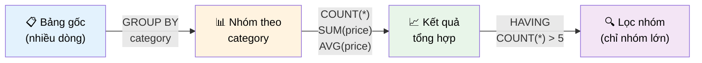

# Phần 10: Tổng Hợp Dữ Liệu và Nhóm với GROUP BY

Trong hành trình làm việc với cơ sở dữ liệu, việc truy vấn từng bản ghi chi tiết thường chỉ là bước khởi đầu. Mục tiêu cuối cùng thường là trích xuất những thông tin tổng quan có ý nghĩa, phân tích xu hướng, hoặc tóm tắt dữ liệu từ một tập hợp lớn các bản ghi. Để chuyển đổi dữ liệu thô thành những insight giá trị, SQL cung cấp hai kỹ thuật mạnh mẽ và liên kết chặt chẽ: **Tổng hợp (Aggregating)** và **Nhóm (Grouping)**.

Chương này được thiết kế để trang bị cho bạn một nền tảng vững chắc, giúp bạn biến hàng triệu bản ghi thành những báo cáo ngắn gọn, dễ hiểu. Chúng ta sẽ khám phá cách các hàm tổng hợp cô đọng nhiều giá trị thành một, và cách mệnh đề `GROUP BY` tổ chức dữ liệu thành các nhóm có ý nghĩa. Đặc biệt, chúng ta sẽ đi sâu vào cơ chế hoạt động ngầm (under the hood) của `GROUP BY`, một kỹ năng thiết yếu để tránh các lỗi phổ biến và tối ưu hóa truy vấn. Cuối cùng, chúng ta sẽ kết hợp cả hai kỹ thuật này, cùng với mệnh đề `HAVING` để thực hiện những phân tích dữ liệu phức tạp, đồng thời liên hệ với tư duy "Vibe Coding" và cách tận dụng các công cụ Agentic AI như Antigravity IDE trong quá trình này.

---

## I. Giới Thiệu: Từ Dữ Liệu Thô Đến Thông Tin Giá Trị

Dữ liệu thô, dù phong phú đến đâu, thường không tự nó kể được một câu chuyện. Để khám phá các mẫu hình, đo lường hiệu suất, hoặc đưa ra quyết định kinh doanh, chúng ta cần khả năng tóm tắt và phân tích. Ví dụ, một danh sách dài các giao dịch bán hàng có thể không hữu ích bằng việc biết tổng doanh thu theo quý, số lượng sản phẩm bán chạy nhất, hoặc doanh số trung bình của mỗi nhân viên. Đây chính là nơi các kỹ thuật tổng hợp và nhóm dữ liệu phát huy vai trò tối quan trọng.

---


*Thứ tự thực hiện: FROM → WHERE (lọc dòng) → GROUP BY (nhóm) → Aggregate Functions → HAVING (lọc nhóm) → SELECT → ORDER BY.*


## II. Tổng Hợp Dữ Liệu (Aggregation): Nền Tảng của Phân Tích

Tổng hợp dữ liệu là quá trình thu thập một tập hợp lớn các giá trị (thường từ một cột cụ thể) và chuyển đổi chúng thành một giá trị duy nhất mang tính tóm tắt. Mục tiêu là cung cấp một cái nhìn tổng thể về dữ liệu, thay vì hiển thị chi tiết từng bản ghi riêng lẻ. Các hàm tổng hợp (Aggregate Functions) là công cụ chính để thực hiện quá trình này.

### 2.1. Bản Chất của Tổng Hợp Dữ Liệu

Hãy hình dung bạn có một bảng chứa hàng ngàn giao dịch. Thay vì duyệt qua từng giao dịch, bạn muốn trả lời các câu hỏi như:

*   Tổng số tiền đã giao dịch là bao nhiêu?
*   Giao dịch lớn nhất và nhỏ nhất có giá trị bao nhiêu?
*   Giá trị trung bình của một giao dịch là bao nhiêu?
*   Có bao nhiêu giao dịch đã được thực hiện?

Các hàm tổng hợp được thiết kế để trả lời những câu hỏi này một cách hiệu quả, bằng cách xử lý tất cả các giá trị liên quan và trả về một kết quả duy nhất.

### 2.2. Các Hàm Tổng Hợp Cốt Lõi trong PostgreSQL

PostgreSQL cung cấp một bộ sưu tập phong phú các hàm tổng hợp. Dưới đây là những hàm cơ bản và được sử dụng rộng rãi nhất, tuân thủ cú pháp chuẩn SQL:

*   **`COUNT(expression)`**: Đếm số lượng hàng mà `expression` có giá trị **không phải `NULL`**.
*   **`COUNT(*)`**: Đếm **tất cả các hàng** trong tập kết quả, bao gồm cả những hàng có giá trị `NULL` trong bất kỳ cột nào.
*   **`SUM(expression)`**: Tính tổng các giá trị số của `expression` trong một tập hợp các hàng.
*   **`AVG(expression)`**: Tính giá trị trung bình của các giá trị số của `expression`.
*   **`MIN(expression)`**: Tìm giá trị nhỏ nhất của `expression`.
*   **`MAX(expression)`**: Tìm giá trị lớn nhất của `expression`.
*   **`ARRAY_AGG(expression)`**: (PostgreSQL Specific) Gom tất cả các giá trị của `expression` vào một mảng. Rất hữu ích khi bạn muốn xem tất cả các mục liên quan đến một nhóm.
*   **`STRING_AGG(expression, delimiter)`**: (PostgreSQL Specific) Gom tất cả các giá trị của `expression` thành một chuỗi duy nhất, được phân tách bởi `delimiter`.

**Ví dụ minh họa cơ bản:**

Giả sử chúng ta có bảng `comments` với các cột `id`, `user_id`, `photo_id`, `content`, `created_at`.

```sql
-- Tạo bảng comments và chèn dữ liệu mẫu
CREATE TABLE comments (
    id SERIAL PRIMARY KEY,
    user_id INTEGER NOT NULL,
    photo_id INTEGER NOT NULL,
    content TEXT,
    created_at TIMESTAMP DEFAULT CURRENT_TIMESTAMP
);

INSERT INTO comments (user_id, photo_id, content) VALUES
(1, 101, 'Great photo!'),
(3, 102, 'Nice shot.'),
(1, 101, 'Love it!'),
(2, 103, 'Awesome.'),
(3, 102, 'Amazing.'),
(1, 104, 'Superb!'),
(5, 105, 'Cool.'),
(2, 101, 'Fantastic!'),
(3, 103, NULL); -- Một bình luận không có nội dung

-- Tìm ID bình luận lớn nhất
SELECT MAX(id) FROM comments;

-- Tìm ID bình luận nhỏ nhất
SELECT MIN(id) FROM comments;

-- Tính giá trị trung bình của các ID bình luận (minh họa cách dùng AVG)
SELECT AVG(id) FROM comments;

-- Tính tổng số bình luận
SELECT COUNT(*) FROM comments;

-- Tính tổng số bình luận CÓ nội dung (không NULL)
SELECT COUNT(content) FROM comments;
```

### 2.3. Hiểu Sâu về `COUNT()`: Sự Khác Biệt Quan Trọng

Sự khác biệt giữa `COUNT(column_name)` và `COUNT(*)` (hoặc `COUNT(1)`) là một trong những điểm thường gây nhầm lẫn nhất:

*   **`COUNT(column_name)`**: Chỉ đếm các hàng mà `column_name` có giá trị **không phải `NULL`**. Nếu một cột có thể chứa `NULL` và bạn sử dụng `COUNT(tên_cột_đó)`, kết quả sẽ không phản ánh tổng số hàng thực tế trong tập dữ liệu.
*   **`COUNT(*)`** hoặc **`COUNT(1)`**: Đếm **tất cả các hàng** trong tập kết quả, bất kể các giá trị `NULL` trong bất kỳ cột nào. Đây là lựa chọn đáng tin cậy nhất khi bạn muốn biết tổng số bản ghi.

**Ví dụ minh họa sự khác biệt:**

Giả sử bảng `photos` có cột `user_id` và một số `photo` có `user_id` là `NULL`.

```sql
-- Tạo bảng photos và chèn dữ liệu mẫu
CREATE TABLE photos (
    id SERIAL PRIMARY KEY,
    user_id INTEGER,
    url VARCHAR(255) NOT NULL
);

INSERT INTO photos (user_id, url) VALUES
(1, 'url1'),
(2, 'url2'),
(1, 'url3'),
(NULL, 'url4'), -- Ảnh này không có user_id
(3, 'url5');

-- Đếm số ảnh có user_id KHÔNG NULL
SELECT COUNT(user_id) FROM photos;
-- Kết quả: 4 (bỏ qua ảnh có ID 4 vì user_id là NULL)

-- Đếm TỔNG số ảnh (bao gồm cả ảnh có user_id là NULL)
SELECT COUNT(*) FROM photos;
-- Kết quả: 5

-- Đếm số lượng URL (giả định URL không NULL)
SELECT COUNT(url) FROM photos;
-- Kết quả: 5 (vì url được khai báo NOT NULL)
```

> [!TIP]
> Trong hầu hết các trường hợp, khi mục tiêu là đếm tổng số hàng trong một tập hợp, hãy sử dụng `COUNT(*)` để đảm bảo tính chính xác và tránh bỏ sót các bản ghi do giá trị `NULL`.

### 2.4. Nguyên Tắc Cơ Bản khi Sử Dụng Hàm Tổng Hợp Đơn Lẻ

Khi chỉ sử dụng hàm tổng hợp mà không có mệnh đề `GROUP BY`, bạn không thể `SELECT` các cột không được tổng hợp cùng lúc.

**Ví dụ lỗi trong PostgreSQL:**

```sql
-- Lỗi: Cột 'comments.id' phải xuất hiện trong mệnh đề GROUP BY HOẶC được sử dụng trong hàm tổng hợp
SELECT id, MAX(id) FROM comments;
```

**Giải thích lý do lỗi:**
Hàm `MAX(id)` trả về một giá trị duy nhất (ID lớn nhất) cho toàn bộ tập dữ liệu. Tuy nhiên, cột `id` (nếu không được tổng hợp) có nhiều giá trị khác nhau. PostgreSQL không thể quyết định nên hiển thị giá trị `id` nào cùng với giá trị `MAX(id)` duy nhất đó trong một hàng kết quả. Điều này dẫn đến sự không rõ ràng và do đó, cơ sở dữ liệu sẽ báo lỗi. Để khắc phục, bạn phải hoặc tổng hợp cột `id` (ví dụ: `MAX(id)`) hoặc đưa nó vào mệnh đề `GROUP BY`.

---

## III. Nhóm Dữ Liệu với `GROUP BY`: Cấu Trúc Hóa Phân Tích

Nhóm dữ liệu là kỹ thuật cho phép chúng ta chia một tập hợp lớn các hàng thành các tập hợp con (gọi là nhóm), dựa trên các giá trị trùng lặp trong một hoặc nhiều cột. Mục đích chính là áp dụng các hàm tổng hợp cho từng tập hợp con này, thay vì trên toàn bộ dữ liệu. Mệnh đề `GROUP BY` trong SQL là công cụ để định nghĩa các nhóm này.

### 3.1. Khái Niệm Nhóm và Mục Đích

Thay vì chỉ biết tổng số bình luận, bạn có thể muốn biết "mỗi người dùng đã viết bao nhiêu bình luận" hoặc "mỗi bức ảnh nhận được bao nhiêu bình luận". Để trả lời những câu hỏi này, chúng ta cần:

1.  Xác định các "thực thể" mà chúng ta muốn phân tích (ví dụ: mỗi `user_id`, mỗi `photo_id`).
2.  Gom tất cả các bản ghi liên quan đến thực thể đó vào một nhóm.
3.  Áp dụng hàm tổng hợp (ví dụ: `COUNT(*)`) cho từng nhóm riêng biệt.

`GROUP BY` chính là mệnh đề thực hiện bước thứ hai.

### 3.2. Cơ Chế Hoạt Động Của `GROUP BY`: Hình Dung "Under the Hood"

Để nắm vững `GROUP BY`, điều quan trọng là phải hiểu cách cơ sở dữ liệu xử lý truy vấn. Hãy hình dung các bước logic sau (đây là một sự đơn giản hóa, nhưng rất hữu ích cho việc xây dựng "Vibe Coding"):

1.  **`FROM` và `WHERE` (Lọc Hàng Ban Đầu):** Đầu tiên, cơ sở dữ liệu xác định bảng nguồn (`FROM`) và sau đó áp dụng bất kỳ điều kiện lọc nào từ mệnh đề `WHERE`. Kết quả là một tập hợp các hàng cơ sở mà chúng ta sẽ làm việc.
2.  **`GROUP BY` (Tạo Nhóm):**
    *   Cơ sở dữ liệu quét qua cột hoặc các cột được chỉ định trong `GROUP BY` (ví dụ: `user_id`).
    *   Nó xác định tất cả các giá trị duy nhất xuất hiện trong (các) cột đó.
    *   Với mỗi giá trị duy nhất, cơ sở dữ liệu tạo ra một "nhóm" hoặc "thùng" (bucket) logic riêng biệt.
    *   Mỗi hàng từ tập hợp cơ sở sau `WHERE` được gán vào nhóm tương ứng dựa trên giá trị của nó trong cột `GROUP BY`.
3.  **`SELECT` (Tổng Hợp và Hiển Thị):**
    *   Sau khi các nhóm được hình thành, cơ sở dữ liệu sẽ xử lý mệnh đề `SELECT`.
    *   Đối với các cột nằm trong `GROUP BY`, giá trị của chúng là duy nhất cho mỗi nhóm, nên chúng được hiển thị trực tiếp.
    *   Đối với các hàm tổng hợp (`COUNT`, `SUM`, `AVG`, v.v.), chúng được áp dụng cho **tất cả các hàng bên trong mỗi nhóm riêng biệt**. Mỗi hàm tổng hợp sẽ trả về một giá trị duy nhất cho nhóm đó.
    *   Kết quả cuối cùng là một hàng cho mỗi nhóm, chứa các giá trị của cột `GROUP BY` và các giá trị đã được tổng hợp.

**Ví dụ minh họa với bảng `comments`:**

```
Bảng comments (sau khi FROM và WHERE, nếu có):
+----+---------+----------+-----------------+
| id | user_id | photo_id | content         |
+----+---------+----------+-----------------+
| 1  | 1       | 101      | Great photo!    |
| 2  | 3       | 102      | Nice shot.      |
| 3  | 1       | 101      | Love it!        |
| 4  | 2       | 103      | Awesome.        |
| 5  | 3       | 102      | Amazing.        |
| 6  | 1       | 104      | Superb!         |
| 7  | 5       | 105      | Cool.           |
| 8  | 2       | 101      | Fantastic!      |
| 9  | 3       | 103      | NULL            |
+----+---------+----------+-----------------+
```

Khi bạn thực hiện `SELECT user_id FROM comments GROUP BY user_id;`, cơ sở dữ liệu sẽ:

1.  Tìm các giá trị `user_id` duy nhất: `1, 3, 2, 5`.
2.  Tạo các nhóm (buckets) cho mỗi `user_id`:
    *   **Nhóm user_id = 1:** (id=1, user_id=1, photo_id=101), (id=3, user_id=1, photo_id=101), (id=6, user_id=1, photo_id=104)
    *   **Nhóm user_id = 2:** (id=4, user_id=2, photo_id=103), (id=8, user_id=2, photo_id=101)
    *   **Nhóm user_id = 3:** (id=2, user_id=3, photo_id=102), (id=5, user_id=3, photo_id=102), (id=9, user_id=3, photo_id=103)
    *   **Nhóm user_id = 5:** (id=7, user_id=5, photo_id=105)

Kết quả của `SELECT user_id FROM comments GROUP BY user_id;` sẽ là:

```
+---------+
| user_id |
+---------+
| 1       |
| 3       |
| 2       |
| 5       |
+---------+
```

Mỗi hàng trong kết quả này đại diện cho một nhóm duy nhất.

### 3.3. Quy Tắc Chọn Cột trong Mệnh Đề `SELECT` khi có `GROUP BY`

Đây là một trong những quy tắc quan trọng nhất và thường gây lỗi cho người mới bắt đầu:

> [!WARNING]
> Khi sử dụng mệnh đề `GROUP BY`, bạn **chỉ có thể chọn** (trong mệnh đề `SELECT`):
> 1.  Các cột đã được liệt kê trong mệnh đề `GROUP BY`.
> 2.  Các cột là kết quả của một hàm tổng hợp.
>
Bạn **không thể chọn** bất kỳ cột nào khác không nằm trong `GROUP BY` và không được tổng hợp.

**Lý do cốt lõi:**
Sau khi quá trình nhóm hoàn tất, mỗi hàng trong tập kết quả đại diện cho một nhóm. Các cột trong `GROUP BY` là duy nhất cho mỗi nhóm. Tuy nhiên, nếu bạn cố gắng chọn một cột như `content` (từ ví dụ trên), trong nhóm `user_id = 1` có nhiều giá trị `content` khác nhau ("Great photo!", "Love it!", "Superb!"). PostgreSQL không thể quyết định giá trị `content` nào để hiển thị cho *một* hàng đại diện cho nhóm `user_id = 1`. Điều này sẽ dẫn đến lỗi "column must appear in the GROUP BY clause or be used in an aggregate function".

**Ví dụ lỗi:**

```sql
-- Lỗi: Cột "comments.content" phải xuất hiện trong mệnh đề GROUP BY HOẶC được sử dụng trong hàm tổng hợp
SELECT user_id, content FROM comments GROUP BY user_id;
```

Nếu bạn muốn làm việc với cột `content` trong ngữ cảnh nhóm, bạn phải tổng hợp nó (ví dụ: `COUNT(content)`, `MAX(content)`, `STRING_AGG(content, ', ')`).

---

## IV. Kết Hợp Sức Mạnh: `GROUP BY` và Hàm Tổng Hợp

Đây là nơi mà `GROUP BY` thực sự phát huy sức mạnh của mình. Khi bạn kết hợp `GROUP BY` với các hàm tổng hợp, các hàm tổng hợp sẽ được áp dụng **trên từng nhóm riêng biệt**, thay vì trên toàn bộ tập dữ liệu.

### 4.1. Cơ Chế Kết Hợp và Dòng Chảy Dữ Liệu

Hãy nhớ lại hình dung về các nhóm tạm thời (buckets) được tạo bởi `GROUP BY`. Khi bạn thêm một hàm tổng hợp vào mệnh đề `SELECT` cùng với `GROUP BY`, cơ sở dữ liệu sẽ:

1.  Tạo các nhóm như đã mô tả ở Mục 3.2.
2.  Đối với **mỗi nhóm**, cơ sở dữ liệu sẽ lấy tất cả các hàng thuộc nhóm đó.
3.  Áp dụng hàm tổng hợp cho các giá trị của cột được chỉ định **trong phạm vi nhóm đó**.
4.  Kết quả là một hàng cho mỗi nhóm, bao gồm giá trị của cột `GROUP BY` và giá trị tổng hợp của nhóm đó.

### 4.2. Ví Dụ Thực Tế 1: Phân Tích Hoạt Động Người Dùng

**Bài toán:** "Tìm xem mỗi người dùng đã tạo bao nhiêu bình luận."

**Phân tích:**

*   Chúng ta cần biết `user_id` (cột để nhóm).
*   Chúng ta cần đếm số lượng bình luận cho mỗi `user_id` (hàm tổng hợp `COUNT(*)`).

**Code minh họa:**

```sql
SELECT
    user_id,
    COUNT(*) AS total_comments -- Đếm số bình luận trong mỗi nhóm và đặt tên alias
FROM
    comments
GROUP BY
    user_id
ORDER BY
    total_comments DESC; -- Sắp xếp để xem người dùng nào có nhiều bình luận nhất
```

**Giải thích:**

1.  `FROM comments`: Chọn dữ liệu từ bảng `comments`.
2.  `GROUP BY user_id`: Gộp các hàng lại với nhau dựa trên giá trị `user_id`. Mỗi `user_id` duy nhất sẽ tạo thành một nhóm.
3.  `SELECT user_id, COUNT(*) AS total_comments`:
    *   `user_id`: Cột này được phép chọn vì nó nằm trong mệnh đề `GROUP BY`.
    *   `COUNT(*) AS total_comments`: Hàm `COUNT(*)` được áp dụng cho **từng nhóm riêng biệt**. Nó sẽ đếm số lượng hàng (bình luận) trong mỗi nhóm `user_id`. `AS total_comments` là một alias (bí danh) giúp cột kết quả dễ đọc hơn.
4.  `ORDER BY total_comments DESC`: Sắp xếp kết quả theo số lượng bình luận giảm dần, giúp dễ dàng nhận biết người dùng tích cực nhất.

**Kết quả (dựa trên dữ liệu mẫu):**

```
+---------+----------------+
| user_id | total_comments |
+---------+----------------+
| 1       | 3              |
| 3       | 3              |
| 2       | 2              |
| 5       | 1              |
+---------+----------------+
```

### 4.3. Ví Dụ Thực Tế 2: Đánh Giá Tương Tác Nội Dung

**Bài toán:** "Mỗi bức ảnh nhận được bao nhiêu bình luận và bình luận cuối cùng là gì?"

**Phân tích:**

*   Chúng ta cần biết `photo_id` (cột để nhóm).
*   Chúng ta cần đếm số lượng bình luận cho mỗi `photo_id` (hàm tổng hợp `COUNT(*)`).
*   Chúng ta cần tìm bình luận cuối cùng (hàm tổng hợp `MAX(content)` hoặc `MAX(created_at)` để tìm bình luận mới nhất, rồi dùng `STRING_AGG` để gom). Để đơn giản, ta sẽ lấy `MAX(content)` như một ví dụ.

**Code minh họa:**

```sql
SELECT
    photo_id,
    COUNT(*) AS total_comments_per_photo,
    MAX(created_at) AS latest_comment_time, -- Thời gian bình luận mới nhất
    STRING_AGG(content, ' | ') AS all_comments_content -- Gom tất cả nội dung bình luận vào một chuỗi
FROM
    comments
GROUP BY
    photo_id
ORDER BY
    total_comments_per_photo DESC;
```

**Kết quả (ví dụ dựa trên dữ liệu mẫu):**

```
+----------+--------------------------+----------------------------+-------------------------------------------------+
| photo_id | total_comments_per_photo | latest_comment_time        | all_comments_content                            |
+----------+--------------------------+----------------------------+-------------------------------------------------+
| 101      | 3                        | 2023-10-27 10:00:08.000000 | Great photo! | Love it! | Fantastic!          |
| 102      | 2                        | 2023-10-27 10:00:05.000000 | Nice shot. | Amazing.                          |
| 103      | 2                        | 2023-10-27 10:00:09.000000 | Awesome. | NULL                              |
| 104      | 1                        | 2023-10-27 10:00:06.000000 | Superb!                                         |
| 105      | 1                        | 2023-10-27 10:00:07.000000 | Cool.                                           |
+----------+--------------------------+----------------------------+-------------------------------------------------+
```
*Lưu ý: `STRING_AGG` sẽ bỏ qua giá trị `NULL` theo mặc định, trừ khi được cấu hình khác. Trong ví dụ trên, bình luận `NULL` cho `photo_id = 103` không xuất hiện trong `all_comments_content`.*

### 4.4. Bài Tập Thực Hành: Phân Tích Danh Mục Sách

**Yêu cầu:** Viết một truy vấn SQL in ra ID của tác giả, tổng số sách mà họ đã viết, và năm xuất bản sớm nhất của một cuốn sách của họ.

**Gợi ý:**

*   Bạn có bảng `authors` (chỉ để tham khảo, không cần join nếu `author_id` có trong `books`) và `books`.
*   Giả định bảng `books` có cột `author_id` và `publication_year`.

**Tạo bảng và dữ liệu mẫu (để bạn có thể chạy thử):**

```sql
CREATE TABLE books (
    id SERIAL PRIMARY KEY,
    title VARCHAR(255) NOT NULL,
    author_id INTEGER NOT NULL,
    publication_year INTEGER
);

INSERT INTO books (title, author_id, publication_year) VALUES
('The Great Novel', 101, 2000),
('SQL for Dummies', 102, 2010),
('Another Story', 101, 2005),
('Data Science 101', 103, 2018),
('Advanced SQL', 102, 2015),
('Epic Fantasy Part 1', 101, 1998),
('Cooking Basics', 104, 2020),
('Learning PostgreSQL', 102, 2022);
```

**Giải pháp chi tiết:**

```sql
SELECT
    author_id,
    COUNT(*) AS number_of_books, -- Đếm số sách trong mỗi nhóm tác giả
    MIN(publication_year) AS earliest_publication_year -- Tìm năm xuất bản sớm nhất
FROM
    books
GROUP BY
    author_id
ORDER BY
    number_of_books DESC, earliest_publication_year ASC;
```

**Giải thích:**

1.  `FROM books`: Truy vấn từ bảng `books`.
2.  `GROUP BY author_id`: Gộp các bản ghi sách lại theo `author_id`. Mỗi `author_id` duy nhất sẽ tạo thành một nhóm.
3.  `SELECT author_id, COUNT(*) AS number_of_books, MIN(publication_year) AS earliest_publication_year`:
    *   `author_id`: Được phép chọn vì nó nằm trong `GROUP BY`.
    *   `COUNT(*) AS number_of_books`: Đếm số lượng sách trong mỗi nhóm tác giả.
    *   `MIN(publication_year) AS earliest_publication_year`: Tìm năm xuất bản nhỏ nhất (sớm nhất) trong mỗi nhóm tác giả.
4.  `ORDER BY number_of_books DESC, earliest_publication_year ASC`: Sắp xếp kết quả theo số lượng sách giảm dần, sau đó theo năm xuất bản sớm nhất tăng dần.

**Kết quả (dựa trên bảng `books` giả định):**

```
+-----------+-----------------+---------------------------+
| author_id | number_of_books | earliest_publication_year |
+-----------+-----------------+---------------------------+
| 101       | 3               | 1998                      |
| 102       | 3               | 2010                      |
| 103       | 1               | 2018                      |
| 104       | 1               | 2020                      |
+-----------+-----------------+---------------------------+
```

---

## V. Lọc Nhóm với `HAVING`: Mở Rộng Khả Năng Phân Tích

Trong SQL, có hai mệnh đề chính để lọc dữ liệu: `WHERE` và `HAVING`. Sự khác biệt và thứ tự thực thi của chúng là tối quan trọng để viết các truy vấn chính xác và hiệu quả.

### 5.1. `WHERE` vs. `HAVING`: Khi Nào Sử Dụng Cái Nào?

Để hiểu rõ, hãy xem xét thứ tự xử lý logic của một truy vấn SQL đầy đủ:

1.  **`FROM`**: Xác định (các) bảng nguồn.
2.  **`WHERE`**: Lọc các hàng **trước khi** chúng được nhóm. Bạn không thể sử dụng các hàm tổng hợp trong mệnh đề `WHERE` vì các nhóm chưa được hình thành và các giá trị tổng hợp chưa được tính toán.
3.  **`GROUP BY`**: Nhóm các hàng còn lại sau khi `WHERE` đã lọc.
4.  **Các Hàm Tổng Hợp**: Tính toán các giá trị tổng hợp cho từng nhóm.
5.  **`HAVING`**: Lọc các nhóm **sau khi** chúng đã được hình thành và các hàm tổng hợp đã được tính toán. Đây là nơi bạn có thể sử dụng các hàm tổng hợp để lọc các nhóm.
6.  **`SELECT`**: Chọn các cột và biểu thức để hiển thị.
7.  **`ORDER BY`**: Sắp xếp tập kết quả cuối cùng.

**Tóm tắt:**

*   **`WHERE`**: Lọc **hàng riêng lẻ**. Thực thi **trước** `GROUP BY`. Không dùng hàm tổng hợp.
*   **`HAVING`**: Lọc **nhóm**. Thực thi **sau** `GROUP BY` và tính toán tổng hợp. Có thể dùng hàm tổng hợp.

### 5.2. Ví Dụ Minh Họa `HAVING`

**Bài toán:** "Tìm các người dùng đã tạo nhiều hơn 2 bình luận và ID ảnh của họ là 101."

Để giải quyết bài toán này, chúng ta cần hai loại lọc:

1.  Lọc các bình luận liên quan đến `photo_id = 101` **trước khi nhóm** (sử dụng `WHERE`).
2.  Lọc các nhóm người dùng mà tổng số bình luận của họ **lớn hơn 2** (sử dụng `HAVING`).

```sql
SELECT
    user_id,
    COUNT(*) AS total_comments_for_photo_101
FROM
    comments
WHERE
    photo_id = 101 -- Lọc các hàng chỉ liên quan đến photo_id 101 TRƯỚC khi nhóm
GROUP BY
    user_id
HAVING
    COUNT(*) > 1 -- Lọc các nhóm mà tổng số bình luận của họ > 1 (trong ngữ cảnh photo_id 101)
ORDER BY
    total_comments_for_photo_101 DESC;
```

**Giải thích:**

1.  `WHERE photo_id = 101`: Đầu tiên, truy vấn chỉ xem xét các bình luận có `photo_id` là `101`.
    *   Các hàng được giữ lại: (id=1, user_id=1, photo_id=101), (id=3, user_id=1, photo_id=101), (id=8, user_id=2, photo_id=101)
2.  `GROUP BY user_id`: Sau đó, các hàng còn lại được nhóm theo `user_id`.
    *   Nhóm user_id = 1: 2 bình luận
    *   Nhóm user_id = 2: 1 bình luận
3.  `HAVING COUNT(*) > 1`: Cuối cùng, các nhóm này được lọc. Chỉ những nhóm nào có `COUNT(*)` (tổng số bình luận trong nhóm đó) lớn hơn 1 mới được giữ lại.
    *   Nhóm user_id = 1 (có 2 bình luận) được giữ lại.
    *   Nhóm user_id = 2 (có 1 bình luận) bị loại bỏ.

**Kết quả (dựa trên dữ liệu mẫu):**

```
+---------+------------------------------+
| user_id | total_comments_for_photo_101 |
+---------+------------------------------+
| 1       | 2                            |
+---------+------------------------------+
```

---

## VI. Tư Duy Vibe Coding và Antigravity IDE với Aggregation/Grouping

Trong kỷ nguyên của AI Coding, việc hiểu sâu sắc các khái niệm cơ bản như `GROUP BY` và Aggregation không chỉ giúp bạn viết SQL tốt hơn mà còn là nền tảng cho "Vibe Coding" – khả năng dự đoán, kiểm soát và tối ưu hóa đầu ra của các hệ thống AI. Đặc biệt với một Agentic AI như Antigravity IDE, việc có một "vibe" tốt về cách dữ liệu được xử lý là chìa khóa để cộng tác hiệu quả.

### 6.1. Vibe Coding: Dự Đoán và Kiểm Soát Dữ Liệu

"Vibe Coding" là khả năng xây dựng một mô hình tinh thần về cách mã (trong trường hợp này là SQL) sẽ tương tác và biến đổi dữ liệu. Đối với `GROUP BY` và các hàm tổng hợp, điều này có nghĩa là:

*   **Hình dung các nhóm (buckets):** Khi bạn viết `GROUP BY user_id`, bạn ngay lập tức hình dung dữ liệu được chia thành các "thùng" riêng biệt cho mỗi `user_id`.
*   **Dự đoán kết quả tổng hợp:** Bạn biết rằng `COUNT(*)` sẽ đếm số hàng trong *từng thùng*, không phải toàn bộ bảng.
*   **Hiểu quy tắc `SELECT`:** Bạn không bao giờ cố gắng `SELECT` một cột không tổng hợp mà không có trong `GROUP BY` vì bạn hiểu rằng mỗi hàng kết quả đại diện cho một nhóm, không phải một bản ghi chi tiết.
*   **Phân biệt `WHERE` và `HAVING`:** Bạn "cảm nhận" được rằng `WHERE` lọc trước khi nhóm, còn `HAVING` lọc sau khi nhóm, và điều này ảnh hưởng đến kết quả cuối cùng.

Khả năng này giúp bạn nhanh chóng phát hiện lỗi logic, tối ưu hóa truy vấn và quan trọng nhất, cộng tác hiệu quả với AI.

### 6.2. Antigravity IDE: Tối Ưu Hóa Quy Trình Với Agentic AI

Antigravity IDE, với khả năng tự chạy script ngầm, gọi subagent trình duyệt, đọc/ghi file và lập kế hoạch tự động, là một công cụ mạnh mẽ. Khi một tác vụ yêu cầu phân tích dữ liệu bằng SQL (như tạo báo cáo, tìm kiếm xu hướng), Antigravity có thể:

*   Tự động phân tích yêu cầu của bạn.
*   Lập kế hoạch các bước cần thiết, bao gồm việc tạo truy vấn SQL.
*   Thực thi truy vấn đó trên cơ sở dữ liệu (có thể thông qua một subagent kết nối CSDL).
*   Phân tích kết quả và trình bày cho bạn.

Tuy nhiên, sức mạnh của Antigravity được tối đa hóa khi bạn, người dùng, cũng có "Vibe Coding" mạnh mẽ.

### 6.3. Áp Dụng Thực Tế Trong Antigravity

1.  **Prompt Engineering (Kỹ thuật Đặt Lệnh):**
    *   Với "Vibe Coding", bạn có thể tạo ra các prompt rõ ràng và chính xác hơn cho Antigravity. Thay vì chỉ nói "Đếm số bình luận", bạn có thể nói "Đếm số bình luận của mỗi người dùng và chỉ hiển thị những người dùng có hơn 5 bình luận, sắp xếp theo số lượng giảm dần." Điều này giúp Antigravity trực tiếp tạo ra truy vấn sử dụng `GROUP BY` và `HAVING` một cách chính xác.
    *   Ví dụ: "Antigravity, hãy phân tích bảng `comments`. Tôi muốn biết mỗi `user_id` đã tạo bao nhiêu bình luận. Chỉ hiển thị những người dùng đã tạo ít nhất 3 bình luận. Sắp xếp kết quả theo số bình luận giảm dần. Hãy sử dụng PostgreSQL."

2.  **Output Validation (Xác Thực Đầu Ra):**
    *   Khi Antigravity trả về một truy vấn SQL hoặc một tập kết quả, "Vibe Coding" cho phép bạn nhanh chóng "quét" qua và cảm nhận xem nó có đúng logic hay không.
    *   Nếu Antigravity tạo ra `SELECT user_id, content FROM comments GROUP BY user_id;`, bạn sẽ ngay lập tức nhận ra đây là lỗi (vì `content` không được tổng hợp và không nằm trong `GROUP BY`) và có thể hướng dẫn lại agent.
    *   Bạn có thể kiểm tra xem `COUNT(*)` có được sử dụng đúng chỗ hay không, hoặc `HAVING` có được áp dụng sau `GROUP BY` không.

3.  **Debugging và Refinement (Gỡ Lỗi và Tinh Chỉnh):**
    *   Nếu Antigravity gặp khó khăn với một truy vấn phức tạp, khả năng "Vibe Coding" của bạn sẽ giúp bạn chỉ ra phần nào của truy vấn cần được điều chỉnh (ví dụ: "Antigravity, có vẻ như bạn đang cố lọc trước khi nhóm; hãy thử sử dụng `HAVING` thay vì `WHERE` cho điều kiện này").
    *   Bạn có thể yêu cầu Antigravity hiển thị các bước trung gian hoặc giải thích logic của truy vấn nó tạo ra, và bạn sẽ có đủ kiến thức để đánh giá giải thích đó.

4.  **Phân Tích Đa Bước:**
    *   Đối với các phân tích phức tạp hơn, Antigravity có thể cần thực hiện nhiều bước (ví dụ: lấy dữ liệu từ một API, lưu vào một bảng tạm, sau đó chạy `GROUP BY` để phân tích). "Vibe Coding" giúp bạn theo dõi toàn bộ luồng công việc này, đảm bảo mỗi bước chuyển đổi dữ liệu đều hợp lý và đạt được mục tiêu cuối cùng.

Tóm lại, trong môi trường Antigravity IDE, "Vibe Coding" không phải là việc bạn tự viết mọi dòng code, mà là việc bạn phát triển một trực giác mạnh mẽ về cách dữ liệu được xử lý. Điều này biến bạn từ một người dùng thụ động thành một cộng tác viên thông minh, giúp Antigravity hoạt động hiệu quả hơn, chính xác hơn và nhanh chóng đạt được mục tiêu phân tích dữ liệu của bạn.

---

## Tóm tắt Phần 10: Tổng Hợp Dữ Liệu và Nhóm với GROUP BY

*   **Mục tiêu:** Chuyển đổi dữ liệu thô thành thông tin tổng hợp và có ý nghĩa thông qua hai kỹ thuật chính: Tổng hợp (Aggregating) và Nhóm (Grouping).
*   **Tổng hợp (Aggregation):** Quá trình giảm nhiều giá trị thành một giá trị duy nhất bằng cách sử dụng các hàm tổng hợp như `COUNT()`, `SUM()`, `AVG()`, `MIN()`, `MAX()`.
*   **`GROUP BY`:** Mệnh đề được sử dụng để gộp các hàng có giá trị giống nhau trong một hoặc nhiều cột thành các nhóm logic. Các hàm tổng hợp sau đó sẽ hoạt động trên từng nhóm riêng biệt.
*   **Cơ chế `GROUP BY`:** Dữ liệu được lọc bởi `WHERE`, sau đó chia thành các "nhóm" hoặc "thùng" tạm thời dựa trên các cột trong `GROUP BY`. Các hàm tổng hợp được áp dụng cho từng nhóm này.
*   **Quy tắc `SELECT` với `GROUP BY`:** Bạn chỉ có thể chọn các cột nằm trong mệnh đề `GROUP BY` hoặc các cột là kết quả của một hàm tổng hợp. Cố gắng chọn một cột không tổng hợp và không nằm trong `GROUP BY` sẽ gây ra lỗi do sự không rõ ràng.
*   **Lưu ý về `COUNT()`:** `COUNT(column_name)` chỉ đếm các giá trị không `NULL`, trong khi `COUNT(*)` hoặc `COUNT(1)` đếm tất cả các hàng, bao gồm cả những hàng có giá trị `NULL`. Ưu tiên `COUNT(*)` để đếm tổng số bản ghi.
*   **`HAVING`:** Mệnh đề `HAVING` được sử dụng để lọc các nhóm dựa trên kết quả của các hàm tổng hợp, sau khi quá trình nhóm và tổng hợp đã diễn ra. Nó khác với `WHERE`, vốn lọc các hàng trước khi nhóm.
*   **Vibe Coding & Antigravity IDE:** Việc hình dung quá trình xử lý dữ liệu của SQL là nền tảng của "Vibe Coding", giúp bạn tương tác hiệu quả hơn với các hệ thống Agentic AI như Antigravity IDE thông qua Prompt Engineering, xác thực đầu ra và gỡ lỗi.

<!-- REVIEWED_BY_AGENT -->
